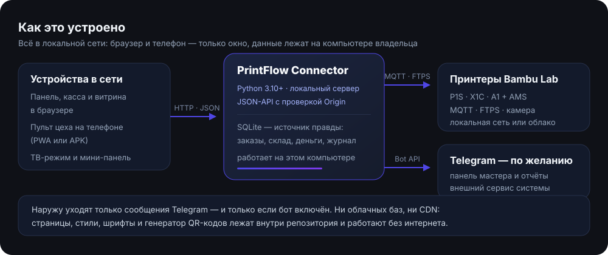

# PrintFlow — локальная система 3D-производства

<p align="center">
  
</p>

<p align="center">
  
  
  
  
  
</p>

**PrintFlow — программа для домашней 3D-мастерской.** Она ведёт заказы и
клиентов, считает себестоимость и прибыль по факту печати, управляет принтерами
Bambu Lab с AMS, держит очередь печати и печатает ценники — а телефон
превращает в пульт цеха у станка.

Всё живёт на **одном компьютере**: база SQLite — источник правды, а браузер,
телефон и принтер — только окно в неё. Облака, подписок и внешних API нет:
страницы, стили, шрифты и даже генератор QR-кодов лежат в репозитории и
работают без интернета. Единственное исключение — Telegram, и только если
владелец сам его включит.

> **NOZZA — бренд витрины** («Там, где рождается форма»): наружу, для
> покупателей, полки, Авито и Telegram, идёт NOZZA; PrintFlow остаётся
> внутренним именем системы. Логотип и знак — `site/assets/brand/`, печатные
> материалы — `site/materials/`.

## Содержание

- [Запуск за три шага](#запуск-за-три-шага)
- [Что умеет система](#что-умеет-система)
- [Пульт цеха на телефоне](#пульт-цеха-на-телефоне)
- [Как это устроено](#как-это-устроено)
- [Управление принтерами и AMS](#управление-принтерами-и-ams)
- [Автоматический учёт](#автоматический-учёт)
- [Телефон, витрина и локальная сеть](#телефон-витрина-и-локальная-сеть)
- [Данные и безопасность](#данные-и-безопасность)
- [Проверки и тесты](#проверки-и-тесты)
- [Документация](#документация)
- [Версия и крупные вехи](#текущая-версия)
- [Структура репозитория](#структура-репозитория)
- [Материалы для полки и бренд](#материалы-для-полки-и-бренд)
- [Бизнес: ниши, закуп, перед первой продажей](#бизнес-ниши-закуп-перед-первой-продажей)

## Запуск за три шага

1. **Откройте папку с PrintFlow и выполните `python pf.py`** (Windows:
   `py pf.py`, или двойной клик по `ЗАПУСТИТЬ.bat`). Первый запуск сам создаст
   окружение и поставит зависимости — интернет нужен один раз.
2. **Откройте адрес из консоли** (`http://localhost:8765/`) или наведите камеру
   телефона на показанный QR-код: панель, касса и витрина откроются на телефоне.
3. **Держите окно открытым, пока работаете** (остановка — Ctrl+C) или поставьте
   автозапуск: `python pf.py install`.

Данные лежат в базе на этом компьютере (`%APPDATA%\PrintFlow` на Windows,
`~/.config/printflow` на Mac/Linux), а не в браузере: `index.html` двойным
кликом открывать нельзя. Что-то не так — `python pf.py doctor`.
Подробности и все команды лаунчера — [`КАК-ЗАПУСТИТЬ.txt`](КАК-ЗАПУСТИТЬ.txt).

## Что умеет система

| Раздел панели | Что делает |
| --- | --- |
| Обзор | Загрузка парка, деньги за период, ближайшие сроки, лента событий, графики |
| Принтеры | Телеметрия, камера, AMS, команды, калибровки, файлы SD, журнал |
| Очередь | Общая очередь парка, файлы с компьютера или SD-карты, подтверждаемый запуск, журнал печатей |
| Заказы | «Заказ из текста», проверка файла/принтера/пластика и безопасная подготовка очереди, архив вместо удаления |
| Клиенты | История покупок, сегменты, очередь обратной связи после оплаченной выдачи |
| Товары и партии | Номенклатура, остатки по складам, цены и маржа; производство на склад с раскладкой по плитам |
| Документы и склады | Приход, продажа, перемещение, списание, инвентаризация, производство; места хранения и резервы |
| Финансы | Доход, расход, прибыль за час печати, проводки, разрез по нишам и налоги |
| Стеллаж | Остатки и продажи, ценники 67×32 и промостенды 67×57, QR и Code 128 с кодом номенклатуры 1С |
| Склад пластика | Катушки, остатки, автосписание, база изделий, память слотов AMS |
| Библиотека | Инструкции, скрипты, чек-листы и материалы для печати на A4 |
| Настройки | Тарифы, автоматизация, Telegram, тема, принтеры, резервная копия |

Отдельные страницы, которые открывают с телефона или из браузера:

- **Витрина для покупателя** — `order.html` (каталог и заявка), страница товара — `shelf.html?id=…`, трекер заказа — `track.html`;
- **Касса** — `cashier.html` (СБП, наличные, офлайн-контур) и Android-оболочка `ai.printflow.kassa`;
- **Пульт цеха** — `control.html` (см. ниже) и мини-панель «у станка» `m.html`;
- **Режим «Стена»** — `tv.html`: полноэкранный вид парка для второго монитора или планшета;
- **Конструктор изделий** — `design.html`; печатные материалы — `site/materials/index.html`.

Горячие клавиши: `Ctrl+K` — командная палитра и глобальный поиск, `N` — новый
заказ, `/` — поиск.

## Пульт цеха на телефоне

Отдельное приложение для работы у станка (этапы 18.0): свой экран на каждую
задачу, крупные кнопки под палец, крупные цифры, честные состояния. Шесть
вкладок:

- **Парк** — плитки принтеров с прогрессом, AMS и тревогами; пауза, продолжение,
  стоп (все команды требуют подтверждения); после финиша — карточка «печать
  закончена»: план и факт по времени и пластику, простой и кнопка «Снял детали»;
- **Очередь** — что печатается и что ждёт, запуск через Preflight, перестановка,
  отмена;
- **Файл** — загрузка «как в слайсере»: перетащил `.3mf` → увидел минуты, граммы,
  материал и цвет → выбрал плиту, принтер и слоты AMS → отправил в очередь или
  сразу запустил;
- **Авто** — почему очередь идёт сама или стоит: флаги автозапуска, тихие часы,
  что будет следующим и почему именно оно, правила очереди и предохранитель
  после двух сорванных печатей подряд;
- **AMS** — слоты из телеметрии и память базы: привязка катушки, «как в прошлый
  раз», отвязка, синхронизация;
- **Камера** — кадр с плиты, снимок в журнал, лампа.

Как поставить: на телефоне откройте `/pult` и добавьте на экран «Домой» (PWA),
либо соберите APK `ai.printflow.pult` — `./scripts/android-build.sh --pult`. Обе оболочки сами обнаруживают новую сборку на локальном коннекторе, показывают changelog, размер и SHA-256 и предлагают установку через системный Android-диалог.
Сборка проверяется на компьютере владельца (JDK и Android SDK).

Инструкция с приёмкой из одиннадцати сценариев — [`docs/ПУЛЬТ-НА-ТЕЛЕФОНЕ.md`](docs/ПУЛЬТ-НА-ТЕЛЕФОНЕ.md),
план этапов и решения — [`docs/ТЗ-18.0-ПУЛЬТ-ЦЕХА.md`](docs/ТЗ-18.0-ПУЛЬТ-ЦЕХА.md).

## Как это устроено

<p align="center">
  
</p>

- **Коннектор** (`connector/printflow_connector.py`) — сервер на Python: JSON-API,
  SQLite, подключения к принтерам, очередь и учёт. Слушает `127.0.0.1` по
  умолчанию, `python pf.py` включает доступ из локальной сети.
- **Страницы** (`site/`) — обычные HTML/JS без сборщиков и внешних библиотек.
  Интерфейс требует запущенного коннектора: без него страница откроется, но
  данные не загрузятся и не сохранятся.
- **Принтеры** — Bambu Lab по локальной сети (MQTT/TLS 8883, FTPS 990, камера
  6000) или через Bambu Cloud; выбор — в карточке принтера.
- **Телефон** — та же панель, касса, витрина и пульт: отдельные приложения не
  нужны, кроме Android-оболочки кассы и APK пульта.

## Управление принтерами и AMS

Поддерживаются оба канала связи, выбор — в карточке принтера (поле «Связь»):

- **Bambu Cloud (по умолчанию для новых принтеров)** — без LAN Only Mode:
  телеметрия и команды через облачный MQTT Bambu, загрузка 3MF в облачное
  хранилище и запуск печати диспетчеризацией `POST /my/task` (как у
  Bambu Studio). Вход — «Настройки → Bambu Cloud».
- **Локальная сеть** — MQTT/TLS 8883, камера 6000, FTPS 990 (прежний способ;
  на защищённых прошивках требует LAN Only + Developer Mode).

Что умеет PrintFlow в обоих режимах: пауза, продолжение, стоп, свет, скорость
печати; температуры сопла и стола, обдув детали; парковка и перемещение осей,
подача и выгрузка филамента; калибровка стола, вибраций, полная калибровка;
назначение типа и цвета пластика в слотах AMS; загрузка 3MF/G-code и запуск
печати с выбором плиты, слотов AMS и калибровок; поиск принтеров (SSDP в сети и
список устройств аккаунта Bambu Cloud).

Опасные команды требуют подтверждения в интерфейсе, а сервер проверяет пределы
(например, температуру и длину перемещения). Камера и файлы SD-карты работают
по локальной сети — укажите IP принтера в карточке, чтобы они были доступны и в
облачном режиме.

## Автоматический учёт

Что происходит без ручного ввода:

1. Печать стартовала → создаётся задание, заказ переходит в статус «Печать» (связь по имени файла или номеру заказа).
2. Печать завершилась → один раз фиксируются граммы и минуты, списывается пластик, считается энергия и себестоимость. Повторное событие принтера не создаёт повторного списания.
3. Заказ переходит в «Постобработку», а карточка показывает план/факт по весу, времени и стоимости.
4. После визуальной проверки мастер нажимает «Принять результат и подготовить сообщение» → заказ получает статус «Готов», текст клиенту копируется, но не отправляется автоматически.
5. При выдаче мастер явно выбирает «оплата получена» или «выдать в долг». Платёж, складское списание и финальный статус фиксируются одной операцией; повторный клик ничего не дублирует.
6. Для долга система готовит корректное напоминание без автоотправки. Отметка «отправлено» ставится отдельно, повтор ограничен паузой, а подтверждённая оплата не может превысить остаток или записаться дважды.
7. Нехватка пластика попадает в список закупок по материалу и цвету. После подтверждённого физического приёма каждая катушка создаётся отдельно, расход фиксируется в выбранной кассе, а повторный запрос ничего не дублирует.
8. Для сорванной печати система подставляет фактические граммы, время и стоимость потерь. Мастер подтверждает причину и при необходимости готовит один повтор в очередь; пластик повторно не списывается, физический запуск не выполняется автоматически. Если печати срываются подряд, автозапуск встаёт и ждёт человека.
9. После оплаченной выдачи заказ сам появляется в CRM-очереди обратной связи. PrintFlow готовит персональный запрос, но отправку отмечает только оператор; оценка, текст, разрешение на публикацию и интерес к повтору хранятся раздельно. Черновик повторного заказа создаётся лишь после явного действия.

Автоматизируются только объективные операции. Визуальная приёмка, причина брака,
физический запуск печати, получение материалов, подтверждение оплаты, внешний
запрос отзыва и разрешение на публикацию требуют действия человека. Настройки
автоматического учёта — в «Настройках → Автоматизация», состояние автоматики
видно на пульте во вкладке «Авто».

## Телефон, витрина и локальная сеть

### Как телефон находит сервер

Порт по умолчанию — **8765**, и он один на всю систему: панель, касса и пульт
открываются по одному адресу, а приложение кассы находит сервер само — по
UDP-маяку, без ввода адреса и без перебора сети. Подробности и разбор частых
причин «касса не видит сервер» — [`docs/ПОИСК-СЕРВЕРА.md`](docs/ПОИСК-СЕРВЕРА.md).

Прямой запуск коннектора слушает только `127.0.0.1`. Обычный `python pf.py`
уже включает доступ из локальной сети; для ручного запуска:

```bash
python3 connector/printflow_connector.py --lan      # или --host 0.0.0.0
```

Адреса для телефона печатаются при запуске вместе с QR-кодом.

- **Витрина для покупателя** — `http://IP:8765/order.html` (каталог + форма заявки), страница товара — `shelf.html?id=…`.
- **Пульт цеха** — `http://IP:8765/pult` (короткий адрес страницы `control.html`).
- **Режим «Стена»** — полноэкранный вид парка для второго монитора или планшета в мастерской.
- **Несколько роутеров или подсетей?** Компьютер и принтер должны быть в одной подсети; диагностика и порядок действий — в разделе «Библиотека → Сеть и доступ».
- **Извне дома** — не открывайте порты в интернет: используйте Telegram-панель (бот) или VPN (Tailscale/WireGuard).

## Данные и безопасность

- База: `%APPDATA%\PrintFlow\printflow.sqlite3` (Windows) или `~/.config/printflow/printflow.sqlite3`.
- Прямой коннектор по умолчанию слушает `127.0.0.1`; `pf.py` включает LAN, а `pf.py --local` снова ограничивает доступ этим ПК. Изменяющие запросы проверяют `Origin`.
- Access Code принтеров и Telegram Bot Token хранятся только в каталоге данных: их нет в Git, HTML, JS и резервной копии.
- Не открывайте в интернет порты PrintFlow, MQTT, камеры и FTPS. Для удалённого доступа используйте VPN.
- Резервная копия — «Настройки → Данные → Скачать копию». Там же — перенос данных из старой браузерной версии.
- Перед обновлением система делает снимок базы в `backups`; общий лимит всех копий задаёт `backup_keep` (по умолчанию 20).

## Проверки и тесты

Перед изменениями и перед раздачей — прогон проверок (из корня репозитория):

```bash
python scripts/check.py                           # полный набор: синтаксис, lint, стенды, тесты
python scripts/check.py --quick                   # быстрый набор: синтаксис, lint, стенды панели и кассы
python3 -m unittest discover -s connector/tests   # только тесты Python (запускать из корня, ~3,5 минуты)
node scripts/pult-check.js                        # стенд пульта цеха (site/control.html)
node scripts/kassa-check.js                       # стенд кассы
node scripts/panel-check.js                       # стенд панели
python3 scripts/pult-acceptance.py                # живая приёмка пульта на копии базы
python3 scripts/acceptance.py                     # живая приёмка системы
```

Замер на 14 сентября 2026: полный прогон — **2021 тест, все зелёные**
(3 пропуска там, где нужен внешний слой); `check.py --quick` — 28 из 28;
стенд пульта — 125 проверок; живая приёмка пульта — 10 из 10, системы — 12 из 12.
Что проверяется каким файлом — [`docs/ТЕСТЫ.md`](docs/ТЕСТЫ.md).

Тестам нельзя молча подгонять поведение: если проверка падает, сначала выясняется
причина. Логика страниц проверяется без браузера — стендом в node со стабом DOM.

## Документация

| Документ | О чём |
| --- | --- |
| [`КАК-ЗАПУСТИТЬ.txt`](КАК-ЗАПУСТИТЬ.txt) | Все команды лаунчера, установка, автозапуск, частые вопросы |
| [`CHANGELOG.md`](CHANGELOG.md) | Полная история по версиям — от 9.0 до текущей |
| [`docs/ПУЛЬТ-НА-ТЕЛЕФОНЕ.md`](docs/ПУЛЬТ-НА-ТЕЛЕФОНЕ.md) | Пульт цеха: установка на телефон, приёмка из одиннадцати сценариев |
| [`docs/ТЗ-18.0-ПУЛЬТ-ЦЕХА.md`](docs/ТЗ-18.0-ПУЛЬТ-ЦЕХА.md) | Зачем пульт, что в каждом этапе, план коммитов |
| [`docs/МАРШРУТЫ.md`](docs/МАРШРУТЫ.md) | Карта JSON-API: где какой маршрут и кто его зовёт |
| [`docs/ТЕСТЫ.md`](docs/ТЕСТЫ.md) | Индекс тестов: поведение против строковых контрактов |
| [`docs/СПРАВОЧНИК-ДЛЯ-ИИ.md`](docs/СПРАВОЧНИК-ДЛЯ-ИИ.md) | Что сделано по версиям, как устроены подсистемы |
| [`docs/ANDROID.md`](docs/ANDROID.md) | Сборка APK кассы и пульта, подпись, раздача |
| [`docs/ПОИСК-СЕРВЕРА.md`](docs/ПОИСК-СЕРВЕРА.md) | Как телефон находит сервер: порт 8765, UDP-маяк, что делать, если не нашёл |
| [`docs/БРЕНД-NOZZA.md`](docs/БРЕНД-NOZZA.md) | Логотип, палитра, голос бренда |
| [`docs/БИЗНЕС-ПЛАН.md`](docs/БИЗНЕС-ПЛАН.md) | Деньги мастерской: ниши, закуп, окупаемость |
| [`docs/ЮРИДИКА-И-УЧЁТ.md`](docs/ЮРИДИКА-И-УЧЁТ.md), [`docs/ИП-И-НАЛОГИ.md`](docs/ИП-И-НАЛОГИ.md) | Продавец, маркировка, налоги, касса |
| [`docs/ТЕХНИКА-ПЕЧАТИ.md`](docs/ТЕХНИКА-ПЕЧАТИ.md), [`docs/СПИСОК-МОДЕЛЕЙ.md`](docs/СПИСОК-МОДЕЛЕЙ.md) | Профили печати и каталог моделей с лицензиями |
| [`docs/АУДИТ-РЕПОЗИТОРИЯ.md`](docs/АУДИТ-РЕПОЗИТОРИЯ.md), [`docs/РОАДМАП-УЛУЧШЕНИЙ.md`](docs/РОАДМАП-УЛУЧШЕНИЙ.md) | Состояние архитектуры, риски, роадмап |
| [`PROMPT-ДЛЯ-ИИ.md`](PROMPT-ДЛЯ-ИИ.md), [`PROMPT-ИНЖЕНЕРА-PRINTFLOW.md`](PROMPT-ИНЖЕНЕРА-PRINTFLOW.md) | Промпты для работы над системой с ИИ |

<a id="текущая-версия"></a>

## Текущая версия: 18.3.0

Версия берётся из `connector/printflow/__init__.py` (`APP_VERSION`); контракт
`connector/tests/test_docs_versions.py` не даёт этому заголовку разъехаться с
кодом. Что менялось по версиям — [CHANGELOG.md](CHANGELOG.md).

### Крупные вехи

| Версия | Что появилось |
| --- | --- |
| 9.0 | Склад пластика, SD-обозреватель, слоты AMS, пресеты плиты |
| 10.0 | Клиентский Telegram-бот и витрина, центр смены, ручная оплата реквизитами и QR |
| 11.0 | Шлюз Bambu Studio: PrintFlow виден в слайсере как принтер; библиотека файлов |
| 12.0 | Клиентский бот «свой заказ под ключ», устранены зависания автобэкапа, единый набор иконок и «живая панель» |
| 13.0 | Качество печати и аналитика брака |
| 14.0 | Роутер и сервисы: разбор `api.py`, надёжность, реестр маршрутов |
| 15.0 | Наблюдаемость, инбокс, склад одной рукой, бот на кнопках |
| 16.0 | Касса: СБП-ядро, касса в локальной сети, автосверка поступлений из банка, Android-оболочка |
| 17.0 | Касса «видит только стеллаж», архив заказов, раздел «Печать», память слотов AMS, приёмка на живом стенде |
| 18.3 | Пересборка «Заказов»: доска и карточка заново — вкладки, история-таймлайн, переходы своих статусов как данные, лёгкий список, сохранённые виды |
| 18.2 | Отчёт дня картинкой (PNG без библиотек) в Telegram: «график», кнопка в «итогах», вечерний автопуш 20:00 с мобильной кассой; фикс обрыва MJPEG-потока камеры на Python 3.14 |
| 18.1 | Бот сотрудников переписан в пакет `staffbot`: таблицы команд вместо цепочек if/elif, диалоги в SQLite, «стоп живой» работает |
| 18.0 | Пульт цеха: отдельное приложение на телефон — парк и команды, очередь, AMS и камера, загрузка файла «как в слайсере» со слотами AMS, автономность с объяснением и фактом |

### Что дальше

Очередь работ открыта, решения принимает владелец: полный журнал улучшений —
[`docs/РОАДМАП-УЛУЧШЕНИЙ.md`](docs/РОАДМАП-УЛУЧШЕНИЙ.md), состояние архитектуры
и риски — [`docs/АУДИТ-РЕПОЗИТОРИЯ.md`](docs/АУДИТ-РЕПОЗИТОРИЯ.md).

Осознанно не сделано и ждёт решения или железа:

- **Оплата картой** — запаркована выключенной: телефон карту не читает (нужен
  терминал/эквайринг или softPOS банка), доведение интерфейса кассы не начато;
- **Авто-эжектор** — снятие деталей без рук: требует безопасного протокола и
  проверки реального железа;
- **Автономная сборка для Windows** — бинарь собирается, но проверяется только
  на реальной машине владельца;
- **Голосовой ввод** и полные inline-меню очереди в Telegram.

«Ночная смена» как режим и авто-перепечатка отклонены владельцем и не
планируются.

## Структура репозитория

```text
ai/
├── README.md                       # эта страница
├── КАК-ЗАПУСТИТЬ.txt               # подробная инструкция по запуску
├── pf.py                           # лаунчер: запуск, окно, установка, обслуживание
├── launcher_window.py              # окно управления на tkinter
├── connector/
│   ├── printflow_connector.py      # точка входа (CLI)
│   ├── requirements.txt            # paho-mqtt, pillow, pywebview
│   ├── pyinstaller.spec            # сборка автономного бинаря
│   ├── printflow/                  # вся серверная логика: база, репо, учёт, принтеры, API
│   └── tests/                      # тесты Python (см. docs/ТЕСТЫ.md)
├── site/                           # интерфейс: HTML + JS/CSS без сборщиков
│   ├── index.html                  # панель
│   ├── cashier.html                # касса, cashier.webmanifest, оболочка Android
│   ├── control.html                # пульт цеха (PWA, свой sw.js)
│   ├── order.html · shelf.html · track.html   # витрина, товар, трекер для покупателя
│   ├── m.html · tv.html · design.html · materials/  # «у станка», «Стена», конструктор, печать
│   └── assets/                     # тема, модули панели, иконки, бренд, dist-сборка
├── android/                        # :app (касса) и :pult (пульт) — оболочки WebView
├── scripts/                        # проверки, стенды, приёмки, сборка APK
├── docs/                           # документы, ТЗ, отчёты, схемы (docs/img/)
└── финмодель-окупаемости.xlsx      # расчёт окупаемости мастерской
```

## Материалы для полки и бренд

Витрина макетов — `site/materials/index.html` (или раздел «Библиотека» в
интерфейсе). Печатается из браузера через Ctrl+P, масштаб 100 %, «вписать в
страницу» выключить.

- **Ценники и промостенды** — конструктор берёт позиции, цены и артикулы из стеллажа, ставит QR и Code 128. Варианты «чистый», «акцент», «акция», «монохром», палитры, шрифт, рамка, акционная старая цена; для промостенда есть вариант с фото товара. Форматы: ценник 67 × 32 мм, промостенд 67 × 57 мм.
- **Наклейки и бирки** — круглые Ø40 и Ø30, прямоугольные 50 × 25, навесные бирки 32 × 55 мм с QR.
- **Постеры, визитки, таблички** — два макета A4/A3, визитки 90 × 50, шесть табличек на полку 90 × 55, вкладыш «спасибо за покупку» 95 × 135 мм.
- **Шапки соцсетей** — аватар 512 × 512 и обложки Telegram и Авито готовыми PNG плюс тексты описания профиля.
- **Витрина магазина** — воблеры с ценой и QR, прайс на подставку из данных PrintFlow, таблички зон, карточки «как заказать», плакат «закажи по QR».

Правила бренда, палитра и логотип — [`docs/БРЕНД-NOZZA.md`](docs/БРЕНД-NOZZA.md).

## Бизнес: ниши, закуп, перед первой продажей

**Три стартовые ниши:** товары для питомцев (адресники, таблички, держатели);
функциональные товары для дома (органайзеры, крепления, некритичные детали по
размерам); товары для локального бизнеса (QR-стойки, таблички, ценники, рабочая
оснастка). Детские игрушки в основную матрицу не входят: для охваченных
категорий действуют требования маркировки и оценки соответствия, и название
«сувенир 14+» фактическое назначение товара не меняет.

**Стартовый закуп пластика** — чистый PLA, 8 катушек по приоритету: чёрный Matte
→ белый Matte → серый → оранжевый → красный → тёмно-синий → зелёный → жёлтый.
Чёрный и белый закрывают персонализацию, три нейтрали — около 70 % работы.
Полная таблица с пояснениями — «Библиотека → Стартовый закуп».

**Перед первой продажей:**

- определите, кто юридически является продавцом;
- подтвердите налоговую схему у бухгалтера;
- проверьте назначение товара, маркировку и документы соответствия;
- проверьте коммерческую лицензию модели и права на логотип;
- согласуйте размер, материал, назначение и ограничения;
- занесите заказ, оплату и контроль качества в PrintFlow;
- не храните Access Code или Bot Token в Git и не присылайте их в чат.
