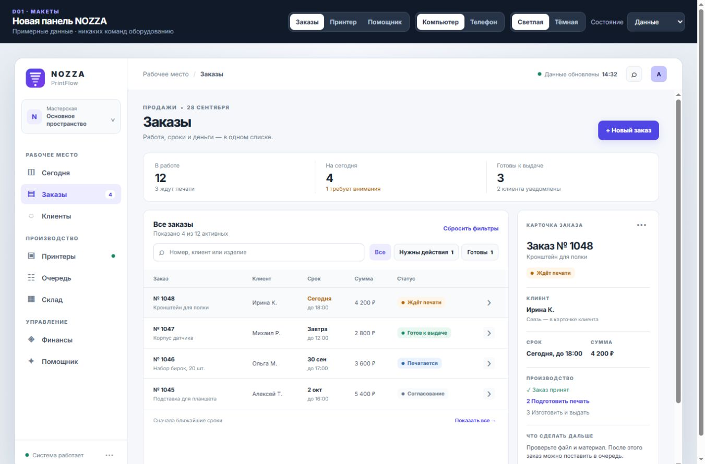

# D01 · Макеты новой панели NOZZA

**Статус:** интерактивный прототип передан на просмотр; визуальное направление ожидает решения владельца продукта. Рабочая панель этим заданием не заменялась.

**Открыть прототип:** [NOZZA · D01](http://127.0.0.1:8765/prototypes/nozza-d01.html). В верхней панели можно выбрать экран, компьютер или телефон, светлую или тёмную тему, обычные данные, загрузку, пустое состояние и ошибку. Ссылку можно сохранить: выбранные параметры записываются в адрес.

## Шесть основных вариантов

| Экран | Компьютер | Телефон |
|---|---|---|
| Заказы | [Открыть](http://127.0.0.1:8765/prototypes/nozza-d01.html?screen=orders&device=desktop&theme=light&state=ready) | [Открыть](http://127.0.0.1:8765/prototypes/nozza-d01.html?screen=orders&device=mobile&theme=light&state=ready) |
| Принтеры | [Открыть](http://127.0.0.1:8765/prototypes/nozza-d01.html?screen=printer&device=desktop&theme=light&state=ready) | [Открыть](http://127.0.0.1:8765/prototypes/nozza-d01.html?screen=printer&device=mobile&theme=light&state=ready) |
| Помощник | [Открыть](http://127.0.0.1:8765/prototypes/nozza-d01.html?screen=assistant&device=desktop&theme=light&state=ready) | [Открыть](http://127.0.0.1:8765/prototypes/nozza-d01.html?screen=assistant&device=mobile&theme=light&state=ready) |

Тёмная тема доступна для всех шести вариантов. Для примера можно открыть [помощника на телефоне в тёмной теме](http://127.0.0.1:8765/prototypes/nozza-d01.html?screen=assistant&device=mobile&theme=dark&state=ready). Отдельные примеры состояний: [загрузка принтеров](http://127.0.0.1:8765/prototypes/nozza-d01.html?screen=printer&device=desktop&theme=light&state=loading), [пустой список заказов](http://127.0.0.1:8765/prototypes/nozza-d01.html?screen=orders&device=mobile&theme=light&state=empty), [ошибка помощника](http://127.0.0.1:8765/prototypes/nozza-d01.html?screen=assistant&device=mobile&theme=dark&state=error).

## Визуальное решение

- Основа — спокойные поверхности и один ведущий акцент на каждом экране. Светлая тема: фон `#F5F7FB`, тёмный текст, белые рабочие области. Тёмная: фон `#0C121B`, поверхности `#16212E`, светлый текст. Фирменный индиго сохранён. Использованы локальный Inter и существующий знак NOZZA.
- На компьютере главное меню слева, содержимое в центре, нужная подробность справа: карточка заказа, камера и телеметрия принтера, контекст помощника. На телефоне постоянная нижняя навигация, подробности заказа открываются поверх списка.
- В заказах первым виден срок и то, что требует действия. Поиск и фильтр остаются на месте при открытии карточки. Основная кнопка карточки зависит от этапа заказа.
- У принтера первыми видны задание, прогресс и доступные действия. Очередь рядом с текущей работой. Камера показывает отдельное состояние «Нет кадра»; работа принтера не выдается за работающую камеру. На свободном A1 не показаны время и параметры другой печати.
- Помощник отделяет ответ с источником от предложения выполнить команду. Перед опасным действием показана карточка проверки. Ошибка модели не маскируется ответом «как будто всё работает».
- Загрузка, пустой результат и ошибка имеют свой текст и следующий шаг. Они не подменяются бесконечным спиннером или полностью пустым экраном.

## Карта навигации

| Группа | Компьютер | Телефон |
|---|---|---|
| Рабочее место | Сегодня, Заказы, Клиенты | Сегодня и Заказы в нижней панели; Клиенты через «Ещё» |
| Производство | Принтеры, Очередь, Склад | Принтеры в нижней панели; Очередь и Склад через «Ещё» |
| Управление | Финансы | Через «Ещё» |
| Помощник | Постоянный пункт боковой панели | Постоянный пункт нижней панели |
| Система | Диагностика из нижней части боковой панели | Настройки через «Ещё» |

Прототип подробно рисует три согласуемых экрана. Остальные пункты показывают место в навигации и объясняют, что их рабочие экраны переносятся следующими задачами. Полная карта разделов и старых маршрутов остаётся в разделе 3.2 [основного плана](ПЛАН-ОБНОВЛЕНИЯ-ДИЗАЙНА-И-АССИСТЕНТА.md).

## Пять сценариев просмотра

1. **Срочный заказ:** открыть «Заказы» → «Нужны действия» → заказ № 1048 → увидеть срок, текущий этап и кнопку подготовки печати.
2. **Выдача заказа:** выбрать «Готовы» → заказ № 1047 → увидеть этап «Оформить выдачу». При возврате фильтр остаётся выбранным.
3. **Контроль печати:** открыть «Принтеры» → P1S → увидеть прогресс, очередь и отдельное сообщение о недоступной камере → нажать «Пауза» и увидеть подтверждение. В прототипе команда не отправляется.
4. **Свободное устройство:** переключиться на A1 → увидеть отсутствие задания, времени завершения и параметров печати; пауза и остановка недоступны.
5. **Помощник:** прочитать ответ о заказе № 1048 и время источника → открыть заказ → вернуться к помощнику → увидеть отдельное подтверждение предложения поставить P1S на паузу.

## Передача в разработку

- Файлы: `site/prototypes/nozza-d01.html`, `site/prototypes/nozza-d01.css`, `site/prototypes/nozza-d01.js`. Прототип изолирован от приложения и использует примерные данные; API, база, Bambu Studio и принтеры не вызываются. Кнопки, которые ещё не связаны с рабочими маршрутами, прямо показывают, что это макет.
- После решения по визуальному направлению D02 выделяет токены и состояния в общую систему, D03 переносит оболочку и навигацию, D04 — таблицы, фильтры, формы и подтверждения. Рабочие заказы, принтеры и помощник затем переносятся по V02, V03 и U01–U02.
- При переносе проверить контраст, размер основных сенсорных целей 44 × 44 px, клавиатуру и возврат фокуса после диалога, масштабы 200%, ширины 360/390/768/1366/1920 px и реальные состояния устаревшей телеметрии. Прототип задаёт направление, но не является результатом этих проверок.
- До внедрения новых действий помощника нужен отдельный согласованный контракт. Прототип не означает согласия на расширение полномочий помощника.
