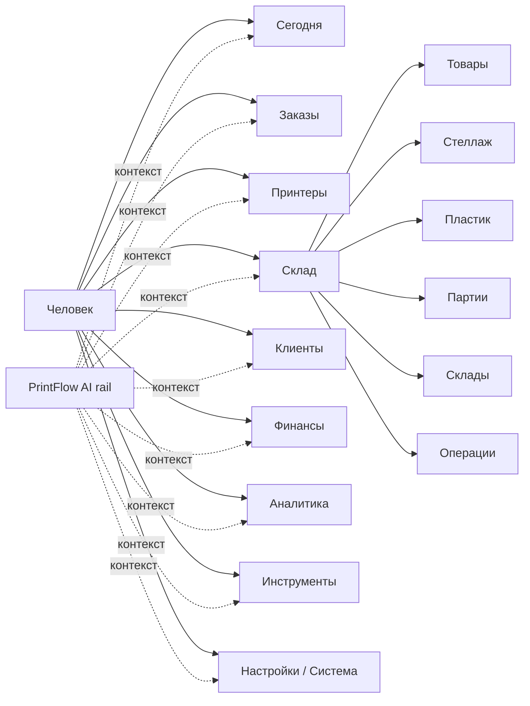
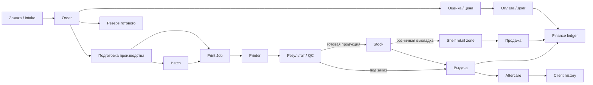
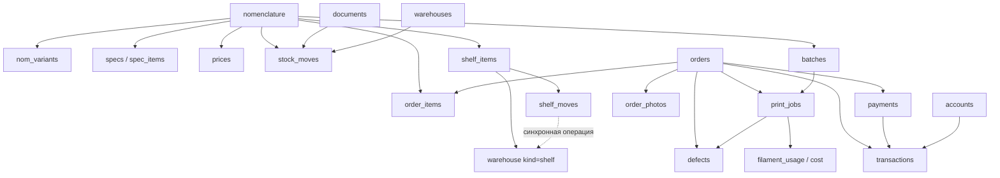
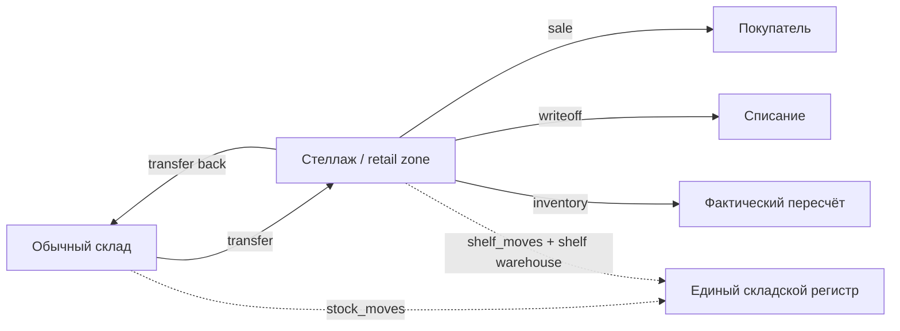
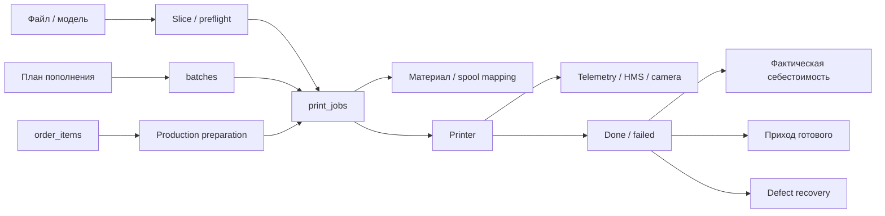
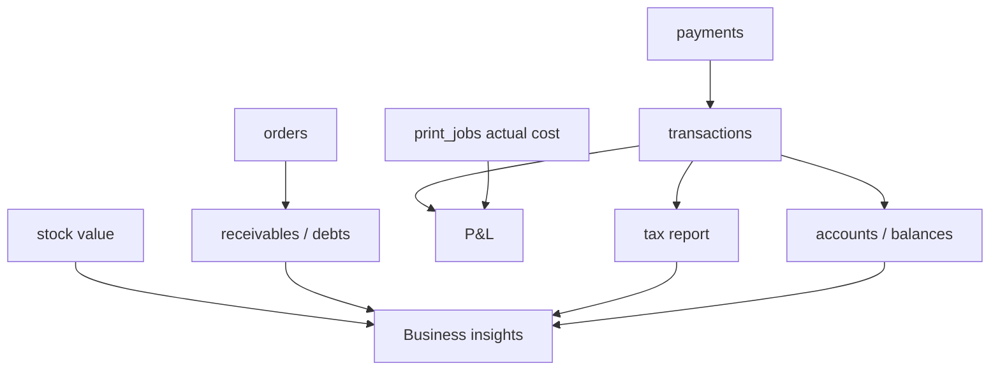
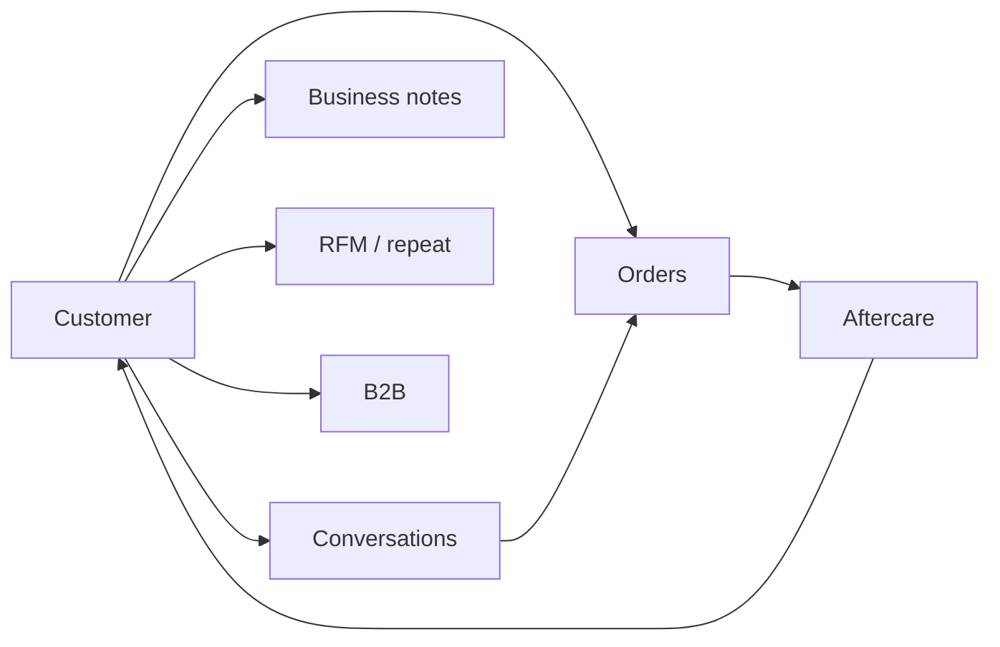
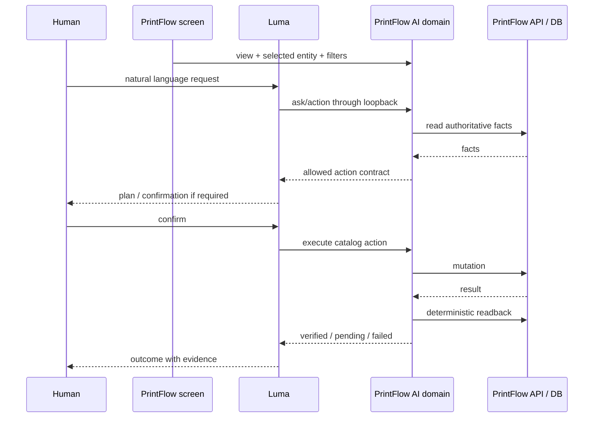

# PrintFlow 19 — function map

> Цель: одна карта, по которой можно понять, **что есть в PrintFlow, где живёт источник истины и как локальный AI взаимодействует с каждой функцией**.
>
> Этот документ описывает целевую структуру PrintFlow 19 поверх реально существующих доменов. Он не создаёт второй набор сущностей и не заменяет API/схему БД.

## 1. Экранная карта



### Первый уровень

| Раздел | Главный вопрос человека | Основные действия |
| --- | --- | --- |
| Сегодня | Что происходит и что мне делать следующим? | открыть проблему, открыть заказ/станок, обсудить с AI |
| Заказы | Где находится каждый заказ в жизненном цикле? | создать, подготовить, сменить этап, выдать, разобрать долг |
| Принтеры | Что делает парк и нужен ли оператор? | pause/resume/stop, камера, AMS, очередь |
| Склад | Что есть, чего не хватает и что нужно произвести? | товар, перемещение, партия, инвентаризация |
| Клиенты | Кто покупал, что обещали и кому нужно написать? | карточка клиента, история, aftercare, B2B |
| Финансы | Сколько денег есть, сколько должны и что надо оплатить? | платёж, проводка, дебиторка, налог, отчёт |
| Аналитика | Где теряются деньги/время и что изменилось? | drill-down к заказу, товару, принтеру |
| Инструменты | Что нужно напечатать/сгенерировать для работы? | ценники, этикетки, формы, QR, материалы |
| Настройки / Система | Всё ли подключено и правильно настроено? | устройства, интеграции, backup, update, diagnostics |

## 2. Главный бизнес-поток



Правило v19: экран может показывать удобное представление этого потока, но **не создаёт новую бизнес-сущность**, если нужная уже существует.

## 3. Источники истины



### Канонические сущности

- **Товар:** `nomenclature`.
- **Вариация:** `nom_variants`.
- **Цена:** `prices`; старый `catalog.price` — совместимое зеркало.
- **Состав заказа:** `order_items`.
- **Заказ:** `orders`.
- **Задание печати:** `print_jobs`.
- **Серийное производство:** `batches`, связанное с `print_jobs.batch_id`.
- **Остаток обычного склада:** сумма `stock_moves`.
- **Стеллаж:** `shelf_items + shelf_moves`, синхронизированный с отдельной warehouse-zone `kind='shelf'`.
- **Оплата:** `payments`.
- **Финансовый факт:** `transactions`.
- **Клиент:** `customers`.

### Legacy, который нельзя снова делать источником

- `catalog` — зеркало/совместимость вокруг `nomenclature`.
- `orders.product` — краткое отображение; состав заказа живёт в `order_items`.
- `shelf_items.qty` — быстрый снимок retail-регистра; изменяется только журналируемой операцией.
- `orders.paid/prepaid` — совместимость; факт оплаты живёт в `payments`.

## 4. Склад и Стеллаж

Стеллаж **не является ещё одним названием общего склада**.



Инварианты:

1. Остаток существующей позиции Стеллажа нельзя править карточкой.
2. Любое изменение количества имеет движение.
3. Со склада на Стеллаж и обратно — атомарные переносы.
4. Архивирование не уничтожает историю и запрещено при ненулевом остатке.
5. Продажи считаются по фактической цене строки продажи, а не по сегодняшней цене карточки.
6. Резервированный остаток нельзя незаметно унести со Стеллажа.

## 5. Производство



Первый уровень UI: текущая печать, прогресс, оставшееся время, проблема и безопасное действие. Камера, AMS, файлы, ТО и журнал — детали выбранного принтера.

## 6. Финансы



Первый уровень финансов v19:

- **Доступно сейчас** — счета/кассы.
- **К получению** — дебиторка.
- **Просрочено** — дебиторка старше порога.
- **К уплате** — налоги/взносы.
- **Результат бизнеса** — прибыль и маржа.
- **Требует решения** — финансовые исключения.

Банк, СБП, кассы, импорт, налоговый реестр и закрытие месяца остаются источниками/операциями внутри Финансов, а не отдельными концепциями верхнего уровня.

## 7. Клиенты



Карточка клиента должна собирать историю, а не дублировать заказ: покупки, долги, разговоры, обратную связь и поводы вернуться.

## 8. Luma → PrintFlow AI

PrintFlow AI — **доменный интерфейс внутри панели**. Оркестрация остаётся у Luma.



### Action contract v19

Каждое доступное Luma действие PrintFlow содержит:

- `domain`
- `risk`
- `reversible`
- `verification`
- `confirm`
- server-owned `method/path/params`

Luma не строит произвольный PrintFlow URL. Разрешён только action из server catalog.

### Текущие домены action catalog

- `production`
- `orders`
- `customers`
- `finance`
- `analytics`
- `inventory`
- `retail`
- `system`
- `global`

## 9. Контекст AI

UI-context эфемерный и не является памятью:

```
view
sub
entity_type
entity_id
filters
dirty
updated_at
```

Примеры:

- экран Printers + `printer:p1s` → «поставь его на паузу»;
- экран Order + `order:ord_123` → «выдай его в долг»;
- экран Shelf + `shelf_item:shf_42` → «верни две штуки на склад».

При смене экрана выбранная сущность сбрасывается. Контекст не пишется в SQLite memory.

## 10. Что должно остаться вторичным

Эти функции важны, но не должны конкурировать с ежедневной работой в основной навигации:

- банковский импорт;
- отдельная страница СБП;
- мобильная касса;
- ценники / labels / marketing generators;
- TV / wall / kiosk;
- диагностические журналы;
- техническая warehouse turnover table;
- AMS engineering controls;
- обновления / backup;
- экспериментальные niche tools.

Они доступны из соответствующего домена или «Инструменты / Настройки».

## 11. Запрещённые архитектурные возвраты

При развитии v19 не делать:

1. второй каталог товаров рядом с `nomenclature`;
2. второй остаток рядом с журналом движений;
3. ручное изменение stock quantity без документа/операции;
4. отдельный AI brain для PrintFlow, конкурирующий с Luma;
5. action AI, который обходит server catalog;
6. «успешно» после физической команды без readback/verified state;
7. отдельные верхнеуровневые экраны для каждого способа оплаты;
8. удаление исторических бизнес-сущностей там, где нужен архив.

## 12. Приоритет завершения PrintFlow 19

```mermaid
flowchart LR
    P0[Data integrity] --> AI[Action contracts]
    AI --> CTX[Screen context]
    CTX --> VERIFY[Action verification]
    VERIFY --> SHELL[Independent shell]
    SHELL --> TODAY[Today]
    TODAY --> PRN[Printers]
    PRN --> FIN[Finance]
    FIN --> ORD[Orders]
    ORD --> STOCK[Stock + Shelf]
    STOCK --> CRM[Clients]
    CRM --> ANALYTICS[Analytics]
    ANALYTICS --> TOOLS[Tools / Settings]
    TOOLS --> CLEANUP[Remove / merge legacy UI]
```



На каждом шаге: сохранить существующий backend contract, добавить regression test, только затем убирать legacy UI.
