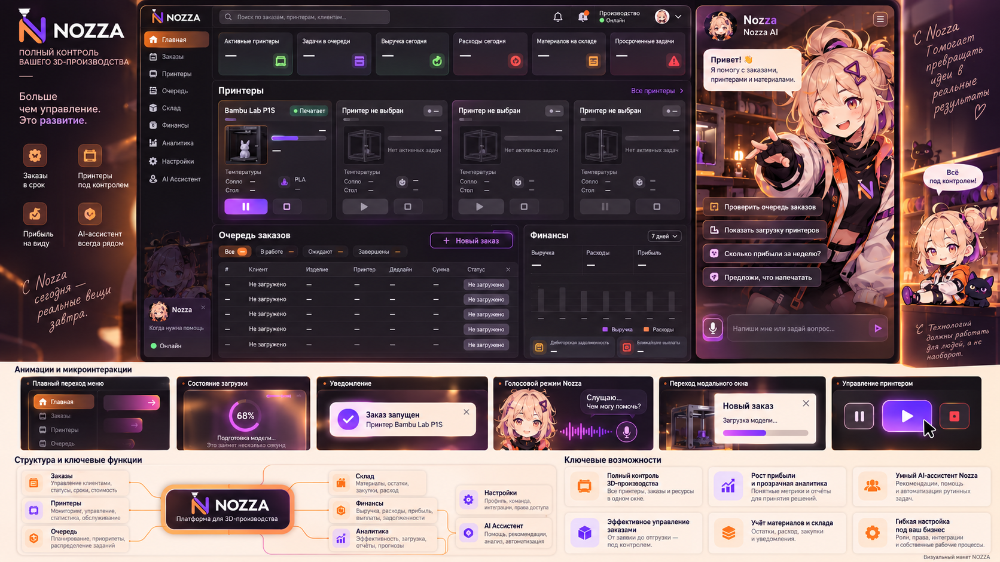
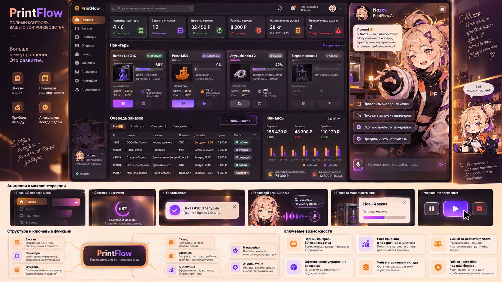
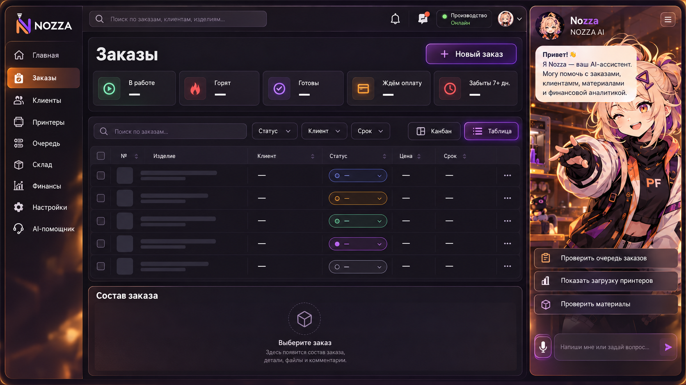
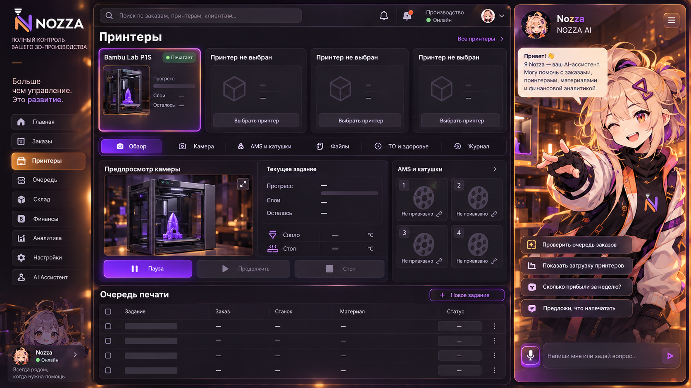
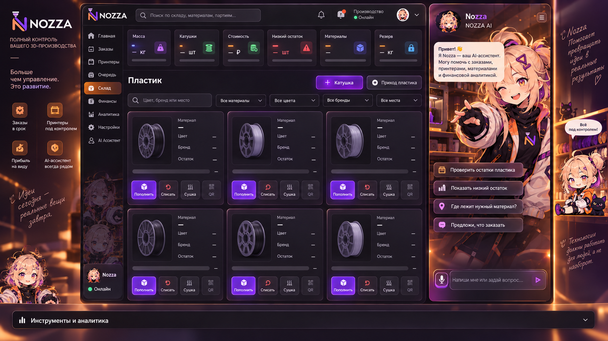
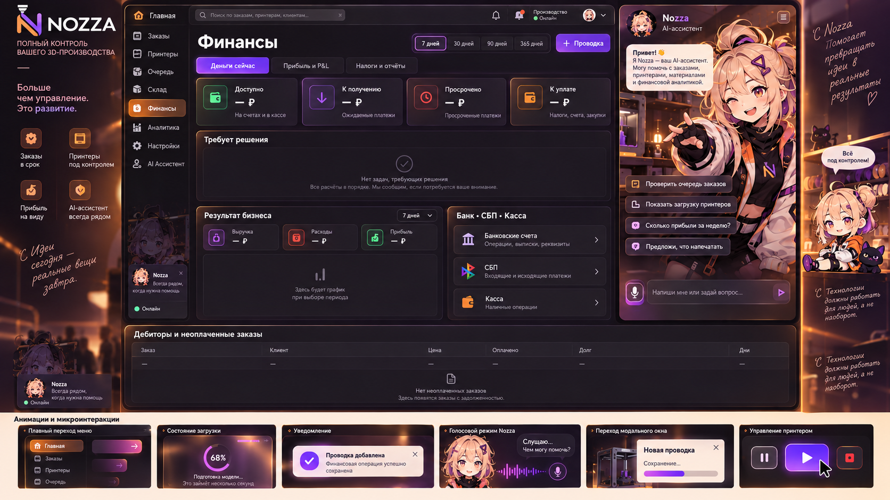
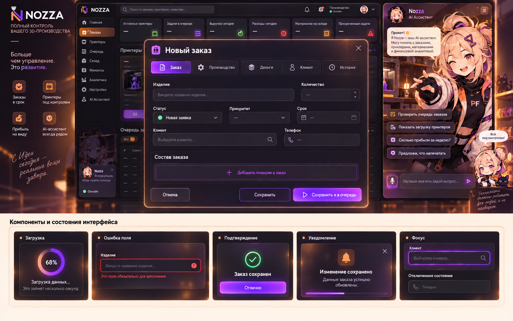
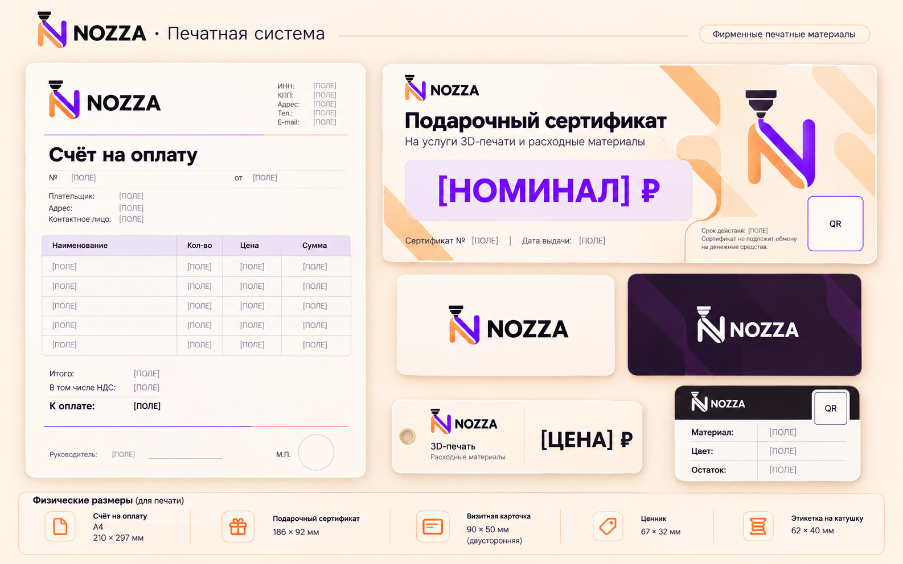

# Дизайн панели NOZZA

Версия2 ·03.10.2026 ·приоритет визуального соответствия исходному референсу.

## 01 Дизайн панели NOZZA

Иллюстрированное задание для дизайнера и frontend-разработчика. Версия 2 от 3 октября 2026.

Главное решение: воспроизвести визуальное оформление предоставленного референса максимально точно. Сохраняются плотная композиция, тёмные стеклянные карточки, тёплая подсветка, фиолетовые градиенты и большая правая панель с персонажем. Компания называется NOZZA; логотип выбран пользователем.

Документ задаёт внешний вид, структуру, состояния, правила взаимодействия и печати. Он не подтверждает работоспособность модели, станков, платежей или новых операций. Действующее приложение и реальные данные в этой задаче не изменяются.

Основная платформа: desktop. Адаптивность за пределами наблюдавшихся размеров описана как предложение. Полные графические референсы приложены отдельными PNG, чтобы их можно было рассматривать в исходном разрешении.

## 02 Как пользоваться документом

Сначала сопоставьте макет с эталоном на странице 3, затем примените геометрию, токены и правила соответствующего экрана. Визуальные изображения показывают художественное направление. Тексты, маршруты, статусы и ограничения в этом документе являются спецификацией; случайные надписи и детали генерации не являются новым функциональным требованием.

| Страницы | Содержание |
| --- | --- |
| 3-6 | Эталон, композиция, палитра и компоненты |
| 7-18 | Главная, заказы, принтеры, склад, финансы и форма заказа |
| 19-23 | Помощник, настройки, клиенты, инструменты и отдельные страницы |
| 24-26 | Адаптивность, интерактивность, доступность и анимации |
| 27-29 | Печатная система и форматы |
| 30 | Проверка реализации и открытые вопросы |

Факт: структура и ограничения взяты из просмотра работающей установки и чтения генераторов. Предложение: новая визуальная система, сетка и правила будущей верстки. Неизвестно: состояния и операции, которые не воспроизводились на реальных данных.

Источники: локальная панель http://localhost:8765/; прикреплённый визуальный референс; выбранный Nozza5.png; сохранённые снимки разделов и прочитанные исходники. Localhost - адрес компьютера с установкой, а не публичная ссылка для подрядчика.

В комплект включены: этот PDF, редактируемый DESIGN-DOCUMENT.md, семь PNG-концепций, исходный референс, выбранный логотип, предыдущая подробная опись функций и спецификация печатных форм с координатами. Предыдущие предложения о сдержанном оформлении и уменьшении иллюстрации заменены требованиями версии 2.

## 03 Эталон визуального оформления

- Сохранить три зоны: узкая навигация, плотный рабочий центр, широкая правая панель Nozza с большим персонажем и мастерской на фоне.
- Сохранить шесть компактных KPI в ряд, четыре места карточек принтеров в демонстрационном эталоне, нижнюю таблицу заказов слева и финансовую карточку справа. Реальный парк выводится по фактическому составу.
- Сохранить оранжевую рамку и подсветку границ, полупрозрачные тёмные поверхности, фиолетовую подсветку кнопок, цветные статусные капсулы и светлую кремовую систему примеров компонентов.
- Заменить брендинг на выбранный NOZZA. Тексты и операционные значения брать из системы; не переносить вымышленные имена, станки, доходы и сроки из картинки.

Верхний центральный интерфейс является эталоном приложения. Внешние рекламные поля и нижняя полоса остаются частью презентационного листа. Они показывают атмосферу и компоненты; основная рабочая панель воспроизводит центральный интерфейс.

## 04 Геометрия центральной панели

Система координат эталона: исходный PNG 1672×941 px, начало сверху слева. Значения ниже измерены по видимым границам с оценочной точностью ±3 px. Граница свечения мягкая, поэтому она не считается краем блока. Эти координаты позволяют сравнить композицию без повторного исследования изображения.

| Зона | x y | w h |
| --- | --- | --- |
| Верхняя панель приложения | 229 / 0 | 1277 / 609 |
| Левое меню внутри приложения | 235 / 8 | 117 / 590 |
| Верхняя строка центра | 353 / 10 | 802 / 39 |
| Рабочее содержимое центра | 359 / 55 | 787 / 543 |
| Ряд KPI | 365 / 54 | 781 / 72 |
| Блок принтеров | 357 / 136 | 798 / 234 |
| Первая карточка принтера | 365 / 168 | 189 / 200 |
| Таблица заказов | 355 / 378 | 513 / 223 |
| Карточка финансов | 877 / 379 | 277 / 221 |
| Правая панель помощника | 1165 / 9 | 332 / 591 |

Для базового рабочего кадра шириной 1440 px масштаб k=1440/1277=1.12764. Координаты приложения считать x′=(x-229)×k, y′=y×k. При высоте около 687 px получается та же композиция. На более высоком окне фон и панели продолжаются вниз; не растягивать персонажа, иконки и буквы по разным осям.

Номинальные desktop-зоны: меню 140 px, центр 910 px, помощник 374 px, разделительные отступы 16 px суммарно. Поле рабочего центра 12 px, gap карточек 8 px, нижняя сетка примерно 65:35. Точные границы при визуальной сверке уточнять по исходному PNG, не по сгенерированному тексту.

## 05 Цвета поверхности и эффекты

Точные цвета исходного дизайна без исходного макета неизвестны. Пять контрольных пикселей прочитаны из PNG; остальные значения - нормативные предложения для повторения его внешнего вида. Градиенты, иллюстрация и альфа-смешение не описываются одним HEX.

| Токен | Значение | Применение |
| --- | --- | --- |
| canvas | #1D161F | Измерение точки 700/140 |
| sidebar | #18131B | Измерение 300/360 |
| surface | #2C232E | Измерение 650/300 |
| header | #231C26 | Измерение 850/28 |
| cream | #FDE4D2 | Измерение 900/790 |
| text / muted | #F8EEE6 / #BFAFB7 | Основной / вторичный текст |
| outline | #5B465C | Тонкая граница тёмной карточки |
| violet | #B52BFF → #8638ED | Primary-gradient135° |
| peach | #F0A368 → #84554A | Выбранная навигация |
| ok / danger | #B7E5CC / #FF929F | Статус + текст |

Карточка: gradient145° #302832→#211B25, border1 px #5B465C, radius10 px, внутренний свет 0 1px 0 rgba(255,238,231,.08). Primary: gradient135° #B52BFF→#8638ED, border1 px #CE8BFF, тень 0 0 18px rgba(164,62,246,.38). Hover усиливает край, а не меняет размер.

Внешняя рамка:1 px #B47B53 и свечение 0 0 28px rgba(237,149,76,.32). Стекло допустимо на шапке и панели помощника; таблица сохраняет достаточно непрозрачную основу для текста. Иллюстрация помощника остаётся яркой, поверх неё текст только на отдельной подложке.

## 06 Типографика и размеры компонентов

Рекомендуемый шрифт Inter с локальной кириллицей, коды JetBrains Mono. Форму слова NOZZA брать из выбранного логотипа. Исходный растр уменьшает интерфейс; целевые размеры ниже заданы для рабочего кадра 1440 px. Они не являются измерением кегля на картинке.

| Элемент | Размер | Оформление |
| --- | --- | --- |
| H1 страницы | 22 / 28 px,700 | Компактный заголовок |
| H2 блока | 16 / 22 px,650 | Как в карточках референса |
| Текст и поля | 13 / 18 px,400-500 | В плотных таблицах минимум 12 |
| KPI | 23 / 28 px,700 | Название 12 / 16 |
| Подпись | 11 / 16 px,400 | Не уменьшать условия и ошибки |
| Кнопка | 36 px; compact30 | Radius8; primary-gradient |
| Input / select | 36 px | Label над полем, border1 |
| Навигация | 34 px | Gap4, padding8, radius8 |
| Строка таблицы | 36-44 px | Зависит от количества строк |
| Chip / progress | 22 px / 6 px | Капсула / фиолетовый track |
| Dialog | max1040 px | Radius14, body scroll |
| Focus | 2 px #D5AAFF | Offset2, не перекрывать |

Spacing:4,8,12,16,20,24,32 px. Основной gap8, padding карточки 12, расстояние между секциями 12. На малой ширине увеличить области нажатия до 44 px. В каждой группе одна основная кнопка; команда Стоп отдельная. Статус, hover, focus и disabled не должны выглядеть одинаково.

Иконки: существующий линейный набор,16-18 px, stroke1.5-1.75. Ключевые операции подписаны. Графики используют оранжевый для поступлений и фиолетовый для расходов, с легендой и доступными текстовыми значениями.

## 07 Главная графический макет

Рабочая композиция повторяет референс: шесть KPI сверху, принтеры в центре, очередь заказов и финансы снизу, Nozza справа. Исходные изображения станков являются иллюстрациями. В реальной системе количество карточек определяется парком, а не наличием четырёх мест на презентационной картинке.

| Сохранить визуально | Сохранить функционально |
| --- | --- |
| Градиенты и свечение primary | Подтверждения физического управления |
| Два нижних блока 65:35 | Связи заказов, оплат, заданий и материалов |
| Большой персонаж справа | Честный статус модели и доступности голоса |

Полный файл: concepts/01-master.png. Макет не является снимком действующей панели. Для pixel-сверки использовать исходный reference и рамки страницы 4.

## 08 Главная правила реализации

| Блок | Порядок и данные |
| --- | --- |
| Шапка | NOZZA в меню, поиск, уведомления, состояние связи. На узкой ширине поиск раскрывается кнопкой. |
| KPI | Основной оперативный ряд сохраняет существующие данные: печать, очередь, заказы, результат; дополнительные метрики складываются в согласованный набор шести карточек. Для неизвестного источника не вычислять значение из референса. |
| Принтеры | Название станка, задача, прогресс, слой, остаток времени, температура факт/цель, материал/AMS, связь с заказом. Один P1S в просмотренном парке не становится четырьмя моделями. |
| Заказы | Таблица №/Изделие/Клиент/Статус/Цена/Срок. Строка открывает заказ. Поиск и быстрые виды ведут к фактической выборке. |
| Финансы | Сумма, валюта, период, источник расчёта. Баланс, выручка, поступления и прибыль не взаимозаменяемы. |
| Брифинг и аналитика | Существующий брифинг и дополнительные виджеты доступны ниже обзорных блоков или в раскрываемой зоне. Они не исчезают из приложения. |

Основная безопасная операция - открыть сущность и увидеть причину риска. Пауза/Продолжить определяются фактическим состоянием станка; Стоп требует существующего подтверждения. Фильтр периода меняет все связанные показатели, а не только подпись.

Нет печати: сохранить высоту карточки, показать свободный парк и переход в очередь. Нет камеры: отдельно сообщить об отказе камеры, оставив телеметрию. Нет модели: помощник сохраняет иллюстрацию и историю, но не показывает готовность отвечать. Во время загрузки KPI имеют skeleton; после пустой выборки - явный текст, не вечный skeleton.

## 09 Заказы графический макет

Меняется центральное содержимое. Боковая навигация, поиск, тёплая рамка и крупная панель помощника сохраняются. Таблица и канбан являются двумя представлениями одной выборки; оформление не создаёт отдельного источника заказов.

Приоритет информации: номер и изделие, клиент, срок и риск, оплачено/долг, статус. Сначала показываются быстрые виды и фильтры, затем список. Подробный состав открывается в заказе. Пустые строки на концепции показывают геометрию загрузки, а не реальные записи.

Полный файл: concepts/02-orders.png. Размеры и состояния таблицы заданы на следующей странице.

## 10 Заказы таблица и канбан

| Элемент | Спецификация |
| --- | --- |
| Виды | В работе / Горят / Готовы / Ждём оплату / Забыты 7+дн. Избранный вид выделен peach-outline; счётчик из той же выборки. |
| Поиск и фильтры | Поиск по заказам; статус, ниша, архив, сохранённый вид, сортировка по новизне/сроку/долгу/забытым. Активные фильтры видны и сбрасываются. |
| Таблица | №64 / Изделие min160 flex / Клиент min120 / Статус 116 / Цена 96 / Срок 112 px. В центральной зоне локальный scroll при нехватке ширины; не сжимать суммы до нечитаемых. |
| Канбан | Колонка 240-280 px; название + количество, карточка номер→изделие→клиент→срок→оплата. Горизонтально прокручивается доска, не вся страница. |
| Статусы | Новая заявка, Расчёт, Ждём предоплату, Очередь, Печать, Постобработка, Готов, Выдан, На складе. Цвет - дополнительный признак. |
| Ограничения | Выдан и На складе не достигаются обычным drag-drop. Сохраняются предусмотренные системой операции и серверные проверки. |

Новый заказ открывает форму, не записывает данные. Открытие строки не проводит оплату и не запускает печать. Разрешённое изменение статуса имеет альтернативу клавиатурой. Сумма и долг подписаны отдельно; отсутствие срока обозначено словами.

Пусто: «Заказов пока нет» и Новый заказ. Фильтр ничего не нашёл: «Нет заказов по выбранным условиям» и сброс. Ошибка запроса: причина и повтор; сохранённый ввод не пропадает. Неизвестный исход записи: проверить текущее состояние перед повтором.

## 11 Принтеры графический макет

Камера, задача, температуры и AMS сгруппированы вокруг выбранного принтера. В крупных карточках используется тот же тёмный материал, фиолетовые шкалы и компактные управляющие кнопки. Изображение камеры в концепции - иллюстрация, не доказательство живого потока.

Функциональные вкладки сохранить по текущей системе: Обзор, Камера, AMS и катушки, Файлы, ТО и здоровье, Журнал. Очередь остаётся самостоятельным разделом. Если генерация подписи отступает от этих названий, программист использует этот список.

Полный файл: concepts/03-printers.png. При неизвестном состоянии физические команды недоступны с объяснением.

## 12 Принтеры и очередь правила

| Поверхность | Состав и действия |
| --- | --- |
| Парк | Карточки по фактическому числу принтеров. Выбор сохраняет название станка во вкладках и подтверждениях. Добавление принтера отдельно. |
| Обзор | Текущая задача, связанный заказ, фактический прогресс и слои, оставшееся время, температура факт/цель, готовность к старту, предупреждения. |
| AMS | Номера слотов, материал, цвет словом и образцом, остаток, складская привязка. «Не привязано» и «Мало пластика» различимы. |
| Камера и журнал | Ошибки камеры отделены от состояния задания. Журнал сохраняет время и источник. Устаревшие данные имеют отметку времени. |
| Очередь | Всего / Печатаются / Ожидают / Без принтера; поиск; Задания/Журнал; группировка по станкам. Задача показывает материал, приоритет, срок и причину блокировки. |
| Команды | Автозапуск - режим с последствиями. Запустить следующее - отдельная операция. UI показывает принятие команды, выполнение и подтверждённый результат раздельно. |

В просмотре очереди счётчик и видимый список не позволяли уверенно установить состав. Это не основание рисовать пустую очередь. Нужен тестовый пример с неназначенным станком, дефицитом материала и задачей в печати.

Камера на desktop занимает до двух третей центра; управление и температура справа. Текстовый список остаётся доступным при отказе графиков и потока. У Стоп собственная danger-outline; он не находится вплотную к Свет/Обновить.

## 13 Склад графический макет

Поднавигация сохраняет шесть разделов: Товары, Стеллаж, Пластик, Партии, Склады, Операции. Во всех них шапка, KPI, фильтры и карточки выглядят как элементы исходного референса. Оперативные данные важнее декоративного фона.

Масса, количество готовых изделий и резерв имеют разные единицы. У катушки сначала видны материал, цвет и граммы, затем стоимость и место. Иллюстративный spool на макете не означает наличие реальной катушки.

Полный файл: concepts/04-stock.png. Дополнительные действия открываются в карточке или меню без скрытого изменения остатка.

## 14 Все складские разделы

| Раздел | Порядок блоков и ограничения |
| --- | --- |
| Товары #products | KPI→поиск/артикул/штрихкод→склад/группа/вид/статус→плитки/таблица. Название, цена, себестоимость, свободно/резерв. План пополнения и сезонная витрина сохраняются. |
| Стеллаж #shelf | Все/Мало/Нет/Пополнить/Мёртвый сток→недельный обзор→карточки. Код 1 С, количество, цена, маржа, продажи и дни запаса. Ценник/Промостенд/На склад/−1/+ - разные действия. |
| Пластик #inventory | KPI→поиск→материал/место/низкий остаток→катушки→инструменты. Приход, Пополнить, Списать, Обрезки, Сушка, QR, Изменить. Остаток 0 и неизвестный остаток разные. |
| Партии #batches | KPI→Все/План/В печати/Частично/Готовы→список→детали. Собрать по плану не означает физически запустить станок. Частичный брак и приёмка остаются отдельными значениями. |
| Склады #warehouses | Карточки складов→ОСВ со складом и периодом→потери→резервы. Сохраняются начальные/конечные количества и суммы, приход и расход. Локальная прокрутка таблицы. |
| Операции #documents | Вид/статус→Номер/Вид/Дата/Склад/Строк/Количество/Сумма/Статус. Приход, продажа, перемещение, списание, инвентаризация, производство, возврат, установка цен. Открытие не проводит документ. |

Для карточек 3 колонки при достаточной ширине центра, 2 при узком центре, 1 на mobile. Минимальная читаемая ширина 260 px. Ведомости и финансовые документы сохраняют таблицу. Поиск без результатов предлагает сброс, ошибка источника не подменяется пустым складом.

## 15 Финансы графический макет

Вкладки соответствуют действующему интерфейсу: Деньги сейчас, Прибыль и P&L, Налоги и отчёты. Доступно, К получению, Просрочено, К уплате отражают существующую последовательность. Банк, СБП и касса доступны как отдельные рабочие поверхности.

Суммы в концепции являются пустыми полями. Оранжевые и фиолетовые графики появляются только при данных с понятным периодом. Положительная сумма сама по себе не является успехом или прибылью.

Полный файл: concepts/05-finance.png. Точные налоговые формулы и значения не определяются дизайном.

## 16 Финансы данные и ограничения

| Блок | Правило |
| --- | --- |
| Деньги сейчас | Доступно→К получению→Просрочено→К уплате→Требует решения→Результат бизнеса→Банк/СБП/касса→Дебиторка→источники учёта. |
| Период | 7/30/90/365, фактические даты. Обновление меняет все зависящие показатели. Нельзя смешивать месяц и период без подписи. |
| Дебиторка | Заказ, клиент, цена, оплачено, долг, дни. Деньги с валютой и правым выравниванием; номер ведёт к заказу. |
| Прибыль и P&L | Месяц, доход, комиссии, переменные, постоянные, налоги, прибыль, маржа. Сохранять определения и источники учёта; неизвестный показатель - не 0. |
| Налоги и отчёты | Существующие режимы и расчёты системы. Дизайнер не добавляет новую налоговую формулу, обязательство или реквизит. Полный функциональный просмотр этой вкладки не выполнен. |
| Проводка и платежи | Ввод→проверка→подтверждение→состояние операции→проверенный результат. Ошибка/неизвестный исход не является подтверждённым платежом. |

Баланс может быть отрицательным. Показать пояснение и переход к источнику, не скрывать минус. Прекращение загрузки при сетевом отказе не превращает задолженность в 0. При импорте выписки сначала предпросмотр, затем существующая операция записи.

Внешний банк/СБП и права доступа сохраняются. Никаких автоматических подтверждений по цвету карточки или успешной анимации. Дизайн сообщения указывает конкретную операцию и её итог после фактического ответа.

## 17 Карточка заказа графический макет

Пять вкладок и закреплённые итоги сохраняют существующую структуру формы. Большая иллюстрация остаётся частью фонового приложения; модальное окно имеет непрозрачную подложку и не теряет читаемость.

Нижняя светлая полоса показывает образцы компонентов, а не реальные выполненные действия. Сообщение об успехе на ней является иллюстрацией будущего состояния.

Полный файл: concepts/06-order-dialog.png. Для реализации использовать тексты и состояния следующей страницы.

## 18 Форма заказа и компоненты

| Вкладка | Поля и порядок |
| --- | --- |
| Заказ | Изделие/работа; готовый товар; категория; резерв; статус; приоритет; ниша; канал; количество; срок; подарок; клиент и контакты; состав с количеством/ценой/весом/временем; явный override итогов. |
| Производство | Материал/цвет, катушки и расход по цветам, граммы, часы, ручная работа, файл/загрузка, качество, упаковка, заметки, чек-лист качества. |
| Деньги | Цена, себестоимость, получено по журналу только для чтения; автоматический/ручной учёт себестоимости. Полученную оплату нельзя произвольно редактировать. |
| Клиент | История сохранённого клиента; новая форма не выдумывает историю. Отдельный переход к карточке клиента. |
| История | Движение сохранённого заказа. Пустой новый заказ: история после сохранения. Время и тип изменения видны. |

Dialog max1040 px, max-height90vh; padding16, две колонки, gap12, состав на всю ширину. Итоги/вкладки закреплены сверху, Отмена/Сохранить/Сохранить и в очередь снизу. Тело формы прокручивается. Последняя кнопка не означает запуск станка.

Label остаётся над полем; единицы вне placeholder. Ошибка под полем, aria-describedby, первая ошибка получает фокус. Закрытие изменённой формы предупреждает о несохранённом. Во время записи кнопка защищена от повторного нажатия; при ошибке ввод сохраняется.

Модальное подтверждение: заголовок операции, сущность, последствия, Отмена и точная команда. Уведомление: конкретный итог после ответа; ошибка не исчезает до чтения. Пагинация и сортировка работают в текущем фильтре и не сбрасывают выбор неожиданно.

## 19 Помощник логотип и настройки

Выбранный знак: сопло над N с оранжево-фиолетовой лентой и надписью NOZZA. Источник Nozza5.png сохранён без изменений. Цветная версия для светлой поверхности; для тёмной будущий SVG имеет белую надпись и сопло, N остаётся цветной. Монохромная версия нужна для термо и одноцветной печати.

Правая панель шириной около 374 px в базовом кадре 1440. Крупный персонаж и мастерская сохраняются как в референсе. Header со статусом, приветственная карточка, быстрые запросы, поле сообщения и голосовые элементы располагаются поверх отдельных тёмных/кремовых подложек. Персонаж не перекрывает кнопки и текст.

| Состояние | Оформление и действие |
| --- | --- |
| Готова модель | Доступный ввод, история, отправка; быстрый запрос заполняет/отправляет по существующему поведению. |
| Нет модели | Та же иллюстрация; явный статус и причина, disabled отправка. Загруженная история не означает доступность модели. |
| Предложение действия | План и требуемое подтверждение отдельно от выполняемой операции. Выполнение и проверенный результат раздельны. |
| Голос недоступен | Неактивный микрофон с причиной. Наличие микрофона в макете не создаёт голосовой backend. |

Настройки: поиск→существующие группы Принтеры/Цех/Склад/Цены/Бизнес/Касса/Система/Все→параметры→Сохранить. Label, пояснение и состояние изменения; секреты маскированы. Сброс поясняет область. Режимы autostart не объединять с обычными визуальными настройками.

Для 1:1-версии помощник постоянно виден на широком desktop. Закрытие панели доступно как режим приложения, но не является основанием убрать её с основного эталона. Подготовка точного SVG и отдельного персонажного ассета ещё требуется.

## 20 Клиенты и центр смены

| Страница | Порядок блоков и поведение |
| --- | --- |
| Клиенты #customers | Сводка→Все/Постоянные/Новые/Без контакта→поиск→Клиент/Связь/Заказов/Выручка/Последний заказ/Сегмент/Кабинет→После продажи→карта. Кабинет и Пожелания отдельны; карта без адресов даёт пояснение. |
| Клиентский контекст | История только сохранённого клиента. Копирование aftercare-текста не является отправкой сообщения; новые CRM-автоматизации не добавляются. |
| Центр смены #ops10 | Оборудование→план-факт/симуляция очереди→обращения→правила/проверки. Обращения/Правила в 2 столбца, план-факт на всю ширину. |
| Симуляция | Результат помечен предварительной проверкой. Dry-run не оформляется как выполненная печать или отправленное обращение. |
| Ниши #niches | Ниша→инструкция теста→KPI→карточки гипотез. Показы/обращения/заказы/повторы/выручка/прибыль/часы. Нет знаменателя - нет искусственного процента. |

Эти страницы используют ту же тёмную систему, таблицы и sidebar. Макет каждой строится из компонентов страницы 6: header→KPI→панель выбора→содержимое. Нет автономной страницы «Аналитика» только потому, что она нарисована в исходном референсе.

Для клиентов сохранять имя и контакт текстом, не заменять персональные сведения аватаром персонажа. Карта разворачивается при наличии адресов. Пустая карточка гипотезы сообщает «Гипотеза не описана» / «Данных ещё нет».

## 21 Конвейер и калькулятор

| Страница | Состав и ограничения |
| --- | --- |
| Конвейер #conveyor | Состояние→загрузка STL/3MF/G-code/библиотека→инженерия допусков→история→объяснение цикла. Выбор станка, тестовая очистка стола, обновление. Допуски и пустая платформа проверяются до запуска. |
| Конвейер действия | Тестовая очистка - физическая команда, отдельная danger-outline и подтверждение. Анимация движения не является телеметрией. Зона загрузки min160 px. |
| Калькулятор #calc | Пресет→плита: масса/часы/штуки/количество/прогрев→материал/качество→работа→подготовка→раскладка→себестоимость→цена/прибыль→минимальная партия→что если→окупаемость. |
| Калькулятор сетка | Ввод 60%, итог 40% центральной зоны; итог sticky при достаточной высоте. Расширенные сценарии раскрываются. На штуку, плиту и партию подписывать отдельно. |
| Калькулятор итог | Коэффициенты и формулы существующие. Нет результата - состояние расчёта, а не рекомендуемая бесплатная цена. Экспорт и создание заказа отдельные действия. |

Визуальный язык: компактные стеклянные карточки, фиолетовые primary, тёплая подсветка и правая Nozza. Центральная форма может вертикально прокручиваться; header и выбранный станок остаются в контексте.

Успешный физический цикл, загрузка файлов и подтверждённые расчёты в этом проходе не выполнялись. Спецификация их экранных состояний является предложением для проверки на тестовом контуре.

## 22 Бот библиотека и хабы

| Страница | Состав и поведение |
| --- | --- |
| Клиент-бот #clientbot | Состояние→inbox/сверка оплаты→заказы/отзывы/покупатели→диалоги/недоставленные→настройки/команды/шаблоны. Сохраняются каталог, уведомления, фото, FAQ, тихие часы, согласия и платежные поля. |
| Бот действия | Проверить токен, Сохранить, Отправить по согласию, Повторить все - разные операции. Токен маскирован. Доставка и подтверждение оплаты не определяются цветом сообщения. |
| Библиотека #library | Начать/Продать/Сделать стабильно→поиск→категории Все/Старт/Продажи/Цех/Система/Инструменты→карточки→статья. Чтение не выполняет пункты чек-листа. |
| Статья | Хлебные крошки→h1→оглавление→содержание→связанный рабочий раздел. Текст 16/26 px, длина строки до 75 знаков. |
| Страницы #pages | Поиск→Панель/Сотрудникам/Экраны/Покупателям/Печать→ссылки с назначением, адресом и требованием кода. QR - отдельная доступная кнопка. |
| Карта #system-map | Функциональные контуры и сквозной AI read→plan→act→verify. Ссылка не означает готовность интеграции; сохранить её назначение. |

Хабы используют 3/2/1 колонки карточек по ширине центра. Действия, меняющие данные или отправляющие сообщения, не запускаются при открытии карточки, категории или страницы. Пустые/ошибочные состояния соответствуют общей матрице страницы 25.

## 23 Отдельные страницы и терминалы

| Маршрут | Назначение и правила |
| --- | --- |
| /cashier | Логотип→Касса NOZZA→код→Войти. Форма 400 px, объяснение сети и ошибка под кодом. Рабочая касса после входа не изучена. |
| /sbp /bank | Платёж: заказ/сумма→ожидающие/последние. Выписка: CSV→Разнести→сверка→последние. Подтверждение/возврат/импорт отдельны, права и фактические операции сохраняются. |
| /m /pult /control | Камера/парк→задачи→выдача/дефицит→команды. Touch44-48 px. Текущая и прежняя задача имеют отдельные время/ID. «Снял деталь» - запись. |
| /tv | Камера→активная печать/слой/остаток/финиш→часы. Крупные цифры, без управляющих команд. |
| /order /shelf | Витрина/товар→наличие→заявка/корзина→контакт/цвет. Неизвестное разрешение заказа отсутствующего товара не задавать из макета. |
| /track /my | Защищённая ссылка/код→объяснение→проверка/кабинет. Не заменять доступ номером или телефоном. Заполненный кабинет не исследован. |
| /spool | Катушка→станок→AMS→тип/цвет→привязка. Без id объяснение и disabled. Успешное взвешивание не проверено. |
| /labels /price-tags | Выбор данных→размер/макет→предпросмотр→печать. Размеры в мм, QR/Code128 без градиентных модулей. |
| /design | Форма→текст→ширина/высота→предпросмотр→STL. Реально конструктор номерка/диска/QR-основания; не превращать в вымышленную заявку. |

Терминалы используют NOZZA и ту же палитру, но не обязаны постоянно показывать большой чат: /tv - экран просмотра, /cashier - вход, клиентские страницы - задача покупателя. Это функциональные исключения из desktop-панели.

## 24 Адаптивность и масштаб

Наблюдение предыдущего прохода: при 1440 px меню присутствует, при 1024 скрыто, при 390 используется одна колонка и нижняя навигация. Эти три точки не доказывают точные breakpoints. Для нового оформления нормы ниже являются предложением.

| Ширина | Будущее поведение |
| --- | --- |
| 1600-1920 | Сохранять композицию референса, меню 9-10%, рабочий центр 64-65%, помощник 25-26%. KPI6 в ряд при читаемой ширине. Дополнительная высота уходит в контент, не в растянутую иллюстрацию. |
| 1440 | Основной эталон: меню 140, центр 910, помощник 374, gap16 суммарно. Таблицы прокручиваются локально при нехватке места; большие формы могут перекрывать центр. |
| 1280-1439 | Не уменьшать текст ниже 12. Помощник можно открыть поверх центра, сохранять тот же образ и оформление. KPI3×2, принтеры 2×2. Это адаптация, не другой стиль. |
| 768-1279 | Меню в drawer, помощник отдельный drawer. KPI2-3 колонки, формы 1-2, блоки заказов/финансов один под другим. |
| 320-767 | Приоритет рабочего сценария. Навигация через меню/существующий нижний паттерн; поля 44, формы полноэкранные; AI отдельно. Тот же материал и цвета, без микроскопической копии desktop. |

При zoom200% элементы переносятся, таблица/канбан имеет ограниченный scroll. Нельзя уменьшить всю страницу transform-scale для имитации 1:1. Числа, кнопки и порядок сохраняют смысл. Иллюстрация использует cover с фиксированной зоной лица и не деформируется.

Печатная верстка вообще не зависит от viewport и UI-theme; физические мм остаются постоянными. Mobile не проверяется через физическое уменьшение A4.

## 25 Интерактивность и состояния

| Элемент | Действие и реакция |
| --- | --- |
| Меню/вкладки | Переход показывает выбранную страницу, сохраняет нужный контекст. Focus видим; стрелки во вкладках. Вложенные ссылки не запускают запись. |
| Поиск/фильтр | Выборка и счётчик обновляются вместе. Активное условие видно, сброс явный. Loading не показывается как пустой итог. |
| Сортировка/страницы | Стрелка и подпись направления; страницы в текущем фильтре. Нельзя незаметно сбрасывать выбор и ограничения. |
| Форма | Label→ввод→локальная валидация→ответ→результат. При ошибке ввод сохранён. Повтор опасной операции после неизвестного исхода только после проверки. |
| Модальное окно | Фокус внутри, Escape/Отмена по допустимому сценарию, возврат фокуса. Несохранённое редактирование требует решения пользователя. |
| Кнопка | Default/hover/focus/pressed/disabled/loading/error. Loading защищает от двойного нажатия. Причина disabled рядом. |
| Уведомление | Конкретная операция и итог после подтверждения. Ошибка сохраняется до чтения/исправления; не закрывать автоматически критичные последствия. |

Общая матрица данных: загрузка / пусто / нет совпадений / ошибка / недоступно / устарело / выполняется / подтверждено / ошибка записи. Ноль - настоящее значение, «-» в макете - неизвестное поле. Недоступность камеры/голоса/модели не скрывает всё приложение.

Источник установил Alt+A для помощника и Enter/Shift+Enter для сообщения. Сохранить их с пояснением. Голосовые кнопки на референсе не создают функцию, пока существующий рантайм её не поддерживает.

## 26 Доступность и анимации

1:1 относится к композиции и внешнему языку, но не оправдывает нечитаемость. Проверять конечное сочетание текста и фона, включая иллюстрацию, градиент и disabled. Обычный текст целевой контраст 4.5:1, крупный 3:1; контуры элементов и focus3:1. Статус всегда имеет слово, не только цвет.

- Весь сценарий доступен клавиатурой: меню, поиск, вкладки, таблицы, modal и AI. Есть skip-link, aria-current, labels и описания ошибок.
- Числа с единицами читаются полностью, сумма не переносится внутри значения. Текстовые ошибки не зависят от toast и цвета.
- Область нажатия минимум 36 px на desktop; touch44-48. У компактной визуальной иконки область может быть шире самой картинки.
- Изображение персонажа декоративное. Screen reader получает имя помощника и его статус, а не повторяет рекламные слоганы. QR имеет подпись назначения.
- Обновление телеметрии не перехватывает focus. Успех aria-live polite, критическая ошибка объявляется без бесконечных повторов.

| Анимация из референса | Норма |
| --- | --- |
| Меню и hover | 120-160 ms; изменение края/свечения, без сдвига строк |
| Dialog / AI drawer | 180-220 ms ease-out; opacity+небольшой translate |
| Toast | 160 ms; статус только после фактического результата |
| Progress | Плавный переход только между подтверждёнными значениями |
| prefers-reduced-motion | Убрать движение/пульсацию, сохранить цвета и мгновенные состояния |

Подсветка не должна выглядеть как активная команда станку. Загрузка модели и печать - разные состояния; нельзя бесконечно показывать декоративные 68% из исходной картинки.

## 27 Печатная система графический макет

Бумага наследует светлые панели нижней части референса, логотип NOZZA, оранжевые акценты и фиолетовую типографику. Счёт и учётная форма читаются на обычном принтере. Чек выдачи и термоэтикетка имеют чистую монохромную версию.

Картинки на листе показывают оформление, не настоящие реквизиты или условия. Размеры и координаты каждого физического макета находятся в приложенных PRINT-DESIGN-SPEC.md и print-layouts.json. PDF NOZZA-print-atlas.pdf содержит 61 страницу размерных образцов.

Полный файл: concepts/07-print-system.png. Изображение-референс не является готовым тиражным PDF.

## 28 Каталог печатных документов

| Форма | Размер и данные |
| --- | --- |
| Счёт / КП / товарный чек / накладная | A4; заказ, строки состава, qty/цена/сумма, клиент, legal_name/ИНН, валюта, существующие подписи. Новые реквизиты/налоги не придумывать. |
| Чек выдачи | Лента 80, рабочая 72 мм; заказ, оплаты, остаток, статус, дата, QR трекинга. Высота по составу, не фиксированный A4. |
| Карточка упаковки | A4; номер/клиент/состав и количество→чек-лист. Без цен; brand-card только при соответствующем флаге. |
| Цеховой отчёт | A4; период, выручка, прибыль/маржа, часы, пластик, задания/брак, новые клиенты, топ изделий и источник расчёта. |
| Гарантийный талон | A5 148×210; заказ/изделие/выдача/срок из настройки. Пустой срок не заменять обещанием. |
| Катушка / QR полки | Бумага 62×40, полезная 58×36; A4-ярлык 70×50 как предложение. Материал/цвет/бренд/остаток/AMS/сушка, доступный LAN-QR. |
| Ценники / промостенды | 67×32 и 67×57; источник каталог/стеллаж/1 С. Чистый, цена, акция, моно, фото. QR/Code128 в отдельных пригодных областях. |
| Визитки | Клиентская 85×55, рекламная 90×50 лицо/оборот; выбранный знак, фактические контакты, персональный код при наличии. |
| Стикеры и таблички | Стикеры 50×25 и размерные варианты; шесть серверных текстов. Таблички 92×65, упаковка 92×52, полка 90×55, вывески 4 размеров. |
| Реклама и обучение | Сертификат 186×92, купон 92×50, вкладыш 95×130, воблер 92×87, зона 186×78, флаерA6, шаг заказа 93.5×92, прайс/памятка/постерыA4/A3. |

Дополнительно включены платёжный QR магазина и печать сводки Сегодня. Постеры имеют 10 типов, библиотека вывесок 24 ситуации. Цифровые тексты Авито, Telegram и шапки соцсетей не становятся печатными формами. Договор/акт/УПД как отдельные генераторы в изученном контуре не найдены.

## 29 Печать точность и оформление

Источник выбранного логотипа - PNG с презентационным фоном и двумя версиями. В размерных образцах он помещён через кадрирование на странице без изменения файла. Для тиража нужен точный SVG colour/dark/black/white/mark/wordmark. Автоматическую приблизительную трассировку не выдавать за утверждённый оригинал.

| Параметр | Норматив |
| --- | --- |
| Бумага | Белая, cream-плашка #FDE4D2 в рекламных блоках; тёмный текст #31242E, secondary #66555F, фиолетовый #6E2BC8, peach #E9925E. Термо: чёрный/белый, без градиентов. |
| Типографика | Arial Regular/Bold, размеры из JSON, строка×1.25. Контакты и условия минимум 7.5-9 pt по формату. Текст не растягивается и не обрезается. |
| Геометрия | Начало сверху слева, x/y/w/h в мм, кегльpt. Масштаб 100%, отключить вписывание и браузерные колонтитулы. Сетка рассчитана по физической бумаге. |
| Спуск | A4 ценник 3×9=27; промостенд 3×5=15;50×25 наклейка 3×9=27 сgap4. Остальные сетки указаны в приложении. |
| Многостраничность | Повторthead, строка целиком; итог/подписи на последнем листе. Длинная строка расширяется. Очень длинный контент переносится, не уменьшается автоматически. |
| QR/Code128 | Существующий payload, чёрные модули на белом, тихая зонаQR4 модуля. Никаких логотипов внутри. Реальный телефон/сканер проверяет пробный лист. |

Графическая концепция является уточнением отделки, физический атлас - точной геометрией. До передачи в реализацию сверить их: новое декоративное поле не сдвигает таблицу, не забирает зону кода и не меняет условия документа. Если для оформления нужен дополнительный блок, обновить координаты и атлас до тиража.

Перед сдачей: линейка 100 мм, реальный держатель 67×32, термо 62×40, лента 80, двусторонний переворот, читаемость номера/условий, отсутствие демо-цен и правильный адрес. Физическая печать в этом задании не выполнялась.

## 30 Приёмка реализации и неизвестные

- Сравнить рабочий desktop и исходный референс при одинаковом размере центрального кадра. Проверять три зоны, KPI, высоты карточек, нижнюю сетку, изображение персонажа, градиенты, края и яркость свечения.
- Согласованный цифровой допуск: границы основных зон±4 px, повторяющихся контролов±2 px при 1440; это предложение для приёмки. Растер генерации не является доказательством pixel-perfect реализации.
- Сохранить все маршруты, статусы, связи и ограничения. Проверить неизвестные/нулевые данные, ошибки, отключения, загрузку, подтверждения и результат записи.
- Проверить 1280/1440/1920,1024/390, zoom200%, keyboard/focus, reduced-motion, локальные шрифты и отказ камеры/AI.
- Проверить суммы и периоды, клиентские и складские ограничения, создание очереди без запуска, права платежей, маскировку токенов.
- Для печати проверить физические размеры, длинный текст, пустой срок гарантии/контакты, реальные QR/Code128 и двусторонний лист.

Что остаётся получить: точные SVG выбранного логотипа; отдельный качественный ассет персонажа из референса; права/исходные слои для иллюстрации; тестовые заполненные заказ, очередь с блокировкой, партия с браком, P&L/налоги, доступный AI/голос и защищённые клиентские ссылки. Компания уже названа NOZZA; новый выбор логотипа не нужен.

Достоверность: структура и источники форм подтверждены просмотром/исходниками. Геометрия и токены здесь - спецификация будущего дизайна. Успешные физические и финансовые операции, физический тираж и точная frontend-копия не выполнены. Разработчик должен приложить скриншоты сверки и перечислить оставшиеся непроверенные состояния.

Приложения: предыдущая функциональная опись DESIGN-SPEC.md; PRINT-DESIGN-SPEC.md; print-layouts.json; NOZZA-print-atlas.pdf; выбранный PNG; исходный reference; семь графических концепций и запросы их генерации. Версия 2 имеет приоритет по визуальному оформлению; факты функций и физические координаты приложений сохраняются.

