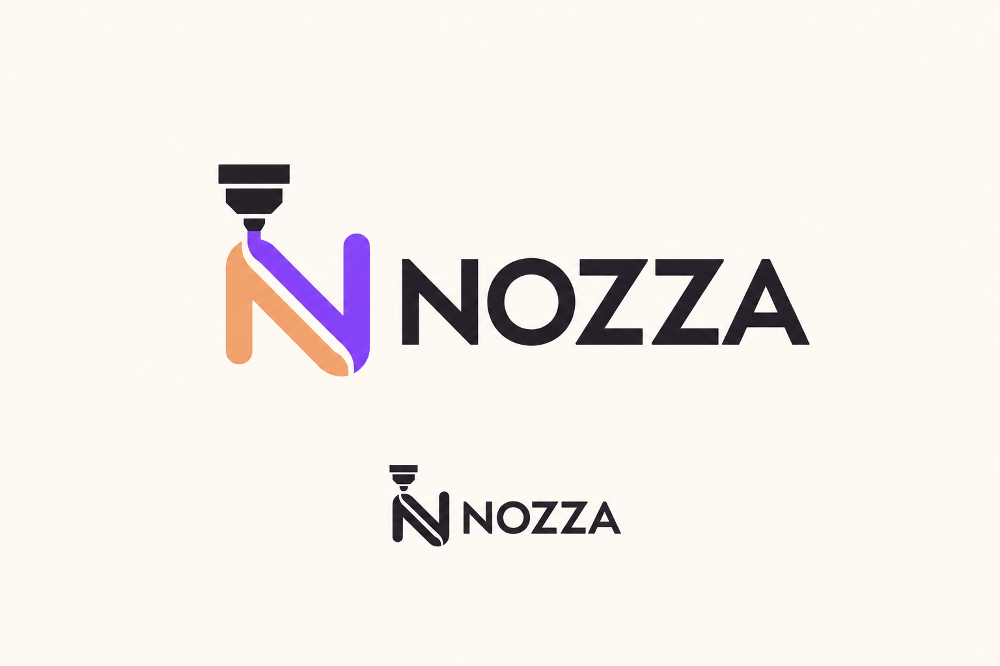

# NOZZA — выбранный логотип

**Решение пользователя от 03.10.2026:** использовать логотип из `Nozza5.png`: сопло над буквой N, оранжевая и фиолетовая лента, чёрная надпись NOZZA. Это выбранный вариант, а не предложение для дальнейшего выбора. Остальные пять направлений остаются архивом концепций.

## Исходник и статус ассета

[NOZZA-selected.png](brand/NOZZA-selected.png) — точная копия файла пользователя, 1536×1024 px. Изображение содержит большое цветное и малое монохромное исполнения на светлом фоне. Это презентационный растр, не прозрачный логотип и не SVG. Не использовать всё изображение целиком как маленький логотип в шапке: большие внешние поля и второе исполнение не являются частью композиции знака.

В печатном PDF логотип размещён из исходника через область кадрирования на странице, сам PNG не изменён. В `print-layouts.json` у каждого блока `kind: logo` указан `asset`, `source_dimensions_px` и `source_crop_px` в формате x/y/w/h. Основная область: 335/253/910/326 px; монохром: 598/715/355/126 px; надпись без символа для узкой этикетки: 614/394/633/142 px. Эти рамки относятся только к данному растру. Ширина сохраняет отношение сторон; PDF не растягивает знак. При будущей векторизации удалить весь светлый фон, внешние поля и второй вариант из основного файла.

## Состав версий для разработчика

| Версия | Применение | Требование |
|---|---|---|
| Основной горизонтальный, цветной | Светлая шапка, сайт, визитка, сертификат | Знак + NOZZA; сохранить сопло, белый промежуток между лентами и форму букв |
| Горизонтальный для тёмного фона | Тёмная панель и рекламная тема | Надпись и сопло белые, N остаётся цветной; создать SVG, в исходном PNG этой версии нет |
| Монохром | Чек, термоэтикетка, одноцветная печать | Использовать нижнюю чёрную версию из выбранного исходника; белая версия для чёрного фона отдельно |
| Символ | Компактное меню, аватар компании, favicon | Сопло + N без повторной надписи; оптическое упрощение при 16–24 px требуется проверить, сейчас такой проверенный SVG отсутствует |
| Надпись | Узкий ценник и малая этикетка | Использовать форму слова из выбранного логотипа, а не похожий шрифт |

Не считать существующие `site/assets/brand/nozza-*.svg` новым выбранным логотипом: они относятся к предыдущему оформлению. Приложение в этой задаче не менялось.

## Геометрия применения

- Горизонтальный цветной растр имеет пропорцию примерно 2.79:1. В интерфейсе базовый размер 128×45.9 px; крупный 168×60.2 px. Для полосы высотой56 px использовать 100×35.8 px. Высота блока с охранным полем должна учитываться отдельно.
- В боковой навигации шириной228 px: область логотипа сверху x20/y16, изображение128×45.9, после него минимум16 px до первого пункта. Сама шапка навигации высотой80 px.
- В компактной навигации использовать символ высотой32 px, шириной примерно23 px; окончательные оптические поля определяются после подготовки SVG. Малый favicon не получать простым уменьшением полного lockup.
- Охранное поле со всех сторон не менее0.25 высоты полного знака. Не ставить слово NOZZA вплотную к кнопке/краю. В печатных карточках маленькая отдельная область ограничивает размер, поэтому слово без символа допустимо.
- Для A4 базовая ширина25.12 мм / высота9 мм в шапке; охранное поле2.25 мм вокруг, кроме уже более широких полей страницы. Для рекламной продукции ширина35–55 мм при наличии места. Не растягивать до полной ширины brand-блока.
- Термопечать: монохром, без серых градиентов. Для этикетки62×40 сложный знак не обязателен; при его уменьшении сначала проверить пробный отпечаток.

## Цвета и ограничения

Фактически в растре видны почти чёрный, оранжевый и насыщенный фиолетовый с лёгкой неоднородностью/градиентом. Точные авторские HEX из PNG достоверно восстановить нельзя. **Предлагаемые токены для векторной версии:** тёмный #27232B, оранжевый #F39B60 → #F5AE79, фиолетовый #9748FF → #7C35E8. Это предложение для согласования SVG, не измеренная фирменная палитра. UI сохраняет более тёмный акцент #6E2BC8 для читаемого текста; окраска логотипа не требует красить мелкий текст тем же ярким фиолетовым.

Запрещено менять направление ленты, убирать сопло в основной версии, заменять NOZZA словом PrintFlow, дописывать NOZZA к уже полной надписи, зеркалить знак, растягивать его, добавлять свечение, встраивать в QR. AI-персонаж не подменяет логотип компании.

## Что подготовить для точной реализации

Векторная отрисовка выбранного знака и букв по исходнику; SVG colour/dark/black/white/mark/wordmark; прозрачные PNG 1×/2×/3×; favicon16/32/48; проверка на светлом/тёмном фоне и термоэтикетке. Не выдавать автоматическую приблизительную трассировку за точный оригинал. В этом комплекте приложен исходный выбранный PNG и его применение в PDF; готовые SVG пока не создавались.
