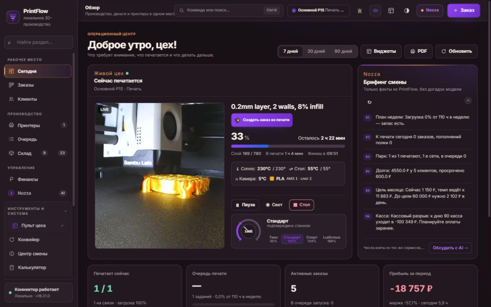
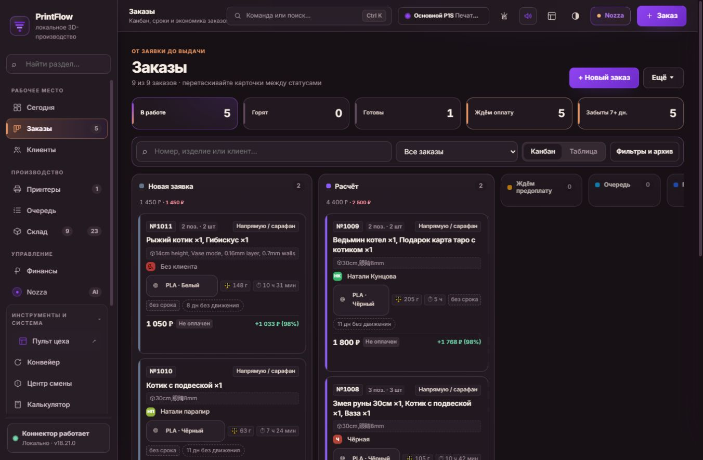

# NOZZA — дизайн-спецификация панели 3D-производства

Дата: 3 октября 2026. Основная платформа: desktop. Версия: 1, для согласования визуального направления и передачи в разработку.

**Бренд компании — NOZZA.** PrintFlow — название, которое сейчас видно в исходной панели, а не название компании. В предлагаемом интерфейсе брендовый блок и новые логотипы используют NOZZA. Решение о сохранении PrintFlow как отдельного названия продукта требуется согласовать; по умолчанию в новых макетах шапка называется NOZZA. Технические маршруты и идентификаторы при ребрендинге менять не требуется.

**Логотип выбран пользователем:** Nozza5.png, знак «сопло + N» с оранжево-фиолетовой лентой. [Правила применения и исходник](BRAND-GUIDE.md). Выбор завершён; альтернативные концепции ниже сохранены для истории. [Дизайн всех найденных печатных форм](PRINT-DESIGN-SPEC.md) включает 61 макет и точные координаты, отдельно от экранных токенов.

## Источники и границы достоверности

- Работающая панель: [http://localhost:8765/](http://localhost:8765/). Этот адрес доступен на компьютере с запущенной установкой, не является публичной ссылкой для внешнего дизайнера.
- Визуальный референс: приложенное изображение «PrintFlow_ контроль 3D-производства.png», локальная копия [reference.png](reference.png).
- Снимки текущего интерфейса: папка [screenshots](screenshots/). Они показывают реальную установку, включая реальные названия, остатки и финансовые показатели. Перед передачей внешнему подрядчику согласовать состав данных.
- Дополнительное подтверждение структуры: site/index.html, подключённые stylesheets, site/assets/fonts.css и v19-shell.js в этой рабочей копии. Код использован только для чтения. Ранее созданные QA-документы не считаются доказательством текущего состояния.
- **Факт UI** — непосредственно увидено при просмотре. **Факт исходника** — найдено в исходных файлах, но не обязательно проверено в браузере. **Вывод** — интерпретация фактов. **Предложение** — будущая спецификация, а не существующее поведение. Эти обозначения действуют во всём документе.
- Просмотрены основные разделы навигации, шесть подразделов склада, пять вкладок новой карточки заказа и 14 отдельных страниц из хаба. Главная дополнительно просмотрена при 1440×900, 1024×768 и 390×844. Это не полный функциональный проход всех вложенных форм.
- Команды оборудования, сохранение сущностей, перемещения, списания, платежи, импорт выписки и отправка сообщений не выполнялись. Новая карточка заказа открыта и закрыта через «Отмена» без сохранения. Панель инцидентов не открывалась: её текст предупреждает, что закрытие отмечает записи увиденными.
- Часть снимков сделана во время загрузки. Такие снимки документируют загрузку, а не отсутствие записей. История успешных изменений, реальные ошибки записи, offline и reduced-motion не воспроизводились. Для них ниже задано предлагаемое поведение.

## 1. Краткое резюме

**Факт UI.** Панель объединяет заказы, клиентов, принтеры, очередь, материалы, товары, розничный стеллаж, складские документы, деньги и вспомогательные инструменты. Основные рабочие роли, выведенные из функций: оператор печати, менеджер заказов, владелец мастерской, сотрудник склада/кассы. Фактическое распределение прав по этим ролям не проверено.

**Предложение.** NOZZA — спокойное рабочее пространство на тёмной основе цвета какао, с персиковым выделением навигации и фиолетовым выделением основных действий. У каждой цифры должны быть понятны период, единица и источник. Камера, статус станка, долг и дефицит важнее декоративных элементов.

Сохранить маршруты, бизнес-статусы, связи заказ–задание–принтер–материал, отдельные денежные операции, проверки перед стартом и подтверждения опасных действий. Изменить иерархию блоков, плотность таблиц, подписи, визуальное разделение статусов, брендинг и оформление ассистента. Иллюстрации использовать на приветственном экране помощника и в справке, не за таблицами и критичными числами.

### Сопоставление с референсом

| Элемент | Что видно в референсе | Решение для NOZZA |
|---|---|---|
| Композиция | Центральная рабочая панель, справа крупный персонаж; рекламные поля по краям | Рабочая панель занимает всю полезную ширину. Рекламные поля и слоганы исключить из ежедневной работы |
| Главная | Шесть KPI, четыре карточки принтеров, таблица заказов и финансы | Использовать фактическое число станков. Не добавлять отсутствующие станки и значения из картинки |
| AI | Постоянная большая иллюстрация, голос и быстрые запросы | Панель по запросу; в текущей установке голос отключён, рантайм недоступен. Иллюстрация не означает готовность AI |
| Навигация | «Аналитика» как самостоятельный пункт | В живой навигации отдельного пункта нет. Оставить аналитику внутри «Сегодня», финансов и других разделов |
| Склад | Один пункт и краткий остаток материалов | Сохранить Товары / Стеллаж / Пластик / Партии / Склады / Операции |
| Карточка заказа | Упрощённая строка с ценой и статусом | Сохранить оплату, приёмку качества, отсутствие срока, состав и ограничения финальных статусов |
| Эффекты | Свечение, градиенты, тёплая подсветка, дымчатые поверхности | Слабое свечение только у выбранного элемента и брендовых поверхностей; под данными непрозрачный фон |

## 2. Структура сайта

### Основная навигация: сохранить фактическую иерархию

| Группа | Разделы и прямые ссылки |
|---|---|
| Рабочее место | [Сегодня](http://localhost:8765/#dashboard), [Заказы](http://localhost:8765/#orders), [Клиенты](http://localhost:8765/#customers) |
| Производство | [Принтеры](http://localhost:8765/#printers), [Очередь](http://localhost:8765/#queue), [Склад: Товары](http://localhost:8765/#products) |
| Управление | [Финансы](http://localhost:8765/#finance), кнопка AI-помощника |
| Инструменты и система | [Пульт цеха](http://localhost:8765/control.html), [Конвейер](http://localhost:8765/#conveyor), [Центр смены](http://localhost:8765/#ops10), [Калькулятор](http://localhost:8765/#calc), [Ниши](http://localhost:8765/#niches), [Печатные формы](http://localhost:8765/#print), [Клиент-бот](http://localhost:8765/#clientbot), [Библиотека](http://localhost:8765/#library), [Страницы](http://localhost:8765/#pages), [Карта системы](http://localhost:8765/#system-map), [Настройки](http://localhost:8765/#settings) |

Поднавигация склада: #products, #shelf, #inventory, #batches, #warehouses, #documents. Поднавигация станка: Обзор / Камера / AMS и катушки / Файлы / ТО и здоровье / Журнал. Финансы: Деньги сейчас / Прибыль и P&L / Налоги и отчёты. Печать: Формы / 3D-печать / Штрихкод и тираж. Заказ: Заказ / Производство / Деньги / Клиент / История.

**Предложение.** Не прятать «Настройки» ниже длинного прокручиваемого списка: закрепить ссылку в нижней зоне sidebar над статусом системы. Остальные инструменты оставить раскрываемой группой. Счётчики снабдить названиями: например, «3 катушки с низким остатком», а не несколько соседних чисел без объяснения.

### Основные сценарии

1. Начало смены: Сегодня → срочные действия → выбранный заказ или станок → проверка причины → действие с предусмотренным подтверждением.
2. Заказ: заявка → расчёт → предоплата → очередь → печать → постобработка → контроль качества → выдача. «На складе» — отдельный конечный исход, не синоним «Выдан».
3. Материалы: Пластик → поиск катушки → просмотр остатка и места → привязка к AMS / приход / списание. Все записи выполнять только в дальнейшем рабочем сценарии, не в дизайн-аудите.
4. Готовая продукция: Товары → партия → приёмка → перемещение на стеллаж → продажа → учёт денег и документа.
5. Деньги: Финансы → долг или расхождение → связанный заказ / касса / банк → отдельная операция → результат в журнале.
6. Помощник: открыть AI → уточнить состояние → получить объяснение или предложение → отдельно подтвердить допустимое действие → увидеть проверенный результат.

### Что осталось неизученным

Все вложенные карточки клиентов и товаров, каждый файл станка, внутренние вкладки пульта и финансов, все 30 материалов библиотеки и генераторы печатных форм, успешные входы по кодам/подписанным ссылкам, реальные операции записи и их ошибки. Подробный UI неизвестных поверхностей не следует считать утверждённым. Нужна обезличенная тестовая база и доступные примеры сохранённых сущностей. Страница /design имеет противоречивые описания в хабе и в самом интерфейсе — см. раздел 9.

## 3. Спецификация каждой страницы

### Общие правила для всех страниц

**Предложение.** После шапки: h1 и описание задачи → главное действие → локальная навигация → сводка → фильтры → основное содержимое → второстепенные инструменты. Один h1; блоки h2; названия карточек h3. Суммы справа, единицы рядом с числом; длинные названия переносятся, полное значение доступно без обязательного hover.

Общие состояния, применяемые ко всем таблицам, карточкам и спискам:

| Код | Предлагаемое состояние | Обязательное содержимое |
|---|---|---|
| L | Загрузка | Skeleton в размерах будущего блока, подпись «Загружаем…». Не подменять неизвестное число нулём |
| E0 | Нет данных | Название отсутствующей сущности, объяснение, существующее действие создания при наличии прав |
| EF | Нет результатов фильтра | «По выбранным фильтрам ничего не найдено», видимые фильтры и «Сбросить фильтры» |
| ER | Ошибка чтения | Назвать незагруженный блок; «Повторить». Уже загруженные независимые блоки остаются доступными |
| OFF | Потеря связи | Последние известные данные + время обновления + пометка устаревания. Опасные действия заблокированы |
| W | Изменение выполняется | Локальный индикатор и защита от повторного нажатия |
| OK | Успешная запись | Сообщение о конкретном изменении только после ответа и проверки результата |
| FAIL | Ошибка записи | Сохранить ввод, объяснить проблему и предложить исправление. Повтор опасной операции после неизвестного исхода — только после проверки факта |

L встречалось при просмотре; часть E0 и disabled описана ниже. W, OK, FAIL и OFF здесь — проектируемые требования, не проверенные свойства текущей панели. Адаптация каждой страницы использует правила раздела 6; специальные исключения указаны локально.

### 3.1 Сегодня — #dashboard

**Факт UI.** Заголовок «Доброе утро, цех!», период 7 / 30 / 90 дней; Виджеты, PDF, Обновить. Первая зона: «Сейчас печатается» с камерой, названием файла, прогрессом, слоями, оставшимся временем, температурами, материалом, Пауза / Свет / Стоп и скоростью. Справа «Брифинг смены». Ниже KPI «Печатает сейчас», «Очередь печати», «Активные заказы», «Прибыль за период», срочные действия, ближайшие сроки и раскрываемая аналитика.

**Предложение порядка.** h1 → предупреждение о связи, если нужно → четыре фактических KPI → срочные действия и сроки → текущая печать / брифинг 8:4 → раскрываемая аналитика. На большом desktop камера не выше 360 px в обзорной карточке; увеличенный просмотр в разделе станка. Главные навигационные действия: открыть проблемную сущность и заказы. Стоп — отдельная danger-кнопка.

**Данные.** printer name, state, file, progress, layer/total, remaining, finish time, actual/target temperature, material/slot, order link, KPI с периодом. В снимке был один P1S, а не четыре принтера референса. Числа меняются в реальном времени и не являются константами макета.

**Состояния.** Увидено «Заказов со сроками нет»; нет локального G-code; AI-рантайм недоступен. Для отсутствия активной печати показать свободный парк и переход в очередь; отказ камеры не скрывает телеметрию. Графики, план, AMS, материалы на очередь, лента, таймлайн, достижения и здоровье системы подтверждены в исходнике, но не все раскрыты в UI.

### 3.2 Заказы — #orders

**Факт UI.** Новый заказ; быстрые виды В работе / Горят / Готовы / Ждём оплату / Забыты 7+ дн.; поиск, сохранённый вид, Канбан / Таблица, Фильтры и архив. Статусы: Новая заявка, Расчёт, Ждём предоплату, Очередь, Печать, Постобработка, Готов, Выдан, На складе. Сортировки: новые, срок, долг, забытые. Фильтры по статусу и нише.

**Предложение.** Панель быстрых видов → поиск и представление → фильтры → доска. Колонка канбана 280–320 px; при нехватке места прокручивается только доска. В колонке: название, количество, сумма и долг с отдельными подписями. Карточка: номер → изделие/состав → клиент → срок и риск → статус оплаты → цена; материал/вес/время вторым уровнем. «Открыть» — основное безопасное действие; переход статуса и «В очередь» визуально второстепенны.

**Факт ограничения.** Выдан и На складе не допускают обычное перетаскивание. Сохранить это правило, дать клавиатурную альтернативу перетаскиванию только для разрешённых переходов. Отдельно сохранить «Без срока», «Без клиента», «Без приёмки», частичную оплату и отрицательную прибыль.

**Таблица.** Исходник задаёт № / Изделие / Клиент / Статус / Цена / Срок и выбор строки. Не добавлять колонку «Принтер», если нет достоверной связи. На mobile рекомендуем таблицу как компактный список, без потери долга и срока. E0/EF/ER — по общим правилам.

### 3.3 Карточка заказа — модальное окно

**Факт UI.** h2 «Новый заказ», краткие итоги печати, пластика и прибыли; пять вкладок. Заказ: изделие/работа, готовый товар, категория, резерв готового, статус, приоритет, ниша, канал, количество, срок, подарочный режим, имя/компания, телефон и мессенджер; позиции состава с количеством, ценой, весом и временем. Есть явный override итогов состава.

Производство: материал, цвет, расход по цветам/катушкам, граммы, часы, ручная работа, файл и его загрузка, качество, упаковка, заметки и чек-лист качества. Деньги: цена, себестоимость, получено по журналу только для чтения, автоматический/ручной учёт себестоимости. Клиент: история сохранённого клиента. История: движение заказа.

**Предложение.** Ширина 1040 px максимум, поля в две колонки, состав отдельной широкой зоной. Итоги и вкладки закреплены сверху, footer с Отмена / Сохранить / Сохранить и в очередь снизу; скролл у тела формы. Сохранение в очередь не изображать как немедленный запуск станка. Полученную оплату не превращать в редактируемое поле.

**Увиденные пустые состояния.** «Откройте сохранённый заказ — подтянем его историю» и «История появится после сохранения заказа». Новая форма показала производственные значения и отрицательную прибыль даже до ручного ввода; происхождение этих значений требует уточнения. В макете помечать такие данные как подставленные, не как уже сохранённые.

**Предложение состояния.** Валидировать обязательные поля после ввода/сохранения; первая ошибка получает фокус. Закрытие изменённой формы спрашивает о несохранённых данных. На tablet одна или две колонки по доступной ширине; mobile — полноэкранная форма и горизонтальные вкладки.

### 3.4 Клиенты — #customers

**Факт UI.** Сводка базы, повторных покупателей и выручки; блок После продажи; сегменты Все / Постоянные / Новые / Без контакта; поиск; карта клиентов; таблица Клиент / Связь / Заказов / Выручка / Последний заказ / Сегмент / Кабинет. Действия Кабинет и Пожелания. В блоке aftercare тексты можно копировать; отправка остаётся за человеком.

**Предложение.** Сводка → сегменты и поиск → таблица → aftercare → карта, раскрываемая при наличии адресов. Без контакта показывать явной подписью. Не использовать аватары-персонажи вместо имён. Увидено «Адресов пока нет» с объяснением заполнить адрес. Содержимое карточек кабинета и пожеланий не открывалось. Не проектировать новые CRM-автоматизации.

### 3.5 Принтеры — #printers

**Факт UI.** Парк с карточкой выбранного P1S, статусом, IP, прогрессом, температурой и AMS; новые файлы из Watch Folder; выбранный станок и его шесть вкладок. Обзор содержит задачу, связь с заказом, шкалу слоёв, готовность к старту, подбор следующего задания, температуры, вентиляторы, историю показателей и раскрываемое управление.

**Предложение.** Верхняя сетка парка с min-width 280 px → sticky-контекст выбранного станка → вкладки → содержимое. Всегда выводить название станка рядом с командой. Основная безопасная команда — открыть детали; Пауза / Продолжить доступны по статусу, Стоп отдельно. Телеметрия факт/цель в одинаковых единицах.

AMS: сохранить номера слотов, материал, цвет, остаток и привязку к складу. В просмотренной карточке видны «не привязан», «мало пластика», несколько предупреждений. Файлы, ТО и журнал подтверждены вкладками, их полный набор операций не проверен. Для L/ER камеры отдельный placeholder; при OFF последнее обновление и запрет команд. Графики и камера на mobile — широкие блоки без смешивания с кнопками.

### 3.6 Очередь — #queue

**Факт UI.** Автозапуск, Запустить следующее, Задание; счётчики Всего / Печатаются / Ожидают / Без принтера; поиск; Задания / Журнал; По принтерам. Разделы «В работе и в очереди», «Журнал печати».

**Наблюдение.** При просмотре счётчики показали одно печатающееся задание, но снимок списка не показал строку. Причина не установлена: это может быть загрузка или рассогласование. Не утверждать, что очередь пуста.

**Предложение.** Сводка → область поиска → задачи с названием, связанным заказом, станком, сроком, материалом, приоритетом и причиной блокировки, если данные существуют → журнал. Автозапуск выделить как режим с последствиями, отдельно от обычных фильтров. Для неназначенного станка самостоятельный chip. Нельзя рисовать успешный старт до подтверждённого состояния оборудования. Tablet/mobile: карточки задач, группы станков раскрываются.

### 3.7 Склад — Товары, #products

**Факт UI.** План пополнения, Товар, Ещё; шесть общих подразделов; KPI позиций, остатков, стоимости, продаж, потребности печати и мёртвого стока. Поиск по названию/артикулу/коду/штрихкоду; склад, группа, вид, статус, сортировка; Плитки / Таблица; сезонная витрина. Группы каталога раскрываемые. Есть предупреждение об изменившихся ценах.

**Предложение.** Общая поднавигация → KPI → единая строка поиска → фильтры → группы/товары. min-width карточки 280 px, изображение 88–120 px; в карточке название, артикул, свободно/резерв, цена, себестоимость/маржа и доступные действия. Не смешивать штуки готовых изделий и граммы катушек в один KPI без пояснения. Ручная продажа, пересчёт цен и списание — записи, их успешные состояния не проверялись.

### 3.8 Стеллаж — #shelf

**Факт UI.** Со склада / Позиция; Все / Мало / Нет / Нужно пополнить / Мёртвый сток; недельный обзор, KPI, прогноз на семь дней и карточки. Карточка включает название, код 1С, размер ценника, количество, цену, себестоимость, маржу, продажи, запас по дням, Карточка / Ценник / Промостенд / На склад / −1 / +.

**Предложение.** KPI и пополнение выше длинного каталога; товар min-width 300 px. −1 и + не выглядят обычным масштабированием: подпись должна объяснять изменение остатка/продажу по фактической логике. Код 1С «не задан» отдельным предупреждением. Прогноз маркировать как оценку при текущем темпе, а не обещание. E0: нет позиций; EF: нет выбранного сегмента. Desktop 3–4 колонки, tablet 2, mobile 1.

### 3.9 Пластик — #inventory

**Факт UI.** Приход пластика / Катушка; KPI граммов, катушек, стоимости, низкого остатка и типов материалов; поиск по цвету/бренду/месту, материал, место, только низкий остаток. Карточки: процент, материал, цвет, бренд, место, граммы/полная масса, стоимость, израсходовано, автоматическое обновление AMS. Действия Пополнить / Списать / Обрезки / Сушка / QR / Изменить. Ниже раскрываемые инструменты и аналитика.

**Предложение.** Кольцо процента вторично по отношению к «840 г / 1000 г». Цвет катушки передавать образцом и названием, не только заливкой. Значения 0 г и неизвестный остаток визуально различать. Показывать источник AMS и время обновления, когда доступны. Карточки 3/2/1 колонки; secondary-действия в меню, основные приход/просмотр остаются видимыми.

### 3.10 Партии — #batches

**Факт UI.** Собрать по плану / Напечатать партию; KPI активных, готовых, брака и себестоимости; фильтр Все / План / В печати / Частично / Готовы. Увидено «Партий пока нет» и пояснение: система разложит количество на запуски без старта станка.

**Предложение.** Сводка → фильтр → партии → детали выбранной партии сбоку на desktop и ниже на tablet. Создание плана и физический старт различить и текстом, и кнопками. Полный заполненный экран партии неизвестен; нужен тестовый пример с частичной приёмкой и браком.

### 3.11 Склады — #warehouses

**Факт UI.** Типы цен / Склад; сводка числа складов, штук, стоимости и резерва; карточки складов; оборотно-сальдовая ведомость со складом и периодом 7/30/90/365; списания и потери; резервы. Колонки ведомости: Код / Номенклатура / Нач. количество / Нач. сумма / Приход / Расход / Кон. количество / Кон. сумма. Увидено «Активных резервов нет».

**Предложение.** Карточки складов → ведомость → потери/резервы. Ведомость сохраняет таблицу и локальный горизонтальный скролл даже на mobile; не скрывать финансовые колонки молча. Строки «Удалённая позиция» сохраняют историю, не заменяются фиктивным названием.

### 3.12 Операции — #documents

**Факт UI.** Заголовок «Документы», действие «Что произошло», фильтры вида и статуса. Виды: приход, продажа, перемещение, списание, инвентаризация, производство, возврат, установка цен. Таблица Номер / Вид / Дата / Склад / Строк / Количество / Сумма / Статус / открыть.

**Предложение.** В поднавигации оставить «Операции», h1 «Складские операции» либо пояснить связь с документами. Черновик и проведённый документ различаются chip и текстом. Открытие безопасно; проведение не должно происходить при клике по строке. Содержимое первички и ошибки проведения не проверялись.

### 3.13 Финансы — #finance

**Факт UI.** Период 7/30/90/365, Проводка; три вкладки. Деньги сейчас: доступно, к получению, просрочено, к уплате → Требует решения → Результат бизнеса → Банк/СБП/касса → Дебиторка → источники и настройки учёта. Дебиторка: заказ, клиент, цена, оплачено, долг, дни. Видны отрицательный остаток и разные значения результата периода/месяца.

**Предложение.** Сохранить эту последовательность, явно обозначить даты периода и метод расчёта. Баланс, выручка и прибыль не взаимозаменяемы. P&L и налоги оформить общей системой, но не выдумывать поля или налоговые формулы: внутренние вкладки не исследованы полностью. Деньги не окрашивать зелёным просто потому, что сумма положительна; semantic-цвет только для отклонения/риска.

Состояния: нет долгов / нет операций — E0; отрицательный баланс — предупреждение с переходом к счёту; неизвестный исход проводки — проверить журнал перед повтором. Tablet/mobile сводка 2/1 колонки, дебиторка со всеми суммами и номером заказа.

### 3.14 Конвейер — #conveyor

**Факт UI.** Состояние → загрузка STL/3MF/G-code и модель из библиотеки → раскрываемая инженерия финала G-code и допусков → история → объяснение цикла. Есть выбор станка, Тестовая очистка стола и Обновить. Текст требует все допуски и подтверждение пустой платформы.

**Предложение.** Проверки допуска показывать до кнопки запуска; блокирующая причина не скрыта в accordion. «Тестовая очистка» — физическая команда, оформить danger-outline с объяснением и подтверждением. Успешный цикл и неисправности не воспроизводились. Зона загрузки минимум 160 px высотой, одна колонка при узкой ширине. Никаких декоративных анимаций движения станка, которые могут выглядеть как реальная телеметрия.

### 3.15 Центр смены — #ops10

**Факт UI.** Оборудование → производство/план-факт и симуляция очереди → обращения → правила и последние проверки. Команды станку вынесены в Принтеры; смена стадии обращения сама не отправляет сообщений; dry-run заявлен без изменения цеха.

**Предложение.** Два столбца Обращения / Правила на desktop, один на tablet; план-факт на всю ширину. Результат симуляции явно пометить «Предварительная проверка», не оформлять успешной печатью. Полный заполненный inbox не проверен.

### 3.16 Калькулятор — #calc

**Факт UI.** Пресеты изделия, база, статистика, экспорт и создание заказа. Блоки: Плита (масса всей плиты, часы, штук на плите, количество, прогрев) → Материал/качество (тип, профиль, поддержки, смены цвета, цена/масса катушки) → Работа → Подготовка модели → Раскладка → Себестоимость партии → Цена/прибыль → Минимальная партия → Что если → Окупаемость.

**Предложение.** Ввод слева 7 колонок, результат справа 5; на desktop результат sticky без перекрытия footer. Явно различить показатели на штуку, плиту и партию. Каталог материалов и коэффициенты сохраняются из системы, не копируются из референса. Нулевой расчёт при ещё неготовом результате не показывать как рекомендованную бесплатную цену. На tablet/mobile итог после основных полей, расширенные сценарии раскрываемые. Проверку формул и создание заказа не выполняли.

### 3.17 Ниши — #niches

**Факт UI.** Ниша, инструкция тестирования; KPI направлений, заказов, конверсии, прибыли; карточки гипотез с показами, обращениями, заказами, повторными, выручкой, прибылью, часами и прибылью/час. Пустые тексты: «Гипотеза не описана», «Данных ещё нет».

**Предложение.** Заголовок гипотезы → описание → воронка → экономика → состояние → редактирование и формы. Нет знаменателя — «—, нужны показы», а не 0% успешности. 3/2/1 карточки. Не добавлять прогноз спроса от AI как факт.

### 3.18 Печатные формы — #print

**Факт UI.** Три вкладки; Формы включает редактор флаера для кофеен, поиск формы, фильтр каталога и бланки/этикетки. Во время первого снимка видна загрузка каталога. Вкладки 3D-печать и Штрихкод и тираж доступны; полный сценарий не выполнялся.

**Предложение.** Различить бумажную печать и запуск 3D-принтера в названиях действий. Каталог: карточка с названием, назначением и физическим размером; редактирование → предварительный просмотр → печать. Утверждённого макета для каждого генератора ещё нет. Печатные поверхности светлые независимо от темы рабочего UI; исключить навигацию из листа.

### 3.19 Клиент-бот — #clientbot

**Факт UI.** Состояние → настройки (token, каталог, уведомления, отзывы, получение, фото, материалы, платежные реквизиты/QR, тихие часы, согласия, FAQ, приветствие) → команды → шаблоны → inbox → ручная сверка оплаты → заказы → отзывы → покупатели → воронка → диалоги/недоставленные сообщения. Есть «Отправить по согласию» и «Повторить все».

**Предложение.** Операционная часть inbox/сверки первой, настройки отдельным раскрываемым блоком или локальной вкладкой без потери функций. Token маскирован и не включён в скриншоты для передачи. Проверить токен, Сохранить, Отправить — отдельные действия с различными последствиями. Платёж не подтверждается одним изменением визуального статуса. Разрешение рассылок и внешнюю отправку сохранить явно. Успешные сообщения и реальные ошибки не проверялись.

### 3.20 Библиотека — #library

**Факт UI.** Галерея моделей, три маршрута Начать / Продать / Сделать стабильно, следующий шаг, поиск, категории Все / Старт / Продажи / Цех / Система / Инструменты, 30 материалов и чек-листы. Ссылки ведут в #library/<материал> либо отдельный инструмент.

**Предложение.** Маршруты → поиск/категории → карточки материалов. Чтение статьи: хлебные крошки, h1, оглавление, содержание и связанный рабочий раздел. Не отмечать чек-лист автоматически при открытии. Детальные статьи и выполнение пунктов не проверялись; шрифтовая спецификация текста ниже.

### 3.21 Страницы — #pages; Карта системы — #system-map

**Факт UI.** Хаб содержит поиск, категории Панель / Сотрудникам / Экраны / Покупателям / Печать и карточки ссылок с QR, назначением и требованием кода. Карта системы описывает 12 функциональных контуров и сквозной AI с read → plan → act → verify.

**Предложение.** Хаб: карточки 3/2/1 колонка; адрес и роль понятны до перехода; QR отдельная кнопка, не вложенная интерактивная цель внутри ссылки. Карта: простая сетка связанных контуров, не диаграмма ради диаграммы; ссылки и описания сохранить. Не показывать карточку как готовую интеграцию только потому, что существует маршрут.

### 3.22 Настройки — #settings

**Факт UI.** Поиск, Сбросить, Сохранить; быстрые группы Принтеры / Цех / Склад / Цены / Бизнес / Касса / Система / Все. На просмотренной группе: Studio gateway, MQTT/FTPS, парк, Watch Folder, Bambu Cloud, preflight, сторож, AMS и камера/демо. Есть встроенный styleguide.

**Предложение.** Группы слева или сверху → h2 темы → название параметра, пояснение и контрол. Переключатели должны показывать несохранённое изменение, если применение отложенное. Обычное сохранение и опасные режимы autostart не объединять в одну непонятную команду. «Сбросить» поясняет область и последствия. Секреты не восстанавливать открытым текстом.

**Наблюдение.** Встроенные образцы styleguide показывали другую палитру, чем вычисленные цвета страницы: их нельзя считать источником истины. Использовать реально применённые токены и согласованную спецификацию. Все параметры всех групп и сохранение не проверялись.

### 3.23 AI-помощник — боковая панель; /assistant.html

**Факт UI.** Открывается кнопкой Nozza и Alt+A; закрытие возвращает фокус. Шапка со статусом и переходом в отдельную страницу; история, быстрые запросы, поле, Отправить; Enter/Shift+Enter. Голос disabled с пояснением о внешнем рантайме. Отображался недоступный рантайм, при этом существующая история чата загрузилась.

**Предложение.** Заголовок «AI-помощник NOZZA», чтобы не смешивать компанию и имя персонажа. Согласовать отдельное имя персонажа. Desktop ширина 398 px; постоянная колонка только при достаточной ширине центра. Иллюстрация максимум 160–200 px в пустом приветствии, в активном чате аватар 32 px. Недоступность модели обозначать рядом с полем; наличие истории не означает готовность отвечать. Предложение действия, ожидание подтверждения, исполнение и подтверждённый результат — четыре разные карточки. Реальные ответы в этом проходе не запрашивались.

### 3.24 Отдельные страницы — наблюдённые входные поверхности

Для каждой ниже: бренд NOZZA, h1 задачи, содержимое в указанном порядке; общие L/ER/OFF и ограничения записей сохраняются. Снимки доступны в screenshots/terminal-<имя>.jpg.

| Страница | Факт UI: назначение, порядок и действия | Предложение / неизвестное |
|---|---|---|
| /cashier | Логотип → «Касса NOZZA» → код → Войти; нужна та же сеть | Форма 400 px, error под кодом, вход с неверным/верным кодом не проверен; рабочая касса за входом неизвестна |
| /sbp | Новый платёж: заказ и сумма → ожидающие → последние; возвраты у подтверждённых | Сумма с валютой и проверкой; подтверждение/возврат отдельным шагом. Хаб обещает код, в текущем просмотре форма открылась без нового ввода кода — причину уточнить |
| /bank | CSV выписки → Разнести → На сверку → Последние | Есть пустые состояния сверки/поступлений. Предпросмотр и результат импорта не проверены. Хаб обещает код, но в просмотре не запросил его |
| /m | Камера/станок → заказы к выдаче → дефицит → команды | Увеличенные touch-цели; опасные команды отделены; запись «Снял деталь» не просто закрытие уведомления |
| /pult и /control.html | Парк, связь, обновление, текущая задача и завершение; вкладки Парк/Очередь/Авто/Файл/AMS/Камера | В снимке текущая печать соседствовала с карточкой прежнего завершения; каждому блоку нужны время и идентификатор задания |
| /shelf | NOZZA → товар → форма имя/контакт/цвет → заявка → вся витрина | Без id видно «Позиция не найдена». Предлагается скрывать отправку заявки до выбора существующей позиции |
| /tv | Камера → активная печать, прогресс, слой, остаток, финиш → часы | Экран просмотра; крупные числа, никаких рабочих команд; ошибка камеры отдельно от задачи |
| /order | NOZZA, описание → карточки каталога и наличие → свой заказ/корзина | Увидено «Под заказ» рядом с disabled «Нет в наличии»; требуется согласовать реальное разрешение заявки. Заявки не отправлялись |
| /track | Заказ → ключ Telegram → объяснение защиты → Проверить | Без подписанной ссылки статус не изучен. Не заменять защищённый ключ номером/телефоном |
| /my | NOZZA → пояснение отсутствующего кода | Входной экран «В ссылке нет кода»; заполненный кабинет неизвестен |
| /spool | Катушка → принтер → слот AMS → запись типа/цвета → привязать | Без id видно «В QR нет id катушки», привязка disabled. Успешное взвешивание/списание не изучено |
| /labels | Катушки/Ценники/Всё → Печать → этикетки с названием, массой и QR | Сохранить читаемый QR и физические размеры; пробная печать не выполнена |
| /price-tags | Выбор товаров → параметры/макет листа; 67×32 и 67×57 мм, CSV 1С, Печать | Отдельные данные «код 1С не задан». Не кодировать брендовый градиент в штрихкоде. Полный print-preview не проверен |
| /design | Форма → текст → ширина/высота → предпросмотр → Скачать STL | Реально конструктор номерка, диска и QR-основания. Хаб называет его заявкой на дизайн, это противоречие; не придумывать форму заявки |

## 4. Визуальная система

### Анализ референса

**Наблюдение изображения.** Широкая композиция примерно 16:9; центральная панель занимает около трёх четвертей ширины вместе с AI, боковые рекламные полосы — остальное. Тёмные коричнево-фиолетовые поверхности, кремовый текст, оранжевые и фиолетовые акценты; светлый нижний блок с примерами анимаций и схемой. Карточки скруглены, тонкие светлые границы, мягкие тени, светящиеся primary-кнопки. Линейные иконки соседствуют с цветными pictograms. Интерфейс плотный: мелкие подписи, компактные таблицы и шесть KPI в ряд. Точное семейство шрифта и реальные размеры из растрового референса установить нельзя; предположительно нейтральный sans-serif. Радиусы 8–16 px и отступы 8–16 px — визуальная оценка в масштабе картинки, не измеренные CSS.

### Цвета: точные значения и происхождение

| Токен | Тёмная тема | Назначение | Статус |
|---|---|---|---|
| background | #171116 | Фон рабочей области | Факт вычисленного CSS |
| surface | #211820 | Карточки | Факт вычисленного CSS |
| surface-raised | #291F28 | Поля, вложенные области | Факт вычисленного CSS |
| sidebar | #241A22 | Боковая навигация | Факт исходника |
| border | #493847 | Разделители | Факт вычисленного CSS |
| text-primary | #F8EEE6 | Основной текст | Факт вычисленного CSS |
| text-secondary | #DDCEC6 | Второй уровень | Факт исходника |
| text-muted | #AA979F | Подписи | Факт вычисленного CSS |
| primary | #8E43F0 | Основное действие | Факт вычисленного CSS |
| primary-end | #6E2BC8 | Второй край градиента | Факт исходника |
| peach | #E9925E | Бренд, активная навигация | Факт исходника |
| success | #73D6AA | Подтверждённая готовность/успех | Факт вычисленного CSS |
| warning | #F3B170 | Требует внимания | Факт вычисленного CSS |
| danger | #FF91A0 | Ошибка/опасная команда | Факт вычисленного CSS |
| focus | #C6A0FF | Двухпиксельный focus-ring | Предложение |

**Предложение.** Сохранить эти реально применённые цвета как исходную точку. Primary-gradient: 120°, #8E43F0 → #6E2BC8, белый текст; hover — лёгкое осветление, без прыжка соседнего контента. Навигация — персиковая полоса 3 px и мягкая тонированная поверхность; это даёт связь с референсом без постоянного свечения.

Светлая тема, значения из подключённого v19-shell.css: фон #F4EAE3, surface #FFF9F4, вложенная поверхность #F6E9E1, граница #D9C8BE, текст #31242E, secondary #5C4854, muted #6B5962. Она не переключалась в текущем проходе, поэтому её визуальная целостность не подтверждена. Для светлой темы предложены semantic-тексты #176B4B / #825013 / #A32142 на мягких фонах, вместо переноса светлых цветов статуса из dark.

### Типографика — предлагаемая единая шкала

Inter и JetBrains Mono уже есть локально в WOFF2, кириллица/латиница. Подключение Inter подтверждено вычисленным стилем. Не делать сеть обязательной для шрифтов.

| Применение | Размер / line-height | Вес |
|---|---|---|
| h1 страницы | 28 / 36 px | 700 |
| h2 блока | 18 / 26 px | 650 |
| h3 карточки | 16 / 24 px | 600 |
| Основной текст/таблица/поле | 14 / 20 px | 400–500 |
| Кнопка | 14 / 20 px | 600 |
| Подпись/метаданные | 12 / 18 px | 400–500 |
| KPI | 28 / 34 px | 700 |
| Большой прогресс | 36 / 40 px | 700 |
| Код/артикул/слой | 12 / 18 px, JetBrains Mono | 500 |
| Статья библиотеки | 16 / 26 px, длина строки до 75 символов | 400 |

Это норматив будущего дизайна, не измерение референса. Числа использовать с табличной шириной знаков. Не уменьшать основной текст до 10–11 px ради повторения картинки.

### Сетка, интервалы и эффекты — предложения

- Spacing: 4, 8, 12, 16, 20, 24, 32, 40, 48 px. Основной gap 16; padding карточки 20; между разделами 24–32.
- Sidebar: 228 px (текущая ширина также измерена); topbar: 64 px; поля центра: 24 px. На широких экранах рабочий контейнер до 1600 px, центрируется внутри свободной области.
- Desktop: 12 колонок, gap 16 px. KPI 3 колонки каждый, главный блок 8 и брифинг 4. Открытый AI шириной 398 px учитывается в доступной ширине, а не перекрывает критичные кнопки.
- Карточка radius 16 px; поля/кнопки 10 px; badge 6 px; dialog 20 px. Border 1 px.
- Карточка: тень 0 8px 24px rgba(0,0,0,0.18); dialog: 0 24px 64px rgba(0,0,0,0.36); overlay rgba(0,0,0,0.52). У таблиц тень не нужна.
- Focus: 2 px #C6A0FF, offset 2 px; на светлой поверхности #6E2BC8. Контур виден поверх hover/selected/error.
- Иконки: использовать существующий набор из assets/icons.js; стандарт 20 px, stroke приблизительно 1.75 px как целевая норма. На кнопках 16–20 px. Команды с риском всегда имеют подпись, не только пиктограмму.
- Декоративное свечение primary: максимум 0 4px 16px rgba(142,67,240,0.18). Таблицы, input и числовые метрики без градиентного фона.

## 5. Библиотека компонентов

Все размеры ниже — предложения. Общие состояния контролов: default; hover (surface-raised/более заметная граница); focus по ring; pressed (слегка темнее); disabled (некликабельно, причина рядом/в подсказке); loading (защита повторной отправки); error (danger + текст). Selected и disabled нельзя обозначать одной и той же бледной заливкой.

| Компонент | Размер/оформление | Варианты, поведение, использование |
|---|---|---|
| App shell | Sidebar 228, header 64, поля 24 | Все внутренние разделы; независимая прокрутка меню, skip-link, сохранять текущую страницу |
| Brand lockup | Знак 32–38 px, NOZZA 18 px/700 | Полный / знак / моно; имя компании не заменять именем помощника |
| Nav item | 40 px высота, padding 12, radius 10 | Обычный/активный/счётчик/внешний; active имеет полосу и текст, aria-current |
| Search | 40 px, icon 20, gap 8 | Разделы / заказы / товары / настройки; область поиска подписана; очистка доступна клавиатурой |
| Command palette | До 640 px, max-height 70vh | Ctrl+K; действия сгруппированы. Наличие палитры не доказывает глобальный поиск по данным |
| Button | 40 px; compact 32; touch 44–48 | Primary/secondary/ghost/danger/icon. Одна primary в локальной группе; стоп отделён |
| Input/select | 40 px, label 14, hint/error 12 | Text/number/date/password/search; единица вне placeholder; label сохраняется после ввода |
| Textarea | min-height 96 px | Заметки/сообщение/CSV; отправка не при случайном blur |
| Checkbox/switch | Видимый контрол 20–36, hit area 44 | Режим/фильтр/согласие. Автозапуск не оформляется без последствий как простой фильтр |
| Tabs/segmented | 40 px, активная полоса 2 px | Заказ/станок/печать/финансы; стрелки клавиатуры; mobile локальный горизонтальный скролл |
| Filter bar | Gap 8, поля 160–240 px | Видимые активные фильтры, reset, количество результатов; перенос по строкам |
| KPI | min-height 104 px, padding 20 | Название/число/единица/период; unknown «—», настоящее zero «0» |
| Status chip | 24–28 px, padding 6–8 | Печать/ожидание/готов/ошибка/нет связи; цвет + текст + при необходимости icon |
| Production card | min-width 280 px, padding 16 | Станок/задача/процент/остаток времени/материал; прогресс только фактический |
| Camera viewport | 16:9 по умолчанию, contain при технической задаче | Live/loading/unavailable/stale; время кадра. Не растягивать изображение |
| Order card | 280–320 px ширина, padding 16 | Канбан; долг/срок/качество выше технических деталей; отсутствие данных текстом |
| Data table | Header 40 px, row min 48 px, cell 12×16 | Заказы/клиенты/долги/движения; sticky header, numeric справа, локальный overflow |
| Pagination | Target 40 px | В просмотренных основных списках пагинация явно не подтверждена; не добавлять фиктивно. Если backend имеет страницы, показывать диапазон и total |
| Dialog | 560 px обычный / 1040 широкий, max 90vh | Order/подтверждение; заголовок, тело, footer; trap focus, Esc по правилам несохранённого ввода |
| AI rail | 398 px, avatar 32, иллюстрация до 200 px | Скрыт/открыт/недоступен/история/подтверждение. Компания и персонаж различены |
| Toast | 360 px max, padding 16 | Успех 5–8 сек; ошибка остаётся до закрытия; важная блокировка дублируется в рабочем блоке |
| Incident panel | До 440 px, группы severity | Закрытие и «Прочитано» разделить в будущем. Не отмечать события прочитанными незаметно |
| Empty/error block | min-height 160 px | Заголовок, причина, safe-действие; справка только по месту ошибки |
| Chart | Высота 240–320 px | Легенда, период, единицы, текстовый эквивалент; нет данных отдельно от горизонтального нулевого ряда |
| QR/print preview | Белый фон, тёмный код, тихая зона | Хаб, катушки, ценники; сканирование и размер проверяются отдельно |

## 6. Адаптивное поведение

### Наблюдённое

- На 1440×900 sidebar виден, главная имеет две колонки.
- На 1024×768 sidebar убран за левый край; меню доступно через кнопку. Не все формы/таблицы проверены на этой ширине.
- На 390×844 sidebar также скрыт, главная выстроена в один столбец, появляется нижняя навигация Сегодня / Заказы / Принтеры / Помощник / Ещё. Крупная камера отсутствует в видимой карточке на этом снимке. В шапке текст тесно соседствует с кнопками и обрезается.
- Это проверка трёх точек, не доказательство точного breakpoint. CSS содержит несколько разных breakpoint; согласовать единую шкалу ниже.

### Предлагаемое, desktop в приоритете

| Диапазон | Навигация и сетка | Данные и формы |
|---|---|---|
| ≥1600 px | Sidebar + центр + возможный AI rail | KPI 4–6 по фактическому набору; парк 3–4 карточки; центр не менее 880 px при AI |
| 1280–1599 | Sidebar, 12 колонок | Главная 8:4 без rail; открытый AI как drawer, если центру не хватает ширины |
| 1024–1279 | Sidebar выдвижной, 8 колонок | Главная 2 блока при достаточной ширине; карточки 2–3; фильтры переносятся |
| 768–1023 | Drawer, 8 колонок | Формы 1–2 колонки; главная чаще одна; AI overlay, фокус изолирован |
| 320–767 | Drawer + существующая нижняя навигация | Карточки 1; KPI 2 при ширине ≥390, иначе 1; dialog full-screen; поля ≥44 px |

Таблицы ведомостей/документов сохраняют горизонтальный скролл внутри контейнера. Канбан сохраняет смысл колонок и локальный скролл; не помещать девять колонок в общую ширину телефона. Для mobile можно предложить переключатель статуса и список, но это отдельное решение, не увиденная функция. Иконки шапки на узком экране объединить в меню «Ещё», оставив меню, название, связь и основной переход. Камеру открыть отдельным действием вместо автоматической тяжёлой загрузки.

Не скрывать долг, ошибку, stale-status, подтверждение операции или итог формы ради компактности. На 200% zoom обеспечить те же правила, что при узкой ширине. У нижней панели учитывать safe area и нижний padding содержимого.

## 7. Интерактивность

| Элемент | Действие пользователя | Реакция интерфейса | Результат | Состояния и ограничения |
|---|---|---|---|---|
| Sidebar | Выбрать раздел | Подсветка, h1, загрузка локального блока | Открыт маршрут | Факт UI; данные не меняются |
| Поиск раздела | Ввести термин | Фильтрация пунктов | Найден маршрут | Предложение: не обещать поиск заказов/настроек |
| Ctrl+K | Открыть палитру | Поиск и список команд | Переход либо дальнейший шаг | Наличие подтверждено; каждый опасный пункт не выполняется сразу |
| Локальный поиск | Ввести запрос | Результаты и число найденных | Сужен список | Сохраняются фильтры; EF отличается от E0 |
| Фильтр/сортировка | Выбрать значение | Active-значение и обновление списка | Новый вид тех же данных | Не сбрасывать остальные фильтры молча |
| Канбан | Перенести карточку | Допустимая цель выделяется | Изменение статуса после ответа | Финальные статусы требуют специальных операций; drag не проверялся |
| Новый заказ | Открыть | Dialog с вкладками | Несохранённая форма | Факт открытия и отмены; не создана запись |
| Сохранить заказ | Подтвердить ввод | W → OK либо FAIL | Сохранённая сущность | Предложение; валидировать и сохранить ввод при отказе |
| Сохранить и в очередь | Нажать | Показать результат сохранения и постановки раздельно | Заказ и задание | Постановка не равно печать; неизвестный частичный исход требует readback |
| Пауза/Стоп | Нажать | Dialog с названием станка/задачи и последствиями | Подтверждённое состояние | В текущем UI обещано подтверждение; фактическое исполнение не проверено |
| Автозапуск | Изменить режим | Объяснение условий и несохранённости | Режим после сохранения | Не снимать safety-gates |
| Складское действие | Пополнить/списать/переместить | Форма количества, источника, причины | Документ/остаток | Не выполнялось; предупреждать о записи и проверять итог |
| Деньги | Проводка/подтверждение/возврат | Объект, сумма, счёт и подтверждение | Журнал операции | Не редактировать получено в заказе как свободную сумму |
| AI | Открыть | Rail, статус, история | Доступен интерфейс чата | Факт UI; модель и голос могут быть недоступны |
| AI-сообщение | Enter / Отправить | Ожидание → ответ/ошибка | Ответ или предложение | Shift+Enter новая строка; отправка в этом проходе не выполнялась |
| AI-действие | Подтвердить предложение | Исполнение отдельно от текста ответа | Проверенный результат | Нельзя считать фразу модели доказательством записи |
| Dialog | Отмена / Esc | Закрытие, возврат фокуса | Нет сохранения | Увидена отмена новой формы; dirty-guard предложен |
| Инциденты | Закрыть / прочитать | Предложение: независимые реакции | Закрытие отдельно от read-state | Текущий текст сообщает о чтении при закрытии; требуется изменить UX позже |
| Уведомление | Перейти к объекту | Открыть связанную сущность | Видна причина | Успех не подтверждается одной анимацией |
| QR | Открыть | Dialog QR + текстовый адрес | Можно открыть другой экран | Не содержать случайно секреты; scan-test на реальном устройстве |
| Печать документа | Предпросмотр | Светлый лист без shell | Бумага/PDF | Не запускать 3D-печать; точные мм и масштаб |

## 8. Доступность и UX

**Предложения для приёмки, не заявления о текущем соответствии.** Основной текст — контраст не ниже 4.5:1, крупный текст 3:1; контуры интерактивных элементов и смысловые графические объекты 3:1. Проверять фактические пары в обеих темах, включая градиенты, disabled и focus. Не использовать прозрачные карточки поверх рисунка для таблиц и форм.

Все функции доступны с клавиатуры. Порядок Tab соответствует визуальному; skip-link ведёт к содержимому; popup/dialog удерживает фокус и возвращает его вызвавшему элементу. У скрытого rail нет доступных Tab-целей. У табов есть selected-state и связанная панель. Команды из канбана имеют кнопочную альтернативу drag.

Поля имеют постоянные labels, единицы и формат; placeholder не является единственной подписью. Ошибка говорит, какое поле исправить и почему; связывается с полем; общая ошибка формы не стирает ввод. Loading/status объявляется без постоянного чтения всей телеметрии. Успешное изменение объявляется один раз.

Touch-цели 44×44 px; desktop icon-button визуально может быть 32 px, но область не менее 40 px. Стоп не стоит вплотную к продолжению и не меняет расположение во время обновления. Каждый физический/денежный диалог указывает объект, последствия и безопасную отмену.

Время обновления особенно важно у камеры, AMS, очереди и банка. «Нет связи», «нет данных», «0», «не назначено» — разные тексты. KPI активных заказов объясняет включённые статусы; показатели периода показывают даты, а месячные значения подпись «текущий месяц».

Анимации предложения: hover/focus 120 ms; drawer 180–220 ms; toast 160 ms. При prefers-reduced-motion отключить сдвиги, пульсацию и вращение, оставить мгновенное изменение состояния. Реальное переключение reduced-motion и offline в этом проходе не проверялось.

## 9. Ассеты и неизвестные

### Найденные ассеты

- Существующие векторные NOZZA: site/assets/brand/nozza-logo.svg, nozza-logo-white.svg, nozza-mark.svg, nozza-mark-white.svg, nozza-mark-1.svg, nozza-mark-1-white.svg, favicon.svg. Это прежние ассеты; новый выбранный знак находится в [brand/NOZZA-selected.png](brand/NOZZA-selected.png). Подготовка его точного SVG остаётся задачей реализации.
- Иллюстрации: nozza-assistant-reference.png и nozza-workshop-v2.png в той же папке. Наличие файлов подтверждено; права, исходные слои и согласование персонажа неизвестны.
- Inter и JetBrains Mono с кириллицей и латиницей в site/assets/fonts; набор иконок assets/icons.js.
- Реальные фото/превью изделий и поток камеры используются в панели; не заменять их вымышленными изображениями референса.

### Шесть новых направлений логотипа NOZZA

Все файлы — **архив растровых концептов**, созданных встроенным imagegen. Пользователь уже выбрал направление «Экструзия N» и предоставил окончательный для этого прохода растр Nozza5.png. Это не готовый SVG. Промпты сохранены в [LOGOS.md](LOGOS.md). Варианты с прежним названием PrintFlow, созданные до уточнения, исключены из комплекта.

| № | Файл | Идея | Оценка применимости |
|---|---|---|---|
| 1 | [Слоистая N](logos/01-layered-n.png) | Геометрическая N из слоёв, связь с аддитивным производством | Высокая: хороший базовый кандидат; проверить читабельность N в 24 px |
| 2 | [Поток N](logos/02-flow-n.png) | Непрерывная лента, мягкий технологический характер | Средняя: дружелюбный, но менее прямой признак 3D-печати |
| 3 | [Рама принтера](logos/03-printer-frame.png) | Рама и печатаемая N | Средняя: понятная категория, больше деталей для favicon |
| 4 | [Слоистая Z](logos/04-isometric-z.png) | Изометрические плоскости складываются в Z | Высокая: лаконичный знак; нужна проверка отличимости |
| 5 | [Экструзия N](logos/05-nozzle-n.png) | Сопло и траектория N | Средняя: хорошо объясняет процесс, сложнее на маленьком размере |
| 6 | [Типографический NOZZA](logos/06-wordmark.png) | Специальные две Z и отдельный компактный знак | Высокая для вывески; проверить пробелы и восприятие двойной Z |

Использовать выбранный знак «сопло + N». Правила размеров и охранного поля из [BRAND-GUIDE.md](BRAND-GUIDE.md) заменяют предварительные рекомендации концепций. Проверить знак в 16/24/32/48 px, wordmark в 120–180 px, монохром, белую инверсию и печать. Финальные комплекты: SVG цветной/моно/инверсия, PNG 1×/2×, favicon, горизонтальная и компактная версии.

### Вопросы и уверенность

| Вопрос / решение | Почему требуется уточнение | Уверенность |
|---|---|---|
| Компания NOZZA | Прямое уточнение пользователя; применять во всех новых брендовых материалах | Высокая |
| Оставлять ли PrintFlow названием продукта | Сейчас присутствует в шапке, подсказках, заголовках и карте | Низкая без решения владельца |
| Как назвать AI-персонажа | «Nozza» сейчас одновременно имя помощника и компании | Средняя: до решения «AI-помощник NOZZA» |
| Недоступный рантайм | Статус явно сообщил timeout; история загрузилась | Высокая для снимка, не для всех будущих запусков |
| Счётчик очереди и невидимая строка | Нельзя отделить загрузку от логического дефекта только по снимку | Низкая для причины |
| /design: заявка или конструктор | Хаб и фактическая страница описывают разные задачи | Высокая для противоречия, низкая для желаемого решения |
| /order: Под заказ + Нет в наличии | Неочевидно разрешено ли заказать отсутствующий товар | Средняя; нужна бизнес-политика |
| Код доступа банка/СБП | Хаб его обещает, текущие страницы не запросили новый код | Низкая для причины: возможна текущая сессия или локальный режим |
| Роли и права | Роль доступа не переключалась | Низкая |
| Постоянная иллюстрация справа | На 1280–1440 отнимает место у рабочих данных | Высокая: использовать открываемую панель |
| Точная палитра референса | Растр без исходного макета | Средняя для визуального направления, низкая для точных HEX |
| Права на персонажа и изображения моделей | Не представлены лицензии/исходники | Неизвестно |
| Все ошибки/успешные записи | Операции намеренно не выполнялись | Неизвестно, нужны тестовые состояния |

Необходимые материалы для закрытия пробелов: обезличенный сохранённый заказ со сроком/частичной оплатой, задача в очереди с блокировкой, частично завершённая партия с браком, заполненная вкладка P&L и налогов, доступный тестовый AI и голос, тестовые подписанные ссылки кабинета/трекера/товара/катушки. Пока их нет, использовать обозначенные предложения и общую матрицу состояний, не изображать вымышленные результаты.

## 10. Чек-лист для реализации

- [x] Выбрать логотип NOZZA: пользователь предоставил Nozza5.png.
- [ ] Утвердить соотношение бренда компании, названия продукта и имени персонажа.
- [ ] Подготовить векторные версии, favicon и mono; обновить брендовые надписи, title, пустые состояния и материалы печати по согласованной карте.
- [ ] Зафиксировать единую таблицу токенов; styleguide отображает вычисленные значения, совпадающие с реальным UI.
- [ ] Сохранить все маршруты из карты и все шесть подразделов склада; не добавлять самостоятельную «Аналитику» по одной картинке.
- [ ] Выполнить макеты Сегодня, Заказы/карточка, Принтеры, Очередь, Товары/Пластик/Стеллаж, Финансы, Настройки и AI как первый комплект.
- [ ] Отдельно согласовать партии, документы, конвейер, клиент-бот и терминалы с их владельцами сценариев.
- [ ] Применить матрицу L/E0/EF/ER/OFF/W/OK/FAIL ко всем данным и формам; ноль не означает неизвестное.
- [ ] Проверить совпадение KPI и списков, определения активного заказа, свободного остатка, долга и периода; причины блокировки видны до действия.
- [ ] Сохранить подтверждения, проверки перед стартом и серверные ограничения физических/финансовых операций.
- [ ] Проверить канбан и его кнопочную альтернативу; финальные статусы достигаются предусмотренной операцией.
- [ ] Устранить неоднозначности /design, /order, завершённой/текущей печати на пульте и области действия счётчиков склада.
- [ ] Сохранить получено по журналу только для чтения в заказе; операции оплаты и возврата отдельные.
- [ ] Закрытие инцидентов не изменяет read-state незаметно; маркировка «Прочитано» явная.
- [ ] Проверить desktop 1280/1440/1920, tablet 1024/768 и mobile 390/320, также 200% zoom и длинные кириллические названия.
- [ ] Проверить обе темы, контраст, focus, tab order, dialog/rail focus trap, screen-reader подписи и reduced-motion.
- [ ] Проверить локальный запуск без интернета: шрифты, иконки, маршруты, ошибки связи и устаревшие данные.
- [ ] Проверить отображение отсутствия камеры/AI/голоса отдельно от недоступности всего приложения.
- [ ] Проверить печатные мм, масштаб 100%, переносы, QR и штрихкод на пробном листе; шапка панели не попадает в печать.
- [ ] Не использовать реальные клиентские данные в публичных макетах; подготовить согласованный обезличенный набор для демонстрации.
- [ ] На этапе реализации собрать frontend bundle при изменении frontend/src и проверить UI desktop/narrow; в текущем задании код не изменяется.
- [ ] Перед сдачей приложить скриншоты ключевых состояний и перечислить все оставшиеся непроверенные поверхности.

## Приложение: материалы текущего прохода

- [Главная desktop 1440](screenshots/dashboard-1440.jpg), [tablet 1024](screenshots/dashboard-1024.jpg), [mobile 390](screenshots/dashboard-390.jpg).
- [Заказы](screenshots/02-orders.jpg), [новая форма](screenshots/order-form.jpg), [принтеры](screenshots/printers.jpg), [очередь](screenshots/queue.jpg).
- [Товары](screenshots/products.jpg), [стеллаж](screenshots/shelf.jpg), [пластик](screenshots/inventory.jpg), [партии](screenshots/batches.jpg), [склады](screenshots/warehouses.jpg), [операции](screenshots/documents.jpg).
- [Финансы](screenshots/finance.jpg), [настройки](screenshots/settings.jpg), [AI](screenshots/assistant.jpg), [библиотека](screenshots/library.jpg), [хаб страниц](screenshots/pages.jpg), [карта системы](screenshots/system-map.jpg).
- [Конвейер](screenshots/conveyor.jpg), [центр смены](screenshots/ops10.jpg), [калькулятор](screenshots/calc.jpg), [ниши](screenshots/niches.jpg), [формы](screenshots/print.jpg), [клиент-бот](screenshots/clientbot.jpg).
- Дополнительные терминалы: screenshots/terminal-*.jpg. Текстовые снимки *-observed.txt предназначены для внутренней сверки; могут содержать контакты и финансовые данные.

