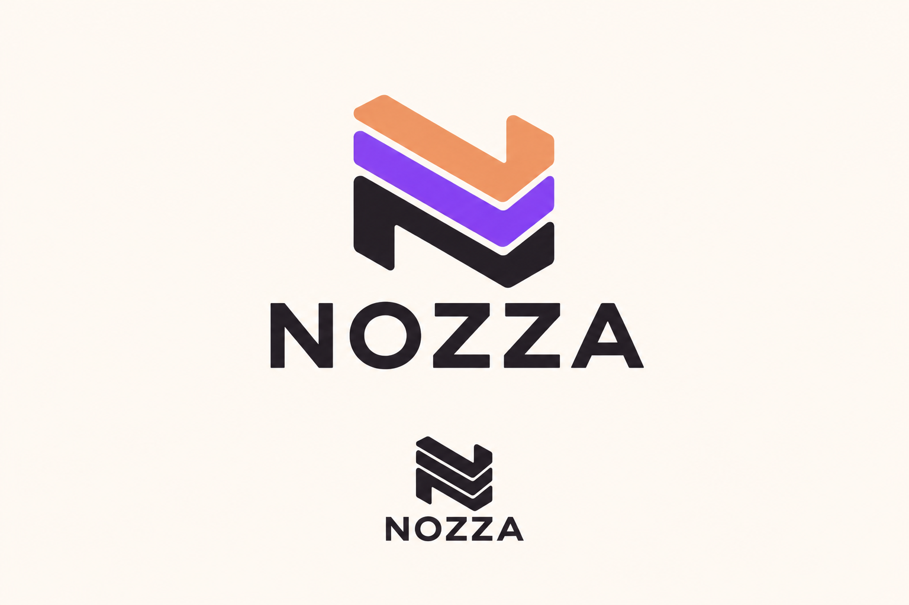
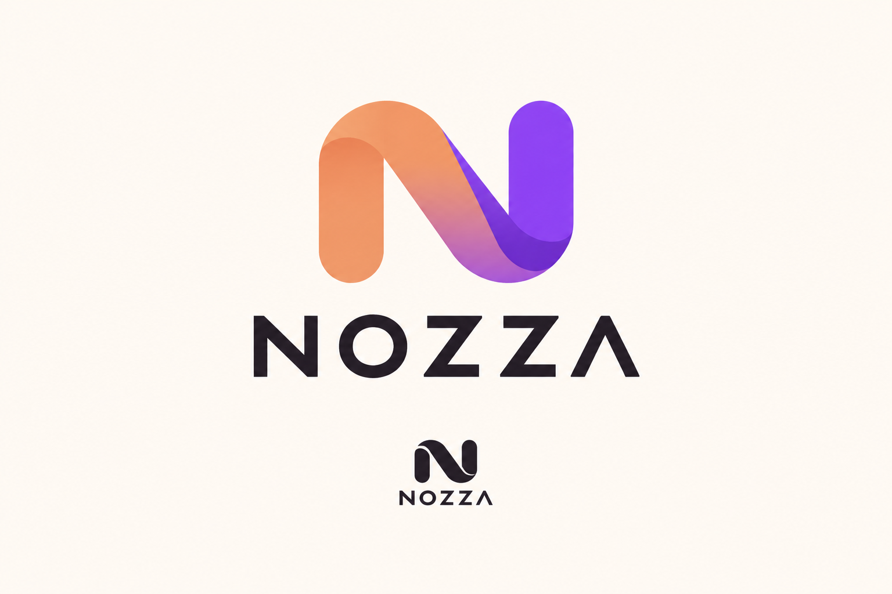
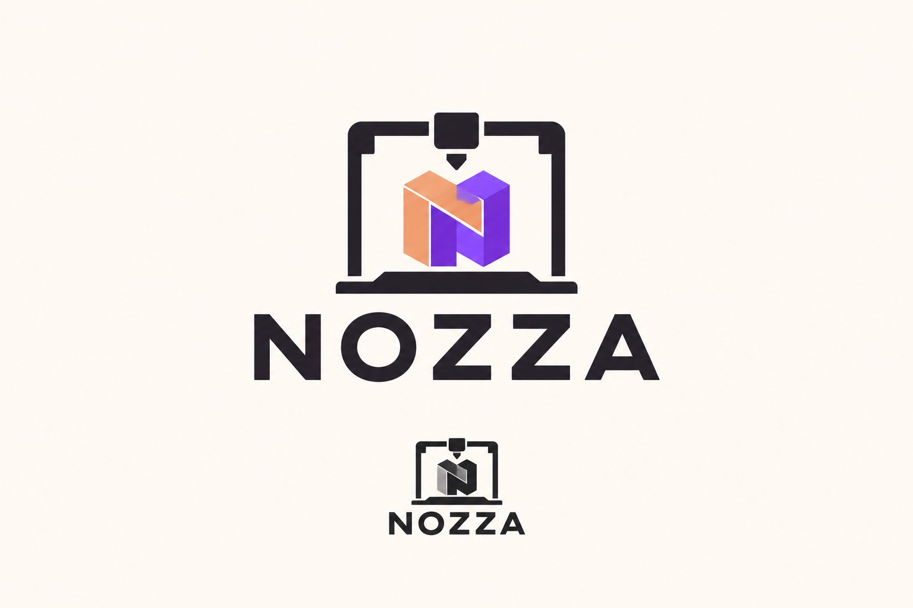
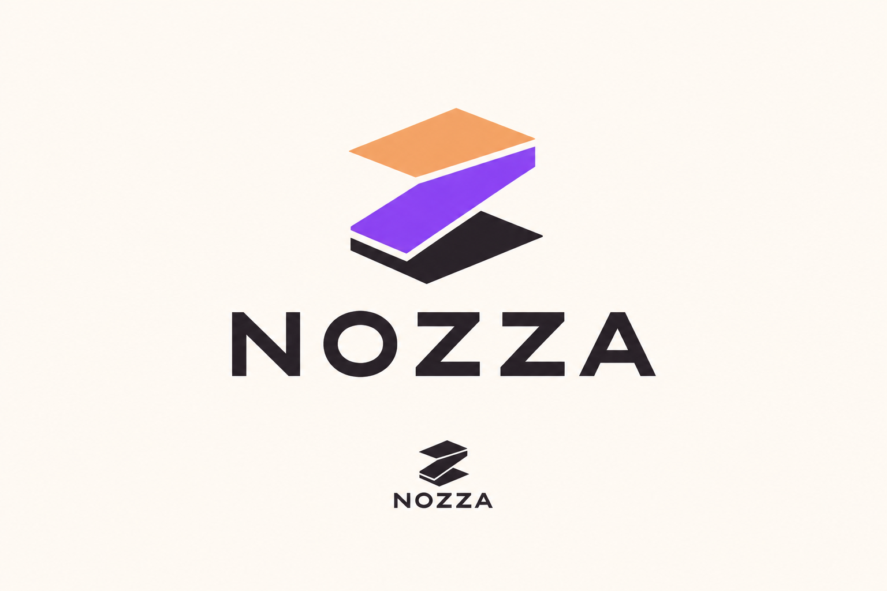
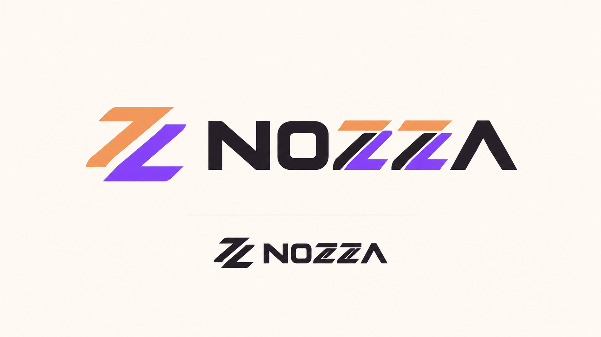

# NOZZA — шесть концепций логотипа

Это архив растровых концепций. **Выбор завершён:** пользователь предоставил Nozza5.png со знаком «сопло + N». Использовать [выбранный исходник и правила](BRAND-GUIDE.md). Для реализации нужна его точная SVG-версия с проверкой при 16–24 px и на этикетке.

## 01-layered-n

Концепция: A bold geometric N made from three additive-manufacturing layers. Clear readable N silhouette.

Точный запрос (built-in image generation):

Use case: logo-brand. One premium company logo concept for NOZZA, a 3D manufacturing workshop and management platform. A bold geometric N made from three additive-manufacturing layers. Clear readable N silhouette. Exact text "NOZZA" in uppercase N O Z Z A. NO other brand names, NO PrintFlow, NO PF or P monogram. Simple flat vector-like contours, modern geometric sans serif, scalable icon and precise wordmark. ONE concept centered with generous white space on solid warm off-white #FFF9F2. Charcoal #241C24, peach #EE9A68, violet #8E43F0, minimal colors. Show a small monochrome rendering of the SAME concept below. No illustration, mascot, photorealism, shadows, mockup or UI. Landscape brand presentation.

## 02-flow-n

Концепция: A continuous rounded ribbon forming an elegant unmistakable N, expressing production flow, not an infinity sign.

Точный запрос (built-in image generation):

Use case: logo-brand. One premium company logo concept for NOZZA, a 3D manufacturing workshop and management platform. A continuous rounded ribbon forming an elegant unmistakable N, expressing production flow, not an infinity sign. Exact text "NOZZA" in uppercase N O Z Z A. NO other brand names, NO PrintFlow, NO PF or P monogram. Simple flat vector-like contours, modern geometric sans serif, scalable icon and precise wordmark. ONE concept centered with generous white space on solid warm off-white #FFF9F2. Charcoal #241C24, peach #EE9A68, violet #8E43F0, minimal colors. Show a small monochrome rendering of the SAME concept below. No illustration, mascot, photorealism, shadows, mockup or UI. Landscape brand presentation.

## 03-printer-frame

Концепция: A minimal 3D printer gantry enclosing a small printed geometric N.

Точный запрос (built-in image generation):

Use case: logo-brand. One premium company logo concept for NOZZA, a 3D manufacturing workshop and management platform. A minimal 3D printer gantry enclosing a small printed geometric N. Exact text "NOZZA" in uppercase N O Z Z A. NO other brand names, NO PrintFlow, NO PF or P monogram. Simple flat vector-like contours, modern geometric sans serif, scalable icon and precise wordmark. ONE concept centered with generous white space on solid warm off-white #FFF9F2. Charcoal #241C24, peach #EE9A68, violet #8E43F0, minimal colors. Show a small monochrome rendering of the SAME concept below. No illustration, mascot, photorealism, shadows, mockup or UI. Landscape brand presentation.

## 04-isometric-z

Концепция: Three isometric planes arranged into one recognizable geometric Z, expressing layered production.

Точный запрос (built-in image generation):

Use case: logo-brand. One premium company logo concept for NOZZA, a 3D manufacturing workshop and management platform. Three isometric planes arranged into one recognizable geometric Z, expressing layered production. Exact text "NOZZA" in uppercase N O Z Z A. NO other brand names, NO PrintFlow, NO PF or P monogram. Simple flat vector-like contours, modern geometric sans serif, scalable icon and precise wordmark. ONE concept centered with generous white space on solid warm off-white #FFF9F2. Charcoal #241C24, peach #EE9A68, violet #8E43F0, minimal colors. Show a small monochrome rendering of the SAME concept below. No illustration, mascot, photorealism, shadows, mockup or UI. Landscape brand presentation.

## 05-nozzle-n

Концепция: A minimal stylized extrusion nozzle drawing a continuous N shaped filament path.

Точный запрос (built-in image generation):

Use case: logo-brand. One premium company logo concept for NOZZA, a 3D manufacturing workshop and management platform. A minimal stylized extrusion nozzle drawing a continuous N shaped filament path. Exact text "NOZZA" in uppercase N O Z Z A. NO other brand names, NO PrintFlow, NO PF or P monogram. Simple flat vector-like contours, modern geometric sans serif, scalable icon and precise wordmark. ONE concept centered with generous white space on solid warm off-white #FFF9F2. Charcoal #241C24, peach #EE9A68, violet #8E43F0, minimal colors. Show a small monochrome rendering of the SAME concept below. No illustration, mascot, photorealism, shadows, mockup or UI. Landscape brand presentation.

## 06-wordmark

Концепция: A custom wide geometric wordmark NOZZA, with the two Z letters subtly cut into layered extrusion paths. A standalone compact double-Z mark.

Точный запрос (built-in image generation):

Use case: logo-brand. One premium company logo concept for NOZZA, a 3D manufacturing workshop and management platform. A custom wide geometric wordmark NOZZA, with the two Z letters subtly cut into layered extrusion paths. A standalone compact double-Z mark. Exact text "NOZZA" in uppercase N O Z Z A. NO other brand names, NO PrintFlow, NO PF or P monogram. Simple flat vector-like contours, modern geometric sans serif, scalable icon and precise wordmark. ONE concept centered with generous white space on solid warm off-white #FFF9F2. Charcoal #241C24, peach #EE9A68, violet #8E43F0, minimal colors. Show a small monochrome rendering of the SAME concept below. No illustration, mascot, photorealism, shadows, mockup or UI. Landscape brand presentation.

