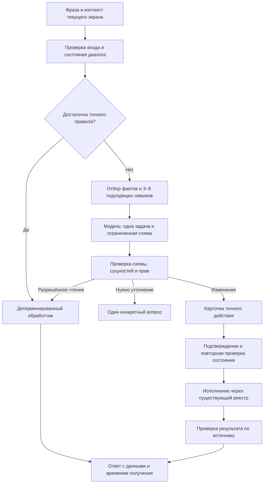

# NOZZA · PrintFlow — план обновления дизайна и ассистента

Дата: 28 сентября 2026 года. Статус: предложение для согласования перед реализацией.

Документ составлен по текущему устройству проекта. Это техническое задание и очередь работ: новые функции из него ещё не реализованы. Сроки и показатели ниже — плановые ориентиры, а не результаты замеров.

Ход первого backend-среза: [отчёт о стенде, исходных показателях и контракте](ОТЧЁТ-BACKEND-СТЕНД-И-КОНТРАКТ.md). S01 выполнена на синтетическом стенде; S03 начата; A01 получила контракт версии 1 и общие состояния ответа; A02 получила строгий бюджет контекста агента и явные ограничения входа основных чатов. Остальные задачи ниже остаются планом.

## 1. Решение руководителя

Цель обновления — сделать панель понятным рабочим местом владельца мастерской, а ассистента — надёжным исполнителем ограниченных задач на доступной локальной модели.

Три результата релиза:

1. **Единый интерфейс.** Заказы, производство, склад, деньги и помощник используют общие элементы, состояния и правила поведения. Основные действия видны сразу; подробности открываются по необходимости.
2. **Ассистент с проверяемым результатом.** Понимает короткие и разговорные запросы, уточняет неоднозначность, использует реальные данные, показывает подготовленное действие и сообщает результат только после проверки.
3. **Сохранность рабочего процесса.** Обновление сохраняет данные, совместимость ссылок и доступ к текущим функциям. Новое оформление и новый механизм ассистента включаются независимо и допускают откат.

Приоритет: сохранность данных → правильность действий → удобство основных сценариев → визуальная целостность → дополнительные возможности.

### Что согласовать перед реализацией

Предлагаемый пакет: новая группировка разделов, обновлённые основные экраны, помощник в боковой панели, карточки действий, управляемая память и режим для слабого компьютера. Это конкретный объём первой большой версии.

Отдельно отложить: новые интеграции, облачную модель с передачей данных, автономную отправку сообщений, дообучение весов, сложные многоагентные схемы и генерацию произвольных программ для исполнения. Возвращаться к ним после измерения пользы основного релиза и отдельного согласования функций.

## 2. На что опирается план

| Наблюдение в текущем коде | Следствие для работ |
|---|---|
| Основная панель находится в большом `site/index.html`; стили распределены между `tokens.css`, `theme.css`, `app.css`, `more.css`, `controls.css` и свежим `refine.css` | Нужны общие компоненты и постепенное удаление старых правил после переноса каждого экрана |
| В `frontend/` уже используются Lit и Vite | Развивать имеющуюся основу; новые компоненты внедрять по одному, сохраняя существующий сервер |
| Есть отдельные касса, управление, мобильная панель, экран цеха, страницы клиентов и генераторы печатных материалов | Дизайн должен охватывать весь набор поверхностей, учитывая разные задачи и размеры |
| `connector/printflow/assistant_brain.py` и `agent/brain.py` имеют самостоятельные цепочки обработки | Согласовать контракты и ответственность, исключить повторную обработку и циклы делегирования |
| Память, детерминированные команды, уточнения, реестр навыков, проверка параметров и подтверждения уже существуют | Развивать и измерять эти механизмы; избегать параллельной реализации тех же функций |
| Планировщик панели получает большой каталог действий; `agent/skills.py` формирует каталог доступных навыков | Перед моделью отбирать небольшой набор подходящих действий |
| Планировщики используют `format: "json"`; `agent/model.py` уже принимает словарь схемы | Передавать схему конкретного задания и проверять смысл полей на сервере |
| В `agent/model.py` системный текст имеет отдельный лимит, а бюджет истории оставляет минимум 400 символов каждому следующему сообщению | Исправить общий бюджет: сейчас он не задаёт строгую верхнюю границу и может обрезать последний запрос после старой истории |
| В панели есть ограничение входной фразы до 1000 символов | Убрать молчаливую потерю текста: согласованные лимиты в UI/API, понятная ошибка или отдельная обработка длинного документа |
| Основные вызовы модели используют `stream: false` | Сначала дать реальные статусы и отмену, затем постепенно выводить текст ответа |
| Документы уже извлекаются и индексируются, существует поиск по словам | Улучшить отбор отрывков и происхождение фактов; необходимость векторного поиска доказать измерениями |
| Последняя визуальная правка ещё не прошла полный завершающий обход | Стабилизация текущего состояния входит в нулевой этап |

Производительность конкретной модели на этом компьютере в рамках подготовки плана не измерялась. Физическая работоспособность камеры не выводится из доступности её сетевого порта. Эти состояния должны отображаться раздельно.

## 3. Визуальная концепция

### 3.1. Характер оформления

**Спокойный, точный интерфейс современной мастерской.** Чёткая сетка, удобные таблицы, крупные важные числа, нейтральные поверхности и один основной акцент. Бренд сохраняется: NOZZA для клиентов, NOZZA · PrintFlow внутри панели.

Предлагаемая основа:

| Элемент | Решение |
|---|---|
| Цвет акцента | Индиго `#4F46E5`; более светлый вариант для тёмной темы после проверки контраста |
| Светлая тема | Фон `#F5F7FB`, белые поверхности, текст `#182230`, тонкие серые разделители |
| Тёмная тема | Фон `#0C121B`, поверхности `#16212E`, текст `#F2F6FB`; проверить все пары текста и фона |
| Семантические цвета | Зелёный — подтверждённый успех; янтарный — внимание; красный — ошибка; нейтральный — нет данных |
| Шрифт | Существующий Inter с локальной загрузкой; числа в таблицах одинаковой ширины |
| Размеры | Основной текст 14–16 px, подписи 12–13 px, заголовки разделов 24–28 px |
| Отступы | Общая шкала 4 / 8 / 12 / 16 / 24 / 32 px |
| Формы | Скругления 10–14 px, мягкая тень только у всплывающих поверхностей |
| Иконки | Один существующий согласованный набор, одинаковые размеры; подписи у важных действий |
| Движение | Короткие переходы 120–180 мс; поддержка уменьшения анимации |

Значения — стартовый дизайн-контракт. Дизайнер проверяет их на реальных экранах и состояниях до массового переноса.

Убрать: повторяющиеся заголовки, декоративные полосы, вложенные карточки без смысла, одинаково яркие кнопки, постоянные технические индикаторы, пустые графики, длинные вступления, дубли меню. Полезная информация переходит в подробности, историю или диагностику.

### 3.2. Навигация

| Группа | Основные разделы | Уточнение |
|---|---|---|
| Обзор | Сегодня | Дела, требующие внимания, и ближайшие действия |
| Заказы | Заказы, Клиенты | Единый переход от заказа к производству и оплате |
| Производство | Принтеры, Очередь, Файлы и слайсер | Состояние оборудования и подготовка задания |
| Склад | Материалы, Изделия | Остатки, резервы, движение и себестоимость |
| Финансы | Касса, Оплаты, Отчёты | Банк и СБП как связанные рабочие инструменты |
| Инструменты | Документы и этикетки, Калькулятор, Остальные инструменты | Название «Печать» уточнить, разделив документы и задания 3D-печати |
| Система | Настройки, Интеграции, Диагностика | Технические подробности собираются здесь |

Помощник доступен общей кнопкой из каждого раздела. Существующие страницы Telegram, Авито, библиотеки и прочих инструментов распределить по назначению после полной карты маршрутов. Старые ссылки и закладки продолжают открывать нужный экран.

На телефоне — до четырёх частых разделов и «Ещё». На широком экране — боковое меню; название мастерской, поиск и состояние связи остаются в компактной верхней строке. Глобальный поиск сначала использует существующие сущности и серверные ограничения доступа.

### 3.3. Спецификация основных экранов

| Экран | Что видно первым | Подробности и действия |
|---|---|---|
| Сегодня | Что просрочено, где остановка, что готово к выдаче; затем 3–4 показателя | Камера и подробная телеметрия открываются по принтеру; нет пустых виджетов |
| Заказы | Поиск, компактные фильтры, список с заказчиком, сроком, суммой и состоянием | Боковая карточка заказа: состав, производство, оплаты, история; основное действие зависит от состояния |
| Принтеры | Состояние, задание, прогресс, ожидаемое завершение и актуальность данных | Камера, AMS, температуры, диагностика; команды с понятной областью действия |
| Очередь | Что печатается, что готово к запуску и что заблокировано с причиной | Совместимость материала/принтера, порядок, связь с заказом; перестановка доступна кнопками и с клавиатуры |
| Файлы и слайсер | Файл, устройство, материал, пригодность задания и следующий шаг | Статус существующего шлюза Bambu Studio показывается по реальным возможностям; новая реализация шлюза оценивается отдельно |
| Склад | Остаток, доступно с учётом резервов, низкий запас, поиск | Карточка материала/изделия и журнал движения; ошибка загрузки не выглядит как нулевой остаток |
| Финансы | К оплате, оплачено, расхождения и период | Первичные записи и операции; сумма вычисляется сервером, статус подтверждается источником |
| Документы и этикетки | Выбор шаблона, данные, предпросмотр, печать | Размеры в миллиметрах и печатные стили сохраняются; элементы управления не попадают в печать |
| Настройки | Понятные группы: мастерская, устройства, помощник, интеграции | Проверка подключения объясняет, какой слой работает и на каком ошибка |
| Клиентские страницы | Заказ, статус, ожидаемое действие клиента, связь | Минимум внутренних терминов, аккуратный мобильный вид, доступные состояния ошибок |
| Экран цеха / TV | Крупные статусы, очередь и предупреждения | Читаемость на расстоянии, отсутствие мелких панелей управления |

Карточка принтера различает: устройство недоступно; телеметрия устарела; печать идёт; камера не присылает кадр; порт камеры доступен. Наличие сетевого соединения не включает надпись «LIVE».

### 3.4. Общие правила взаимодействия

- Один главный акцент на экране или в форме; опасное действие визуально отделено.
- Для каждого блока предусмотрены загрузка, пустой результат, ошибка, устаревшие данные и нормальное состояние.
- Ошибка сохраняет введённые поля и предлагает конкретное следующее действие.
- Фильтры сохраняются при открытии карточки и возврате. Выбранные фильтры видимы и сбрасываются явно.
- Состояние определяется текстом и значком вместе с цветом.
- Видимый фокус, корректный порядок Tab, Escape для закрытия, возврат фокуса, подписи полей и сообщения об ошибках.
- Внутренняя цель доступности: контраст обычного текста от 4,5:1; основные сенсорные цели 44 × 44 px. Допустимые исключения документируются.
- Проверяемые ширины: 360, 390, 768, 1366 и 1920 px; масштаб текста 200%. Общий экран не прокручивается горизонтально. Широкая таблица может прокручиваться внутри обозначенной области.

## 4. Ассистент для слабых языковых моделей

### 4.1. Архитектура одного запроса

Панель владеет заказами, складом, деньгами, очередью и данными принтеров. Агент владеет локальным компьютером и своими существующими навыками. Между ними — версионированный контракт запросов и результатов, общий идентификатор запроса, ограничение делегирования и понятный владелец сессии. Начать с адаптеров поверх текущих API. Физическое объединение процессов и баз не требуется для первого релиза.

### 4.2. Как снизить требования к модели

**1. Использовать быстрые точные маршруты.** Статусы, суммы, арифметика, поиск по номеру заказа, переход на страницу и известные команды обрабатываются существующим кодом. Поддержку отрицания, исправления и неоднозначных имён проверять отдельными сценариями. Низкое совпадение правила не должно запускать действие.

**2. Сократить каталог.** Первый отбор использует слова, текущую страницу, доступность навыка и найденные сущности. В модель попадают 3–8 кандидатов с короткими описаниями и необходимыми параметрами. Если подходящего кандидата нет, система расширяет поиск один раз либо уточняет задачу. Текущий экран — подсказка; явный запрос пользователя имеет приоритет.

**3. Давать одно ограниченное задание.** Отдельные режимы: выбрать действие, извлечь параметры, ответить по найденным данным, написать текст. Не заставлять маленькую модель одновременно искать, планировать длинную цепочку, считать и подтверждать результат. Дополнительный вызов оправдан измеримым улучшением качества.

**4. Использовать структурированный ответ.** Схема задаёт допустимый тип ответа, идентификатор действия, параметры и недостающие поля. Ollama поддерживает передачу JSON Schema через `format`; это подходит для существующего клиента. Смысл значений всё равно проверяется сервером. [Документация Ollama: Structured Outputs](https://docs.ollama.com/capabilities/structured-outputs).

**5. Ограничить исправления.** При ошибке схемы — максимум одна попытка исправления с кратким описанием нарушения. Затем понятный отказ или уточнение. Повторная генерация никогда не повторяет уже отправленную команду. Произвольные неизвестные поля не расширяют разрешения.

**6. Исправить бюджет контекста.** Сначала резервируются обязательные инструкции, текущий запрос и ответ модели. Затем помещаются актуальные данные и результат последнего инструмента, выбранные навыки, краткое состояние диалога и только потом старая история. Лимит общий. При нехватке места удаляются старые сведения, а пользователю не подменяют смысл незаметным обрезанием сообщения.

**7. Держать состояние разговора в структуре.** Активный заказ/принтер, выбранный клиент, открытое уточнение, последнее действие и его результат хранятся отдельно от свободного текста. Фраза «а второй?» разрешается относительно конкретного показанного списка. Устаревший или неоднозначный список требует уточнения.

**8. Проверять факт исполнения.** «Команда отправлена», «принтер подтвердил» и «печать началась» — разные состояния. При таймауте сначала запросить реальное состояние. Если результат неизвестен, показать это прямо и предоставить безопасный способ проверки.

**9. Подбирать режим по измерениям.** Не выбирать модель только по названию семейства или количеству параметров. На фиксированном наборе русскоязычных задач сравнивать качество, задержку и память. Режим инструментов включается только для проверенной связки модели и версии сервера. Ollama поддерживает tool calling, однако качество конкретного маршрута нужно измерять в проекте. [Документация Ollama: Tool calling](https://docs.ollama.com/capabilities/tool-calling).

### 4.3. Начальные профили ресурсов

Это параметры эксперимента для ограниченных задач мастерской. Они не являются обещанием работы на любом компьютере.

| Профиль | Начальная настройка | Поведение |
|---|---|---|
| Экономный | Контекст 4k токенов, 3–5 навыков, короткий ответ | Точные команды приоритетны; одновременно один запрос к модели; до 2 вызовов на обычную задачу |
| Сбалансированный | Контекст 8k, 5–8 навыков, больше найденных отрывков | До 2 вызовов на обычную задачу; до 3 заранее ограниченных шагов составного сценария |
| Расширенный | Контекст и лимиты по результатам замеров | Длинные документы, дополнительные возможности модели только при подтверждённой поддержке |

Лимит вызовов включает исправление схемы. Когда лимит исчерпан, ответ строится из результата инструмента шаблоном. Увеличение контекста увеличивает потребление памяти, поэтому сначала измеряются фактическое размещение модели и размер выделенного контекста. [Документация Ollama: Context length](https://docs.ollama.com/context-length).

Символы и токены не приравниваются. При отсутствии доступного совместимого токенизатора используется консервативная оценка с запасом и сверка фактических счётчиков; система не заявляет точный токенный лимит по одному числу символов. Слишком длинный запрос направляется в обработку документа либо возвращает понятное ограничение.

Очередь запросов ограничена. Повторное нажатие «Отправить» не создаёт дубликат. Отмена прекращает дальнейшие шаги; уже выполненное изменение отмечается в результате. Отмена HTTP-запроса и прекращение вычисления в рантайме проверяются отдельно.

### 4.4. Память и документы

- Сохранить существующие механизмы памяти панели и агента; определить владельца каждого типа записи и исключить дублирование.
- Разделить предпочтения пользователя, подтверждённые правила, факты о сущностях и временное состояние задачи.
- У записи есть источник, время, область применения и признак подтверждения. Временные данные не становятся вечной инструкцией.
- При противоречии памяти и актуальной записи заказа приоритет у текущего источника; пользователь видит причину расхождения.
- Память доступна для просмотра, исправления и удаления. Удаление убирает запись и из активного поиска/кэша. Политику хранения резервных копий объяснять отдельно.
- Существующее обучение командам сохраняется. Новое правило показывается пользователю перед сохранением; изменённые команды проходят ту же проверку риска и параметров.
- Для документов проверить доступность SQLite FTS5; внедрять только при подтверждённой пользе. Сохранить рабочий запасной поиск.
- Отбирать короткие отрывки с названием документа и расположением. Ответ по документу ссылается на эти отрывки; отсутствие информации не заполняется догадкой.
- Вложения, страницы и результаты инструментов считаются данными, а не новыми инструкциями исполнителю.
- Векторный индекс и дообучение рассматривать только после сравнения с простым поиском на отложенных примерах.

### 4.5. Договор исполнения действия

Карточка изменения формируется сервером из проверенных параметров. Обязательные данные: тип действия, точный объект, изменение «до → после», последствия, источник состояния и срок актуальности подтверждения.

Подтверждение связано с неизменяемым идентификатором предложения и его параметрами. Изменение параметров создаёт новое предложение. Перед исполнением повторно проверяются доступность объекта, разрешения и значимые условия. Повтор подтверждения использует ключ идемпотентности там, где операция допускает такую гарантию.

Для принтера и внешних систем, где нельзя обеспечить транзакцию, сохраняются факт отправки и идентификатор команды, проверяется состояние и блокируется слепой повтор. Составная задача хранит результат каждого шага и умеет завершиться частично; уже выполненные шаги не запускаются заново без отдельного решения.

Общий результат API: `request_id`, `session_id`, `status`, `message`, `data`, `sources`, `proposal`, `error`. Состояния: принято, поиск данных, требуется уточнение, требуется подтверждение, выполняется, выполнено, частично выполнено, ошибка, отменено, результат неизвестен. UI получает только реально наступившие этапы.

### 4.6. Человечное общение

Ассистент отвечает по-русски, начинает с результата, избегает длинных вступлений, учитывает уже выбранные объекты и задаёт один конкретный вопрос. Факты, суммы и обещания берёт из источников. Уверенность в формулировке не заменяет проверку.

Примеры желаемого поведения:

- «Нашёл три заказа на сегодня. У одного ещё нет оплаты.» Затем список и переходы к заказам.
- «Есть два Ивана. Выберите клиента: Иван П. — заказ №…; Иван С. — заказ №…». Показать только необходимое для различения.
- «Подготовил перенос задания на P1S. Материал совпадает; принтер освободится примерно в 18:40 по текущей телеметрии.» Затем карточка подтверждения.
- «Команда отправлена, но принтер ещё не подтвердил запуск. Проверяю состояние». После таймаута — честный неизвестный результат.
- «Модель сейчас недоступна. Статус заказа могу показать по данным панели». Доступные точные функции остаются рабочими.

## 5. Новый интерфейс помощника

### Основной режим

Помощник открывается справа поверх текущего рабочего контекста; на узком экране занимает отдельную страницу. Есть возможность перейти в полноэкранный разговор. Оба представления используют одну историю и одинаковые карточки.

Верхняя строка: название разговора, новое общение, дополнительные действия. Технические статусы модели, голоса и агента раскрываются по индикатору состояния. В обычном режиме достаточно короткого сообщения о готовности или конкретной проблеме.

Над вводом: видимые метки контекста — «Заказ №…», «Принтер P1S», «Документ…». Метку можно удалить. Отправка не прикрепляет незаметно весь экран, файлы или персональные данные.

В разговоре предусмотрены:

1. Короткий ответ с переходами к объектам.
2. Таблица или список найденных объектов.
3. Карточка уточнения с вариантами.
4. Карточка предлагаемого действия с подтверждением.
5. Результат действия и сведения о проверке.
6. Источник и время актуальности данных.
7. Ошибка с доступным следующим шагом.

Подсказки зависят от открытого раздела: в заказах — «Что нужно выдать сегодня?», в складе — «Каких материалов не хватает?», у принтера — «Почему задание не запускается?». Подсказка предлагается только при наличии соответствующей функции.

Постепенный вывод текста вводится после работающей отмены. Предложение действия показывается лишь после полной серверной проверки, даже если пояснение уже появляется в чате. Внутренние рассуждения и выдуманные этапы «мышления» не выводятся.

## 6. Задачи команде

Роли: **РП** — руководитель/владелец продукта; **Д** — дизайнер; **Ф** — frontend; **Б** — backend/ассистент; **К** — контроль качества. Один человек может выполнять несколько ролей, но критерий приёмки проверяется отдельно от заявления исполнителя.

Оценки ниже — человеко-дни активной работы, без ожидания согласования. P0 блокирует выпуск, P1 входит в основной релиз, P2 — второй пакет после результатов первого. Все задачи создаются как отдельные задания с приложенными примерами и зависимостями.

### Этап 0. Зафиксировать надёжную основу

| ID | Приоритет / роль / оценка | Задание и результат | Приёмка / зависимость |
|---|---|---|---|
| S01 | P0 · Б+К · 2–3 | Описать рабочую среду, источники БД, резервирование и изолированный стенд; сохранить исходные показатели данных | Восстановление копии проверено отдельно; стенд не обращается к рабочим принтерам и интеграциям. Без зависимостей |
| S02 | P0 · Ф+К · 2–3 | Завершить проверку текущих визуальных правок, согласовать версии CSS и service worker, составить карту всех экранов и состояний | Каждый HTML/маршрут учтён; новый и старый кэш проверены; рабочие записи сохранены. После S01 |
| S03 | P0 · Б+К · 3–4 | Подготовить начальный набор запросов и снять качество/скорость текущего ассистента на выбранной машине | Версии, настройки, входы и результаты воспроизводимы; отдельные цифры для правил и модели. После S01 |

### Этап 1. Дизайн и общие элементы

| ID | Приоритет / роль / оценка | Задание и результат | Приёмка / зависимость |
|---|---|---|---|
| D01 | P1 · Д+РП · 2–3 | Утвердить карту навигации и прототипы: заказы, принтер, помощник; настольный и мобильный варианты | Пользователь может пройти 5 основных сценариев по прототипу; названия разделов однозначны. После S02 |
| D02 | P1 · Д+Ф · 3–4 | Описать и внедрить токены обеих тем и каталог состояний компонентов | Цвета, отступы, типографика централизованы; контраст проверен; нет новых случайных палитр. После D01 |
| D03 | P1 · Ф · 3–5 | Обновить каркас панели, навигацию, заголовки и адаптивное поведение | Существующие ссылки работают; меню доступно с клавиатуры; ширины 360–1920 px. После D02 |
| D04 | P1 · Ф+К · 4–6 | Сделать общие таблицы, фильтры, формы, диалоги, карточки и состояния ошибок на текущем стеке | Использование на двух разных экранах; ввод и фокус сохраняются; ошибки не стирают форму. После D02 |

**D01 · утверждено владельцем (28.09.2026):** [шесть интерактивных макетов и сценарии](D01-МАКЕТЫ-NOZZA.md). Получено указание «Да, внедряй как есть». Общая основа D02–D04 перенесена в панель; [карта S02](S02-КАРТА-ЭКРАНОВ-И-РЕСУРСОВ.md) и [дизайн-система D02](D02-ДИЗАЙН-СИСТЕМА-NOZZA.md) фиксируют результат и границы переноса.

### Этап 2. Рабочие экраны

| ID | Приоритет / роль / оценка | Задание и результат | Приёмка / зависимость |
|---|---|---|---|
| V01 | P1 · Ф+Д · 2–3 | Перестроить обзор «Сегодня» по событиям и следующим действиям | Критичные проблемы видны без раскрытия; пустые виджеты отсутствуют. После D03–D04 |
| V02 | P1 · Ф+Б · 4–6 | Обновить заказы/клиентов, карточку заказа и связь с производством/оплатой | Поиск → карточка → возврат сохраняет фильтры; суммы и статусы сходятся с API. После D03–D04 |
| V03 | P0 · Ф+Б · 4–6 | Обновить принтеры, очередь и подготовку задания; различить связь, телеметрию и камеру | Недоступная камера не скрывает печать; повтор клика не дублирует задание; причины блокировки видны. После D03–D04 |
| V04 | P0 · Ф+Б · 3–5 | Обновить склад и финансы, явно разделить ноль/нет данных/ошибку | Остатки, резервы и суммы не меняются от открытия экрана; сбои API не показываются как пустая база. После D03–D04 |
| V05 | P1 · Ф+Д · 4–6 | Перенести остальные разделы, кассу, мобильные/служебные страницы, TV и клиентские страницы | Матрица S02 закрыта полностью, каждый экран имеет владельца и все состояния. После V01–V04 |
| V06 | P1 · Ф+К · 2–3 | Привести генераторы документов, ценников и этикеток к общей оболочке | Печатные размеры, поля, QR и переносы совпадают с эталонами; управление не печатается. После D04 |
| V07 | P1 · Ф · 2–4 | Удалить заменённые стили и повторную разметку после переноса страниц | Для компонентов остался один источник стилей; `refine.css` не превращается в новый бесконечный слой. После V01–V06 |

### Этап 3. Надёжный ассистент

| ID | Приоритет / роль / оценка | Задание и результат | Приёмка / зависимость |
|---|---|---|---|
| A01 | P0 · Б · 3–4 | Ввести общий контракт результата, владельца контекста и правила делегирования панели/агента | Нет циклов; единый request_id; старые API поддерживаются адаптерами. После S03 |
| A02 | P0 · Б · 2–3 | Исправить бюджет контекста, лимиты входа и приоритет последнего сообщения | Длинная история не вытесняет текущую задачу; превышение лимита обрабатывается явно. После A01 |
| A03 | P1 · Б · 3–4 | Реализовать отбор навыков и фактов перед моделью, развить точные маршруты | Доля найденного правильного навыка измерена; отрицания и неоднозначность не запускают действие. После A01, S03 |
| A04 | P0 · Б · 3–4 | Ввести схемы по типам задач и ограниченное исправление ответа | Неизвестные действия/поля отвергаются; максимум один repair; поддержан отказ модели. После A02–A03 |
| A05 | P0 · Б+К · 3–5 | Усилить существующие подтверждения, идемпотентность, проверку состояния и результата | Двойной клик/таймаут/повтор не дают вторую операцию; изменение объекта требует обновления предложения. После A01, A04 |
| A06 | P1 · Б · 3–5 | Согласовать память панели/агента, источники, исправление и удаление | Конфликт фактов виден; удалённая память исключена из поиска; правила не включаются скрыто. После A01 |
| A07 | P1 · Б · 3–4 | Улучшить поиск по документам и краткий ответ с источниками | Найденный фрагмент открывается; неподтверждённые числа не выдаются за факт; есть fallback поиска. После A02, A06 |
| A08 | P1 · Б · 3–4 | Реализовать очередь, профили ресурсов, таймауты и отмену | Один тяжёлый запрос в экономном режиме; отмена останавливает следующие шаги; нет бесконечного ожидания. После A01–A02 |
| A09 | P1 · Б+Ф · 2–4 | Добавить поток событий, затем поток текста с совместимым запасным ответом | Статусы соответствуют реальным событиям; неполная карточка не исполняется; разрыв соединения обработан. После A05, A08 |
| A10 | P2 · Б+РП · 3–5 | Добавить 3 ограниченных составных сценария по итогам использования | Каждый шаг имеет вход, результат и остановку; частичный успех не маскируется. После A05, A07, Q02; отдельное согласование сценариев |

### Этап 4. Интерфейс помощника

| ID | Приоритет / роль / оценка | Задание и результат | Приёмка / зависимость |
|---|---|---|---|
| U01 | P1 · Ф · 3–5 | Сделать общий чат, боковую панель и полный экран с общей историей | Переход не теряет сообщение; метки контекста видны и удаляемы; мобильная клавиатура не закрывает ввод. После D04, A01 |
| U02 | P0 · Ф+Б · 3–4 | Внедрить единые карточки уточнения, действия, результата и ошибки | Карточка точно повторяет проверенные параметры; есть срок/статус предложения; нельзя подтвердить устаревшее. После U01, A05 |
| U03 | P1 · Ф+Б · 2–3 | Добавить управление памятью, источники и понятное состояние подключения | Пользователь исправляет/удаляет факт; видит источник и причину недоступности. После U01, A06–A07 |
| U04 | P1 · Д+Ф+Б · 2–3 | Переписать тексты, подсказки и реакции на ошибки | Короткие ответы по-русски; нет неподтверждённого «готово»; подсказки соответствуют доступным функциям. После U02–U03, A09 |

### Этап 5. Приёмка и выпуск

| ID | Приоритет / роль / оценка | Задание и результат | Приёмка / зависимость |
|---|---|---|---|
| Q01 | P0 · К+Ф · 3–5 | Пройти визуальную и функциональную матрицу всего проекта | Все страницы, темы, ширины, клавиатура и печатные шаблоны отмечены результатом; критичные дефекты закрыты. После V07, U04 |
| Q02 | P0 · К+Б · 3–5 | Провести финальное сравнение ассистента на отложенном наборе и сбоях | Отчёт по качеству, ложным действиям, скорости и памяти; каждое ухудшение разобрано. После A04–A09, U04 |
| Q03 | P0 · Б+Ф+К · 2–3 | Проверить миграции, кэш, резервирование, откат и пробный выпуск | Данные сходятся до/после; старый интерфейс включается обратно; откат не удаляет новые записи. После Q01–Q02 |
| Q04 | P1 · РП+К · 1–2 | Провести пользовательскую приёмку и опубликовать краткую инструкцию | Владелец выполняет основные сценарии без подсказок; ограничения и открытые вопросы перечислены. После Q03 |

Всего: **32 задачи**, из них 31 задача основного релиза и одна задача второго пакета. Оценка основного релиза: примерно **84–128 человеко-дней**. Уточнить после S01–S03 и прототипов; это диапазон планирования, без гарантий календарного срока.

## 7. Распределение работ и порядок выпуска

### Рабочие потоки

- **Руководитель:** фиксирует объём, принимает D01, не добавляет функции в середине этапа без оценки влияния на срок.
- **Дизайнер:** ведёт общие правила и реальные состояния, передаёт frontend готовые сценарии, проверяет перенос.
- **Frontend:** отвечает за оболочку, страницы и общие элементы, затем подключает готовые контракты ассистента.
- **Backend:** отвечает за данные, контракты, маршрутизацию, исполнение и измеримое качество модели.
- **Контроль качества:** начинает со стенда и набора сценариев, ведёт приёмку на всём протяжении работ.

Для команды из двух разработчиков с частичным участием дизайнера и проверяющего предварительный календарный ориентир — **12–16 недель**, с уточнением после нулевого этапа. Для одного исполнителя — примерно **5–7 месяцев активной работы**. Разбивка позволяет выпускать полезные части раньше полного завершения.

### Контрольные точки

1. **Основа:** S01–S03. Известно, что сохраняем и как измеряем результат.
2. **Прототип и компоненты:** D01–D04; одновременно A01–A04. Можно оценить новый вид и качество ограниченных запросов отдельно.
3. **Первый полезный выпуск:** заказы, принтеры, очередь, базовая оболочка; новый ассистент только для чтения и предложений.
4. **Полный рабочий цикл:** склад, финансы, карточки действий, память, отмена и проверка результатов.
5. **Завершение покрытия:** остальные страницы, печатные материалы, очистка старых стилей, общий выпуск.

Новый дизайн и новый механизм ассистента управляются отдельными настройками. Механизм ассистента сначала проверяется на сохранённых обезличенных запросах. Теневая обработка никогда не выполняет действия. После приёмки включается чтение, затем подтверждаемые изменения.

### Первые поручения как руководителя

**Задание backend:** выполнить S01 и подготовить S03. Затем A01–A02. Сдать схему владения данными, безопасный стенд, таблицу исходных результатов и примеры переполнения контекста до/после. К работе с новыми действиями переходить после согласования контракта.

**Задание frontend:** выполнить S02 вместе с проверяющим. Составить полный перечень экранов, закрыть незавершённые правки оформления и различия версий ресурсов. Затем внедрять D02–D04 по принятому прототипу.

**Задание дизайнеру:** выполнить D01. Сдать шесть основных макетов: заказы, принтер и помощник на компьютере и телефоне, плюс светлую/тёмную тему и примеры ошибки, загрузки и пустого состояния. Основной акцент — читаемость и путь к действию.

**Задание проверяющему:** зафиксировать эталоны записей, сценарии сбоев и первый набор диалогов. Для каждого дефекта — шаги, ожидаемое и фактическое поведение, окружение и связанная задача. В ежедневном отчёте — блокирующие проблемы и подтверждённо закрытые сценарии.

**Задание руководителю:** принять визуальную концепцию и границы первой версии. Раз в неделю проводить демонстрацию на одинаковых сценариях, сверять объём, качество и оставшиеся риски.

## 8. Проверка качества ассистента

### Набор оценки

Начальный набор — 300 сценариев: 200 для разработки, 100 отложенных для приёмки. Дополнительный критичный набор минимум 60 сценариев выполняется отдельно и не растворяется в среднем балле. Данные синтетические или обезличенные, действия выполняются на стенде.

Категории: точные команды; разговорные перефразирования; опечатки; отрицания; неоднозначные имена; несколько реплик; переключение темы; устаревшая память; недоступная модель; неправильный JSON; отсутствующее поле; выдуманный ID; неполный поиск; противоречивые документы; текст с вредоносной инструкцией внутри документа; повтор команды; истёкшее подтверждение; изменение состояния после подтверждения; обрыв ответа; частично выполненная задача.

| Показатель | Предварительная цель выпуска | Как измеряем |
|---|---|---|
| Корректное завершение поддерживаемых задач | ≥90% на отложенном наборе | Проверяется конечное состояние и ответ; у неоднозначной задачи правильным результатом считается требуемое уточнение |
| Правильный навык попал в короткий список | ≥97% | Сравнение с ручной разметкой; отдельно по группам задач |
| Схема ответа корректна | ≥99% после не более одного исправления | Все модельные вызовы; таймауты и отказ схемы видны отдельно |
| Неправильное изменяющее действие | 0 в критичном приёмочном наборе | Любой случай блокирует выпуск; это не гарантия отсутствия ошибок вне набора |
| Дублирующее выполнение | 0 в сценариях повтора/таймаута | Сверка журнала и итоговых записей/команд |
| Ответ по источнику | Каждый проверяемый факт имеет источник | Ручная и автоматическая сверка чисел, ID и статусов |
| Быстрые команды | p95 до 500 мс для локального обработчика без ожидания внешних систем | Измеряется отдельно от сетевого времени и UI |
| Отклик интерфейса | Принятие запроса отображается до 200 мс | Пользователь получает видимый статус до начала тяжёлой работы |
| Модельная задержка | Бюджет фиксируется по S03; цель — снизить p95 на 25% без падения качества | Сравнение одинаковой модели, машины, данных; холодный и прогретый запуск отдельно |
| Размер входа в модель | Снизить медиану минимум на 40% для каталожных запросов | Фактические счётчики рантайма, с контролем качества |
| Память и устойчивость | Без OOM и неограниченного роста очереди в согласованном профиле | Фиксируется RAM/VRAM, размер очереди, длительность; бюджет выбирается по доступному оборудованию |

Цели пересматриваются после исходных измерений с объяснением причины. Снижать порог качества ради красивой цифры скорости нельзя. В отчёте показываются знаменатели, результаты по категориям и все критичные ошибки.

## 9. Защита данных и выпуск

- Перед изменениями схемы БД — резервная копия и проверенное восстановление на отдельном экземпляре.
- Рабочая база и стенд имеют разные каталоги и явно различимое оформление. Переменные окружения тестов указывают на стенд.
- Контроль сохранности проверяет идентификаторы, количество и значимые поля заказов, остатков, платежей и заданий. Одного совпадения количества недостаточно. На работающем сервере учитываются законные изменения за время проверки.
- Миграции первого этапа преимущественно добавочные. Скрытый или перенесённый элемент интерфейса не удаляет данные.
- Откат frontend и нового маршрута ассистента проверяется отдельно от отката данных. Для восстановления БД предусмотрено сохранение новых операций после снимка.
- Старые маршруты поддерживаются адаптерами. Service worker и версии статических ресурсов обновляются согласованно; проверяется открытая старая вкладка после обновления.
- Основной цикл приёмки использует имитаторы принтеров и внешних систем. Проверка реального оборудования проводится отдельным согласованным сценарием, с учётом текущей печати.
- Журналы хранят этапы, длительности, код ошибки и обезличенные идентификаторы. Полный текст документов и персональные данные не попадают туда по умолчанию.

## 10. Условия готовности релиза

Релиз готов, когда:

1. Вся матрица страниц закрыта, включая служебные, клиентские и печатные поверхности.
2. Основные сценарии выполняются с компьютера и телефона, с клавиатуры и при потере соединения.
3. Нет открытых P0-дефектов и необъяснённых расхождений данных.
4. Нет ложных состояний камеры, склада, оплаты и успешного исполнения.
5. Ассистент прошёл отложенный и критичный наборы на зафиксированных моделях/профилях.
6. Слабый компьютер имеет предсказуемые лимиты, работающую отмену и доступные функции без модели.
7. Повторное нажатие, обрыв связи и перезагрузка не приводят к повторной операции.
8. Новый и старый режимы совместимы с текущими данными; откат проверен.
9. Обновлённые компоненты заменили свои старые версии; лишние стили удалены после подтверждённого переноса.
10. Пользователь принял основные сценарии, получил краткое описание изменений и известных ограничений.

## 11. Риски и решения

| Риск | Как управляем |
|---|---|
| Маленькая модель хорошо отвечает на примеры, но путается в реальных запросах | Отложенные перефразирования и новые сущности; результаты по категориям; точные обработчики и уточнение |
| Уменьшение контекста теряет нужный факт | Приоритет последнего запроса, структурное состояние, измерение полноты поиска, источник каждого факта |
| Перенос оформления ломает существующие обработчики | Поэкранная миграция, сохранение контрактов, приёмка маршрутов и событий до удаления старого кода |
| Появляется третья система ассистента | Согласованный контракт и адаптеры над двумя существующими механизмами; запрет дублирующего исполнителя |
| Редизайн прячет важные функции | Полная карта S02 и проверка пользовательских сценариев; перенос в подробности с доступной навигацией |
| Сбой внешней системы ошибочно выглядит как потеря данных | Раздельные состояния «нет записей», «ошибка», «данные устарели» и проверка источника |
| Команда исполнена, но подтверждение потерялось | Состояние «результат неизвестен», журнал отправки, проверка результата до повтора |
| Срок растёт из-за новых идей | Отдельный второй пакет, оценка каждой добавки, еженедельная демонстрация принятого объёма |

## 12. Точки входа в код для исполнителей

Пути относительно корня проекта:

- Оболочка и страницы: `site/index.html`, `frontend/src/index.js`, `frontend/src/pf-pages-hub.js`, `frontend/src/pages-data.js`.
- Стили: `site/assets/tokens.css`, `theme.css`, `app.css`, `more.css`, `controls.css`, `refine.css`; ресурсный кэш — `site/sw.js`.
- Помощник в браузере: `site/assistant.html`; дополнительный UI агента — `agent/ui.py`.
- Механизм панели: `connector/printflow/assistant_brain.py`, `assistant.py`, `routes_assistant.py`, `assistant_memory.py`, `assistant_knowledge.py`.
- Механизм агента: `agent/brain.py`, `model.py`, `skills.py`, `executor.py`, `learning.py`, `store.py`, `documents.py`, `panel_client.py`.
- Существующие проверки: `connector/tests/test_assistant*.py`, `test_agent_brain.py`, `test_agent_understanding.py`, `test_agent_os.py`, `test_agent_personal.py`; `scripts/assistant-check.js`, `scripts/panel-check.js`.
- Бренд и интеграция: `docs/БРЕНД-NOZZA.md`, `docs/ШЛЮЗ-BAMBU-STUDIO.md`.

Начало реализации: согласовать предложенный пакет, затем выполнить S01–S03. Следующая демонстрация должна показать работающий новый экран заказов и измеренное улучшение одного типового запроса ассистента на выбранной слабой модели.
